<div align="center">

# GHULAM ISHAQ KHAN INSTITUTE OF ENGINEERING SCIENCES AND TECHNOLOGY

### Faculty of Computer Engineering

---

<br><br>

## VISTA: Verification using Intelligent Systems for Test Automation

### Senior Design Project (SDP) — Final Year Project Report

<br><br>

**Submitted by:**

| Name | Registration Number |
|------|-------------------|
| Asad Ali | 2021-CE-XXX |
| Sheikh Abbas | 2021-CE-XXX |
| Mian Arqam | 2021-CE-XXX |

<br>

**Advisor:** Dr. Fahad Bin Muslim

**Co-Advisor:** Dr. Waqar

**Industrial Partner:** NECOP

**Industrial Mentors:** Dr. Haroon &nbsp;&nbsp; Dr. Majeed

<br><br>

**Degree:** Bachelor of Science in Computer Engineering

**Session:** 2021 – 2025

**Date:** April 2026

</div>

---

## Certificate of Approval

It is certified that the work presented in this report was performed by **Asad Ali**, **Sheikh Abbas**, and **Mian Arqam** under the supervision of **Dr. Fahad Bin Muslim**. The work is adequate and lies within the scope of the BS degree in Computer Engineering at Ghulam Ishaq Khan Institute of Engineering Sciences and Technology.

<br>

-------------------&nbsp;&nbsp;&nbsp;&nbsp;&nbsp;&nbsp;&nbsp;&nbsp;&nbsp;&nbsp;&nbsp;&nbsp;&nbsp;&nbsp;&nbsp;&nbsp;&nbsp;&nbsp;&nbsp;&nbsp;&nbsp;&nbsp;&nbsp;&nbsp;&nbsp;&nbsp;&nbsp;&nbsp;&nbsp;&nbsp;&nbsp;&nbsp;&nbsp;&nbsp;&nbsp;&nbsp;&nbsp;&nbsp;-------------------

**Dr. Fahad Bin Muslim**&nbsp;&nbsp;&nbsp;&nbsp;&nbsp;&nbsp;&nbsp;&nbsp;&nbsp;&nbsp;&nbsp;&nbsp;&nbsp;&nbsp;&nbsp;&nbsp;&nbsp;&nbsp;&nbsp;&nbsp;&nbsp;&nbsp;&nbsp;&nbsp;&nbsp;&nbsp;&nbsp;&nbsp;&nbsp;&nbsp;&nbsp;&nbsp;&nbsp;&nbsp;&nbsp;&nbsp;&nbsp;&nbsp;&nbsp;&nbsp;&nbsp;**Dr. Waqar**

*(Advisor)*&nbsp;&nbsp;&nbsp;&nbsp;&nbsp;&nbsp;&nbsp;&nbsp;&nbsp;&nbsp;&nbsp;&nbsp;&nbsp;&nbsp;&nbsp;&nbsp;&nbsp;&nbsp;&nbsp;&nbsp;&nbsp;&nbsp;&nbsp;&nbsp;&nbsp;&nbsp;&nbsp;&nbsp;&nbsp;&nbsp;&nbsp;&nbsp;&nbsp;&nbsp;&nbsp;&nbsp;&nbsp;&nbsp;&nbsp;&nbsp;&nbsp;&nbsp;&nbsp;&nbsp;&nbsp;&nbsp;&nbsp;&nbsp;&nbsp;&nbsp;&nbsp;&nbsp;&nbsp;&nbsp;&nbsp;&nbsp;&nbsp;&nbsp;&nbsp;&nbsp;&nbsp;&nbsp;&nbsp;&nbsp;&nbsp;&nbsp;*(Co-Advisor)*

<br>

-------------------

**Prof. Dr. Qadeer Ul Hassan**

*(Dean, Faculty of Computer Engineering)*

---

## SDGs Inclusion

This project contributes to the following United Nations Sustainable Development Goals (SDGs):

**SDG 4 — Quality Education:** VISTA generates fully reproducible evaluation artifacts — including evaluation scripts, prompt templates, per-sample JSON manifests, and an interactive web playground — that are directly usable in university-level laboratory courses on hardware verification. Students engage with the complete pipeline from RTL input through LLM inference, post-processing, and formal tool feedback, building both theoretical understanding and practical proficiency. The project produces open documentation and code that can be integrated into courses at GIKI and beyond.

**SDG 9 — Industry, Innovation and Infrastructure:** Robust digital infrastructure depends on thoroughly verified hardware. Formal verification has historically required expensive commercial tools accessible only to large organizations. VISTA couples an open-source large language model with freely available formal tools (Yosys, SymbiYosys) to reduce the expertise and cost barriers for assertion-based verification, fostering innovation and making verification infrastructure accessible to smaller engineering teams, academic laboratories, and emerging markets.

**SDG 12 — Responsible Consumption and Production:** Full fine-tuning of an 8-billion-parameter language model would require multiple high-memory GPUs running for many days, consuming substantial energy. VISTA's use of **QLoRA** (Quantized Low-Rank Adaptation) reduces the trained parameter count to a small adapter while running inference on a 4-bit quantized model, cutting GPU memory requirements from approximately 32 GB to under 8 GB and significantly reducing energy consumption. This aligns research practice with principles of responsible and sustainable compute usage.

<br>

-------------------&nbsp;&nbsp;&nbsp;&nbsp;&nbsp;&nbsp;&nbsp;&nbsp;&nbsp;&nbsp;&nbsp;&nbsp;&nbsp;&nbsp;&nbsp;&nbsp;&nbsp;&nbsp;&nbsp;&nbsp;&nbsp;&nbsp;&nbsp;&nbsp;&nbsp;&nbsp;&nbsp;&nbsp;&nbsp;&nbsp;&nbsp;&nbsp;&nbsp;&nbsp;&nbsp;&nbsp;&nbsp;&nbsp;-------------------

**Dr. Fahad Bin Muslim**&nbsp;&nbsp;&nbsp;&nbsp;&nbsp;&nbsp;&nbsp;&nbsp;&nbsp;&nbsp;&nbsp;&nbsp;&nbsp;&nbsp;&nbsp;&nbsp;&nbsp;&nbsp;&nbsp;&nbsp;&nbsp;&nbsp;&nbsp;&nbsp;&nbsp;&nbsp;&nbsp;&nbsp;&nbsp;&nbsp;&nbsp;&nbsp;&nbsp;&nbsp;&nbsp;&nbsp;&nbsp;&nbsp;&nbsp;&nbsp;&nbsp;**Dr. Waqar**

*(Advisor)*&nbsp;&nbsp;&nbsp;&nbsp;&nbsp;&nbsp;&nbsp;&nbsp;&nbsp;&nbsp;&nbsp;&nbsp;&nbsp;&nbsp;&nbsp;&nbsp;&nbsp;&nbsp;&nbsp;&nbsp;&nbsp;&nbsp;&nbsp;&nbsp;&nbsp;&nbsp;&nbsp;&nbsp;&nbsp;&nbsp;&nbsp;&nbsp;&nbsp;&nbsp;&nbsp;&nbsp;&nbsp;&nbsp;&nbsp;&nbsp;&nbsp;&nbsp;&nbsp;&nbsp;&nbsp;&nbsp;&nbsp;&nbsp;&nbsp;&nbsp;&nbsp;&nbsp;&nbsp;&nbsp;&nbsp;&nbsp;&nbsp;&nbsp;&nbsp;&nbsp;&nbsp;&nbsp;&nbsp;&nbsp;&nbsp;&nbsp;*(Co-Advisor)*

---

## Abstract

The verification of register-transfer level (RTL) hardware designs is one of the most time-consuming and expertise-intensive phases of modern system-on-chip (SoC) development. Industry surveys consistently report that verification consumes between 60% and 70% of total project engineering effort, and this fraction continues to grow as design complexity scales. **SystemVerilog Assertions (SVA)** provide a rigorous, executable notation for expressing temporal and safety properties of digital hardware; however, authoring high-quality assertions demands deep familiarity with both the SVA language and the microarchitectural intent of the design — a rare and expensive combination of skills.

This report presents **VISTA** (Verification using Intelligent Systems for Test Automation), a complete end-to-end framework that automatically generates SystemVerilog Assertions directly from RTL code fragments without requiring any natural language specification or annotated waveforms. VISTA is built on **LLaMA 3.1 (8B)**, a state-of-the-art open-source large language model, fine-tuned using **QLoRA** (Quantized Low-Rank Adaptation) on approximately **20,000** RTL–assertion pairs drawn from the **VERT** corpus. The training uses LoRA rank and alpha of 256 with 4-bit NF4 base model quantization, achieving a 4× memory reduction while retaining full task performance.

A central engineering challenge is that VERT samples are conditional RTL fragments rather than complete synthesizable modules, making them incompatible with open-source formal verification tools such as SymbiYosys. VISTA addresses this with a **Dynamic RTL Wrapper** that automatically infers signal declarations, aligns clock domains, handles reset semantics, and packages each fragment into a fully elaboratable SystemVerilog module. A **deterministic post-processing pipeline** then extracts clean property blocks from raw model output, sanitizes expressions for tool-dialect compatibility, and applies a **greedy Yosys-based filter** that maximizes the number of valid assertion clauses while guaranteeing Yosys parseability.

Evaluation on a frozen 100-sample slice of VERT (run `model_eval_v7_100`, adapter `checkpoint-891`) demonstrates **100%** Yosys syntax success, **99%** SymbiYosys bounded model-checking pass rate, and a mean **Gold Jaccard similarity of 0.9914** against expert-authored reference assertions, with **89 of 100** samples achieving perfect token-set identity. The single formal failure (sample 82) is thoroughly analysed and attributed to four-valued logic semantics in case selectors — a formal tool semantics issue rather than a generation defect. A **Next.js** web playground and **FastAPI** backend complete the deployment stack, providing interactive demonstration for stakeholders.

**Keywords:** SystemVerilog Assertions, Formal Verification, Large Language Models, QLoRA, VERT Dataset, Dynamic RTL Wrapping, SymbiYosys, Bounded Model Checking, Hardware Verification Automation, LLaMA 3.1

---

## Acknowledgements

The authors express their sincere gratitude to **Dr. Fahad Bin Muslim**, whose expert guidance, constructive criticism, and unwavering patience were indispensable throughout this project. His deep knowledge of hardware verification methodologies and large language models shaped every phase of VISTA's design and evaluation.

Heartfelt thanks are due to **Dr. Waqar** (Co-Advisor) for consistent feedback on the system architecture and for pointing the team toward relevant literature on formal methods and parameter-efficient fine-tuning.

The industrial mentors at **NECOP** — **Dr. Haroon** and **Dr. Majeed** — provided invaluable real-world perspective on assertion authoring pain-points and on the practical adoption requirements for AI-assisted verification tools. Their industry insight significantly sharpened the project's focus.

The authors thank the maintainers of **Yosys**, **SymbiYosys**, **Unsloth**, and **Hugging Face Transformers**, whose open-source tools form the technical backbone of VISTA. The **VERT dataset** authors deserve special acknowledgement for curating the RTL–assertion corpus that made supervised fine-tuning at scale possible.

Finally, the Faculty of Computer Engineering at GIKI provided laboratory resources, GPU compute access, and an intellectually stimulating environment. The authors also thank their families for their patience and moral support during the demanding final year of this programme.

---

## Table of Contents

| Section | Title | Page |
|---------|-------|------|
| | Title Page | i |
| | Certificate of Approval | ii |
| | SDGs Inclusion | iii |
| | Abstract | iv |
| | Acknowledgements | v |
| | Table of Contents | vi |
| | List of Figures | viii |
| | List of Tables | x |
| **CHAPTER I** | **Introduction** | **1** |
| 1.1 | Background and Motivation | 1 |
| 1.2 | Problem Statement | 4 |
| 1.3 | Research Objectives | 6 |
| 1.4 | Scope and Delimitations | 7 |
| 1.5 | Original Contributions | 8 |
| 1.6 | Report Organisation | 9 |
| **CHAPTER II** | **Literature Survey** | **10** |
| 2.1 | Hardware Verification Overview | 10 |
| 2.2 | SystemVerilog Assertions — Language and Semantics | 13 |
| 2.3 | Classical Assertion Mining Techniques | 16 |
| 2.4 | Large Language Models for Code Generation | 18 |
| 2.5 | LLM-Assisted Hardware Verification | 20 |
| 2.6 | Datasets and Benchmarks | 24 |
| 2.7 | Parameter-Efficient Fine-Tuning | 26 |
| 2.8 | Open-Source Formal Verification Tools | 29 |
| 2.9 | Gap Analysis and Project Positioning | 31 |
| **CHAPTER III** | **System Requirements and Specifications** | **33** |
| 3.1 | Stakeholder Analysis | 33 |
| 3.2 | Functional Requirements | 34 |
| 3.3 | Non-Functional Requirements | 36 |
| 3.4 | Use Case Descriptions | 37 |
| 3.5 | Data Specification | 39 |
| 3.6 | Interface Specifications | 40 |
| **CHAPTER IV** | **Proposed Solution — Architecture and Implementation** | **42** |
| 4.1 | High-Level System Architecture | 42 |
| 4.2 | Dataset Preparation and Training | 45 |
| 4.3 | QLoRA Fine-Tuning of LLaMA 3.1 | 48 |
| 4.4 | Inference Pipeline | 52 |
| 4.5 | Post-Processing Pipeline | 54 |
| 4.6 | Dynamic RTL Wrapper | 58 |
| 4.7 | Formal Evaluation Harness | 62 |
| 4.8 | Web Application Stack | 65 |
| **CHAPTER V** | **Results and Discussion** | **68** |
| 5.1 | Experimental Setup | 68 |
| 5.2 | Aggregate Evaluation Metrics | 70 |
| 5.3 | Gold Jaccard Similarity Analysis | 73 |
| 5.4 | Assertion Clause Statistics | 75 |
| 5.5 | Case Study — Sample 82 Formal Failure | 77 |
| 5.6 | Evolution Across Evaluation Runs | 79 |
| 5.7 | Qualitative Analysis and Discussion | 81 |
| **CHAPTER VI** | **Conclusion and Future Work** | **84** |
| 6.1 | Conclusion | 84 |
| 6.2 | Limitations | 86 |
| 6.3 | Future Work | 87 |
| | Glossary | 91 |
| | References | 93 |
| | Appendix A — Evaluation Configuration | 96 |
| | Appendix B — Prompt Template v2 | 97 |
| | Appendix C — Per-Sample Results Summary | 98 |

---

## List of Figures

| Number | Caption | Page |
|--------|---------|------|
| Fig. 1.1 | Hardware design and verification lifecycle | 2 |
| Fig. 1.2 | VISTA system context (black-box view) | 5 |
| Fig. 2.1 | Taxonomy of assertion generation approaches | 11 |
| Fig. 2.2 | SVA concurrent property syntax structure | 14 |
| Fig. 2.3 | Comparative LLM-assisted verification approaches | 22 |
| Fig. 2.4 | QLoRA adapter mathematics (weight decomposition) | 27 |
| Fig. 2.5 | Open-source formal verification tool stack | 30 |
| Fig. 3.1 | UML Use Case Diagram — VISTA system | 34 |
| Fig. 3.2 | UML Component Diagram — system boundary | 41 |
| Fig. 4.1 | UML Package Diagram — module organisation | 43 |
| Fig. 4.2 | VISTA end-to-end pipeline (activity diagram) | 44 |
| Fig. 4.3 | VERT dataset record structure | 46 |
| Fig. 4.4 | Training data preparation flow | 47 |
| Fig. 4.5 | UML Class Diagram — QLoRA adapter model | 49 |
| Fig. 4.6 | Training loss and perplexity curve (schematic) | 51 |
| Fig. 4.7 | UML Sequence Diagram — interactive inference | 53 |
| Fig. 4.8 | Post-processing pipeline (detailed activity) | 55 |
| Fig. 4.9 | UML State Machine — assertion extraction states | 57 |
| Fig. 4.10 | Dynamic RTL wrapper — synchronous template | 59 |
| Fig. 4.11 | Dynamic RTL wrapper — combinational template | 61 |
| Fig. 4.12 | Formal harness — artifact generation flow | 63 |
| Fig. 4.13 | UML Sequence Diagram — formal evaluation run | 64 |
| Fig. 4.14 | UML Class Diagram — FastAPI backend schemas | 66 |
| Fig. 4.15 | UML Sequence Diagram — web request lifecycle | 67 |
| Fig. 5.1 | Primary evaluation metrics — bar chart | 71 |
| Fig. 5.2 | Gold Jaccard distribution — histogram | 74 |
| Fig. 5.3 | Gold Jaccard distribution — pie chart | 74 |
| Fig. 5.4 | Assertion clause statistics — stacked bar | 76 |
| Fig. 5.5 | Sample 82 — failure root-cause decision tree | 78 |
| Fig. 5.6 | Evaluation run progression (v5 → v7) | 80 |
| Fig. 6.1 | VISTA research roadmap | 89 |

---

## List of Tables

| Number | Caption | Page |
|--------|---------|------|
| Table 2.1 | Comparison of assertion generation approaches | 23 |
| Table 3.1 | Functional requirements specification | 35 |
| Table 3.2 | Non-functional requirements specification | 36 |
| Table 3.3 | Use case UC-01: Generate Assertions | 38 |
| Table 3.4 | Use case UC-02: Run Formal Verification | 39 |
| Table 4.1 | VERT dataset field specification | 46 |
| Table 4.2 | QLoRA training hyperparameters | 50 |
| Table 4.3 | Prompt template v2 field definitions | 53 |
| Table 4.4 | Post-processing operation catalogue | 56 |
| Table 4.5 | Dynamic wrapper signal inference rules | 60 |
| Table 4.6 | FastAPI endpoint specification | 65 |
| Table 5.1 | Aggregate evaluation metrics — model_eval_v7_100 | 70 |
| Table 5.2 | Gold Jaccard distribution buckets | 73 |
| Table 5.3 | Clause-level statistics | 75 |
| Table 5.4 | Sample 82 properties | 77 |
| Table 5.5 | Evaluation run progression | 79 |
| Table 5.6 | Comparison with related work | 82 |

---

# CHAPTER I

## Chapter 1: Introduction

### 1.1 Background and Motivation

The design of modern digital hardware has grown to an extraordinary level of complexity. A contemporary mobile application processor may integrate tens of billions of transistors across multiple heterogeneous compute clusters, deep cache hierarchies, high-bandwidth memory interfaces, and sophisticated power management fabrics — all packed onto a die smaller than a thumbnail and manufactured in process nodes below five nanometres. The correctness of such designs cannot be assumed; it must be rigorously established before tape-out, because a single undetected bug can cost a semiconductor company tens of millions of dollars in re-spins, recalls, and market delays, while simultaneously posing safety risks in safety-critical applications such as automotive systems-on-chip and medical devices.

The discipline responsible for establishing this correctness is **hardware verification**. Verification consumes, by most industry estimates, between 60% and 70% of the total engineering effort expended on a complex SoC project, and this proportion has been growing steadily for two decades as design complexity outpaces the productivity of verification methodologies. At the register-transfer level (RTL), the two dominant verification paradigms are simulation-based verification and formal verification.

**Simulation-based verification** exercises the RTL model against a sequence of input stimuli generated by a testbench and checks the design's outputs against an expected response. **Constrained random verification (CRV)**, where stimuli are generated randomly within declared constraints and checked against functional coverage models, has become the industrial standard. CRV can find the vast majority of common bugs efficiently, but it is fundamentally incomplete: a correctly designed testbench can achieve 100% functional coverage and still miss bugs that require improbable input sequences that the constraint model did not anticipate.

**Formal verification** overcomes this incompleteness by exhaustively analysing the design's state space with respect to a set of formally specified properties. The most widely used formal technique in RTL development is **bounded model checking (BMC)**, which unfolds the design's transition relation for a fixed number of clock cycles and uses a SAT or SMT solver to check whether any property violation is reachable within that bound. If no violation is found within the bound, the design is considered correct up to that depth. Larger bounds or inductive proof extensions can establish unbounded correctness for certain classes of properties.

The key enabling artefact for formal verification is the **assertion** — a formal statement, written in a hardware property language such as SystemVerilog Assertions (SVA), that expresses what the design must always do or must never do. Assertions drive both simulation-time checking (where they are evaluated cycle-by-cycle during simulation) and formal checking (where they serve as the properties to be proved or disproved). Their quality directly determines the depth and reliability of verification: a sparse or incorrect assertion set will certify a buggy design, while a rich, accurate assertion set provides a powerful and scalable verification closure criterion.

**Fig. 1.1 — Hardware design and verification lifecycle**

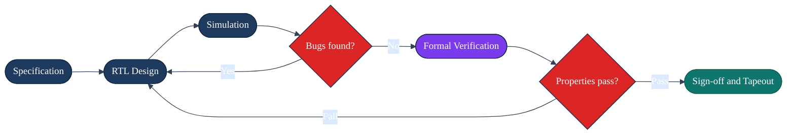
```mermaid
%%{init:{"theme":"base","themeVariables":{"primaryColor":"#1e3a5f","primaryTextColor":"#ffffff","primaryBorderColor":"#0f2540","secondaryColor":"#dbeafe","tertiaryColor":"#d1fae5","lineColor":"#334155","fontFamily":"Times New Roman","fontSize":"15px"}}}%%
flowchart LR
    A([Specification]) --> B([RTL Design])
    B --> C([Simulation])
    C --> D{Bugs found?}
    D -->|Yes| B
    D -->|No| E([Formal Verification])
    E --> F{Properties pass?}
    F -->|Fail| B
    F -->|Pass| G([Sign-off and Tapeout])
    style A fill:#1e3a5f,color:#fff,stroke:#0f2540
    style G fill:#0f766e,color:#fff,stroke:#065f46
    style D fill:#dc2626,color:#fff
    style F fill:#dc2626,color:#fff
    style E fill:#7c3aed,color:#fff
```

Despite their criticality, assertions are seldom written in sufficient quantity or quality in industrial practice. Three barriers are well-documented in the literature:

1. **Expertise barrier.** Writing concurrent SVA temporal properties requires simultaneous mastery of: the SystemVerilog language including its sampling semantics, the formal semantics of operators such as `|->`, `|=>`, and `##n`, the clocking and reset conventions of the specific design, and the microarchitectural intent of the module being specified. This combination is rare.

2. **Time cost.** Authoring, reviewing, simulating, and debugging assertion sets is manual, iterative, and slow. On large designs with hundreds of modules, the assertion authoring effort alone can take several verification engineers weeks or months.

3. **Coverage gap.** Under-specified assertion sets have poor coverage of corner cases — precisely the cases most likely to harbour latent bugs. Without automated assistance, assertion density is typically insufficient to provide meaningful formal closure.

The emergence of **large language models (LLMs)** trained on large corpora of code opens an exciting and practical new path. Models such as LLaMA 3.1, trained on billions of tokens of source code across dozens of programming and hardware description languages, have demonstrated strong generative capability for code synthesis tasks. If an LLM can be reliably fine-tuned and steered to produce high-quality SVA directly from RTL code, verification engineers gain a powerful first-pass assertion draft generator that meaningfully reduces the authoring bottleneck.

VISTA pursues exactly this vision: an automated, specification-free, end-to-end system for RTL-to-SVA generation with formal validation, accessible through an open-source toolchain and a web-based demonstration interface.

### 1.2 Problem Statement

The **VERT** corpus provides approximately 20,000 paired records of (RTL fragment, reference SVA assertions, clock metadata). It represents the largest publicly available dataset of this kind and is a natural foundation for supervised fine-tuning of an assertion generator. However, its use raises three distinct engineering challenges that prior work has not simultaneously addressed:

**Challenge 1 — Fragment-level RTL incompatibility.** VERT records consist of conditional RTL fragments — typically `always` blocks, `case` bodies, or `if`/`else` chains — extracted from larger designs. They are not self-contained, synthesizable modules. Open-source formal tools such as Yosys and SymbiYosys expect fully elaboratable module descriptions with explicit port lists, signal declarations, clock primitives, and optionally reset logic. Presenting a bare VERT fragment to such a tool results in immediate elaboration failure. This gap between the dataset format and tool requirements must be bridged by a wrapper generator — a non-trivial engineering problem because signal declarations must be inferred from the fragment text without access to the original module's context.

**Challenge 2 — Yosys SVA dialect.** The Yosys formal front-end, while powerful, supports a subset of the full IEEE 1800 SVA language. Features such as `##n` cycle delays within assertions, `$past()`, `$rose()`, `$stable()` sampled-value functions, and certain forms of sequence repetition are not supported. A model fine-tuned on VERT naturally learns to reproduce the SVA patterns it has observed, including these unsupported operators, leading to parse failures in the formal tool. A sanitization pass is required that either removes or rewrites unsupported constructs while preserving the core temporal logic of the assertion.

**Challenge 3 — Credible evaluation.** Measuring assertion quality by string similarity alone is insufficient because similar-looking assertions may have very different formal semantics, and structurally different but semantically equivalent assertions may score poorly on lexical metrics. A credible evaluation of VISTA must include: (a) a lexical similarity score (Gold Jaccard) against expert reference assertions, and (b) an independent formal correctness verdict from SymbiYosys bounded model checking. Combining these two orthogonal quality signals provides a far more reliable picture of system performance than either metric alone.

**Fig. 1.2 — VISTA system context**

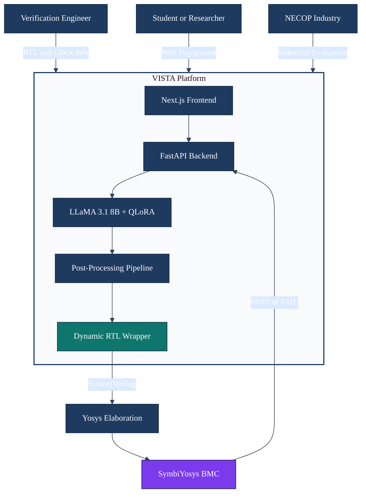
```mermaid
%%{init:{"theme":"base","themeVariables":{"primaryColor":"#1e3a5f","primaryTextColor":"#ffffff","primaryBorderColor":"#0f2540","secondaryColor":"#dbeafe","tertiaryColor":"#d1fae5","lineColor":"#334155","fontFamily":"Times New Roman","fontSize":"15px"}}}%%
flowchart TB
    VE[Verification Engineer] -->|RTL and Clock info| VISTA
    STU[Student or Researcher] -->|Web Playground| VISTA
    IND[NECOP Industry] -->|Industrial Evaluation| VISTA
    subgraph VISTA [VISTA Platform]
        WEB[Next.js Frontend]
        API[FastAPI Backend]
        LLM[LLaMA 3.1 8B + QLoRA]
        POST[Post-Processing Pipeline]
        WRAP[Dynamic RTL Wrapper]
        WEB --> API --> LLM --> POST --> WRAP
    end
    WRAP -->|SystemVerilog| YS[Yosys Elaboration]
    YS --> SBY[SymbiYosys BMC]
    SBY -->|PASS or FAIL| API
    style LLM  fill:#1e3a5f,color:#fff
    style WRAP fill:#0f766e,color:#fff
    style SBY  fill:#7c3aed,color:#fff
    style VISTA fill:#f8fafc,stroke:#1e3a5f,stroke-width:2px
```

### 1.3 Research Objectives

The objectives of VISTA are precisely defined and measurable:

1. **Fine-tune** a state-of-the-art open-source 8B-parameter language model (LLaMA 3.1) using QLoRA on the full VERT corpus (~20,000 RTL–assertion pairs), achieving convergence within 3 epochs.

2. **Implement** a dynamic RTL wrapper that transforms arbitrary VERT fragment records into elaboratable, formally verifiable SystemVerilog modules, handling both synchronous and combinational designs.

3. **Implement** a deterministic post-processing pipeline — comprising region extraction, property block splitting, expression sanitization, and greedy Yosys filtering — that guarantees tool-parseable output regardless of model output quality.

4. **Evaluate** the complete pipeline using Yosys syntax checking and SymbiYosys bounded model checking on a frozen 100-sample evaluation slice, reporting syntax success rate, formal pass rate, and Gold Jaccard similarity.

5. **Analyse** all failure modes honestly, including the identification and root-cause analysis of the single formal failure in the primary evaluation run.

6. **Deliver** a functioning web demonstration interface (Next.js frontend + FastAPI backend) for interactive use by stakeholders, reusing the same production pipeline as the evaluation script.

### 1.4 Scope and Delimitations

**Within scope:**
- VERT-format RTL fragments with clock and synchronization metadata
- Single-clock synchronous and combinational digital designs
- Open-source formal tools: Yosys, SymbiYosys with `smtbmc` backend
- Local GPU inference (no cloud model serving)
- Bounded model checking proofs (not k-induction or equivalence checking)

**Outside scope:**
- Full hierarchical SoC-level verification with multiple clock domains
- Proprietary commercial EDA tools (Synopsys VCS, Cadence JasperGold)
- Analog, mixed-signal, or timing-sensitive design verification
- Production-scale CI/CD deployment with security hardening
- Assertion generation from natural language specifications or waveforms

### 1.5 Original Contributions

This project makes the following original technical contributions:

1. **Dynamic RTL Wrapper with intelligent signal inference** — Includes Verilog keyword filtering, English stop-word removal for model-generated tokens, explicit width inference from RTL declarations, and a `_started` flip-flop for first-cycle assertion gating that prevents vacuous results under BMC.

2. **Five-stage deterministic post-processing pipeline** — Uniquely combines region extraction, balanced parenthesis assertion parsing, property block regex splitting, expression sanitization (with seven distinct transformation rules), and a greedy incremental Yosys filter that maximises clause retention while guaranteeing parseability.

3. **Reproducible evaluation framework** — Per-run frozen directories with JSON manifests, prompt template snapshots, and adapter path logging ensure exact result reproduction.

4. **Honest failure analysis** — Documented root-cause analysis of the single formal failure showing that Gold Jaccard = 1.0 is insufficient as a correctness proxy when RTL contains four-valued logic constructs.

5. **Integrated full-stack demonstration** — The FastAPI backend directly imports the evaluation pipeline (no code duplication), ensuring that web-demo results are identical to paper results.

### 1.6 Report Organisation

Chapter 2 surveys the related literature across formal hardware verification, assertion mining, LLM-assisted code generation, relevant datasets, parameter-efficient fine-tuning, and open-source formal tools, closing with a gap analysis that positions VISTA. Chapter 3 presents system requirements and specifications, including stakeholder analysis, functional and non-functional requirements, and use case descriptions. Chapter 4 provides a detailed account of the proposed solution, covering each system component from training through the web interface, supported by UML diagrams. Chapter 5 presents and analyses all experimental results, including per-metric commentary, a case study of the formal failure, and comparison with related work. Chapter 6 concludes the report and outlines a structured future research roadmap.

---

# CHAPTER II

## Chapter 2: Literature Survey

### 2.1 Hardware Verification Overview

The verification of digital hardware has been an active research and engineering discipline since the 1970s, when Hoare logic and temporal logic were first proposed as frameworks for reasoning about program and circuit correctness. Over five decades, the field has evolved from manual inspection and directed simulation to sophisticated automated techniques capable of handling designs with billions of states.

At the highest level, hardware verification techniques partition into three families: simulation-based, formal, and hybrid approaches that combine elements of both.

**Simulation-based verification** applies input stimuli to a simulation model of the RTL design and checks outputs. The earliest form was directed simulation, where human engineers wrote specific input sequences targeting known design corner cases. This was succeeded by **constrained random verification (CRV)**, where a constraint solver generates random inputs satisfying designer-specified constraints, and the simulation is run until functional coverage goals are met. The coverage model — typically expressed using SystemVerilog covergroups and coverpoints — guides the random generation process towards unexplored regions of the design's input space. CRV has become the industrial standard and is supported by mature commercial simulators (Synopsys VCS, Cadence Xcelium, Mentor ModelSim).

The fundamental limitation of simulation is **incompleteness**: no matter how extensive the testbench, simulation only exercises a finite subset of the design's infinite input space. Bugs requiring improbable or long input sequences systematically evade simulation-based testing.

**Formal verification** addresses incompleteness by exhaustive state-space analysis. The primary technique applicable to RTL is **model checking**, where an algorithmic procedure determines whether a temporal logic property holds over all reachable states of a finite-state model of the design. Three main algorithms are used in industrial practice:

- **Bounded model checking (BMC):** Unrolls the design's transition relation for *k* steps and encodes the question "does a property violation exist within k cycles?" as a SAT or SMT formula. Efficient since the 1990s following the invention of DPLL-based SAT solving.
- **k-induction:** Extends BMC to prove that if no violation exists in any sequence of k steps, and if the design's invariants are established at the start, then no violation can exist at all. Provides complete proofs for certain property classes.
- **Interpolation and IC3/PDR:** More recent techniques that construct compact inductive invariants abstractly, enabling proofs of deep temporal properties that would require impractically large BMC bounds.

**Fig. 2.1 — Taxonomy of assertion generation approaches**

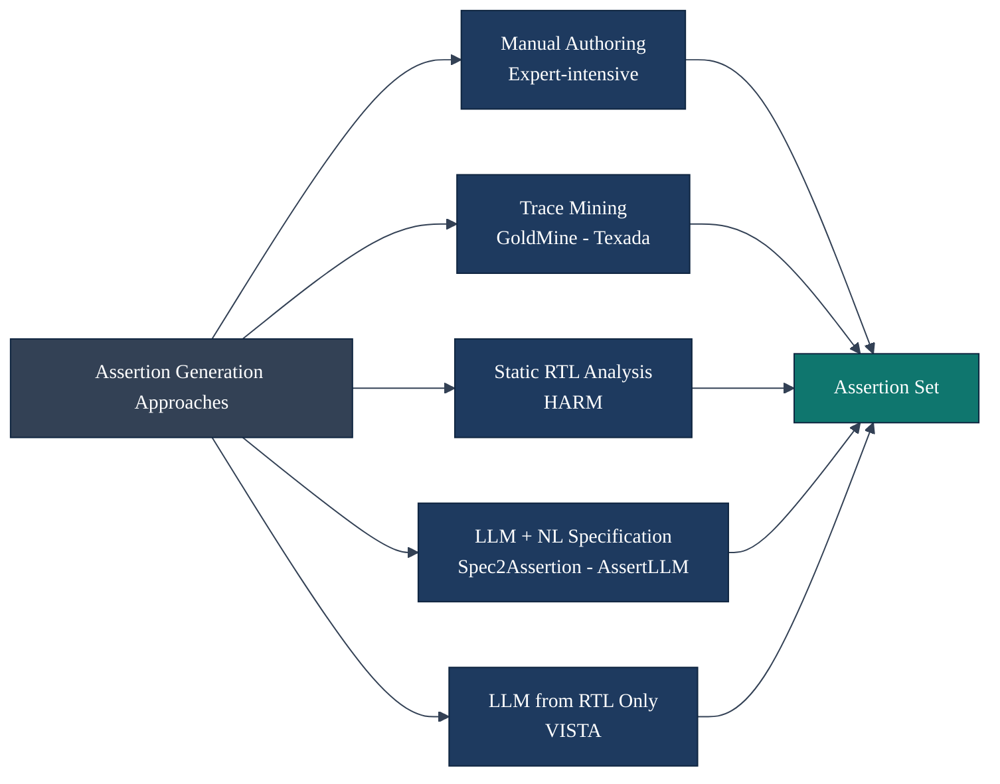
```mermaid
%%{init:{"theme":"base","themeVariables":{"primaryColor":"#1e3a5f","primaryTextColor":"#ffffff","primaryBorderColor":"#0f2540","secondaryColor":"#dbeafe","tertiaryColor":"#d1fae5","lineColor":"#334155","fontFamily":"Times New Roman","fontSize":"15px"}}}%%
flowchart LR
    ROOT[Assertion Generation Approaches]
    ROOT --> M[Manual Authoring
Expert-intensive]
    ROOT --> TM[Trace Mining
GoldMine - Texada]
    ROOT --> SA[Static RTL Analysis
HARM]
    ROOT --> NL[LLM + NL Specification
Spec2Assertion - AssertLLM]
    ROOT --> RL[LLM from RTL Only
VISTA]
    M  --> OUT[Assertion Set]
    TM --> OUT
    SA --> OUT
    NL --> OUT
    RL --> OUT
    style RL  fill:#1e3a5f,color:#fff,stroke:#0f2540
    style OUT fill:#0f766e,color:#fff
    style ROOT fill:#334155,color:#fff
```

Formal verification tools in common academic use include **Yosys** (open-source synthesis and formal front-end), **SymbiYosys** (orchestration front-end for multiple proof backends), **CBMC** (C/Verilog bounded model checker), and **JasperGold** (commercial formal verification platform by Cadence). In this project, Yosys and SymbiYosys form the formal verification layer due to their open availability, active maintenance, and support for SystemVerilog.

The combination of simulation and formal verification — using simulation for broad functional coverage and formal for property proof of critical safety and security properties — is the current best practice in safety-critical hardware development. VISTA targets the assertion authoring step, which is the common prerequisite for both paradigms.

### 2.2 SystemVerilog Assertions — Language and Semantics

**SystemVerilog Assertions (SVA)** are standardised in IEEE 1800. They provide two categories of assertions:

**Immediate assertions** evaluate a Boolean expression at a specific simulation point (analogous to runtime assertions in software). They are simple but cannot express temporal relationships across clock cycles.

**Concurrent assertions** evaluate properties over sequences of clock cycles using a rich temporal language. They are the primary tool for formal verification. A typical concurrent assertion has the structure:

```
property <name>;
    @(<edge> <clock>) disable iff (<reset>)
    <antecedent> |-> <consequent>;
endproperty
assert property (<name>);
```

The temporal operators of primary importance are:

| Operator | Meaning |
|----------|---------|
| `\|->` | Overlapping implication: if antecedent holds at cycle t, consequent must hold at cycle t |
| `\|=>` | Non-overlapping implication: if antecedent holds at cycle t, consequent must hold at cycle t+1 |
| `##n` | Advance n clock cycles |
| `##[m:n]` | Advance between m and n cycles (range) |
| `[*n]` | Repeat exactly n times |
| `[*m:n]` | Repeat between m and n times |
| `$past(x, n)` | Value of signal x, n cycles ago |
| `$rose(x)` | True if x transitioned 0→1 this cycle |
| `$fell(x)` | True if x transitioned 1→0 this cycle |
| `disable iff` | Suspend checking during condition (typically reset) |

**Fig. 2.2 — SVA concurrent property syntax structure**

```
property SafeWrite;
    @(posedge clk)       ← Clocking event (sampling edge)
    disable iff (rst)    ← Reset guard (suspend during reset)
    (wr_en && !full)     ← Antecedent (trigger condition)
    |=>                  ← Non-overlapping implication
    (count == $past(count) + 1);  ← Consequent (what must hold next cycle)
endproperty

assert property (SafeWrite);  ← Instantiate and check
```

The **Yosys formal front-end** supports a functional subset of concurrent SVA. Specifically, it handles basic `|->` and `|=>` implications, `disable iff`, and simple Boolean consequents and antecedents. It does not support `##n` cycle delays inside assertion bodies, `$past()`, `$rose()`, `$fell()`, `$stable()`, complex sequence repetition, or certain forms of system function calls within properties. This dialect gap is a key engineering constraint that VISTA's post-processing pipeline must navigate.

#### Evaluation Metric: Gold Jaccard Similarity

The **Gold Jaccard** metric used in VISTA evaluation provides a token-set-based measure of assertion similarity. For two assertion strings A and B, it is defined as:

$$J_{gold}(A, B) = \frac{|T(A) \cap T(B)|}{|T(A) \cup T(B)|}$$

where $T(X)$ denotes the set of alphanumeric tokens extracted from assertion string X by whitespace and punctuation splitting. This metric is invariant to token reordering, making it a useful proxy for semantic similarity when the assertion vocabulary — comprising signal names, operator keywords, and structural identifiers — is shared between generated and reference assertions. A score of 1.0 indicates perfect token-set overlap; a score of 0.0 indicates no shared tokens. The choice of a token-set metric rather than a string-edit metric is deliberate: SVA assertions can express the same logical property with different operator orderings or variable name bindings, and a strict string match would unfairly penalise semantically correct but lexically divergent outputs.

### 2.3 Classical Assertion Mining Techniques

Before the advent of large language models, the dominant paradigm for automated assertion generation was **data mining from simulation traces** combined with **static analysis of RTL structure**. This section reviews the three most influential classical approaches and identifies the fundamental limitations that motivate an LLM-based alternative.

**GoldMine** (Garg et al., 2008) represents the state of the art in simulation-trace mining. It applies a decision-tree learning algorithm to simulation waveform databases, discovering candidate Boolean invariants and temporal implications over signal transitions. GoldMine has been demonstrated on realistic industrial RTL benchmarks and can generate thousands of candidate assertions in a single run. Its key limitation is the **closed-world assumption**: the tool can only discover properties that are exercised within the provided simulation traces. Corner cases absent from simulation — precisely the cases that matter most for correctness — cannot be captured. Furthermore, GoldMine generates a large proportion of **weak or vacuous assertions** (properties that hold trivially because their antecedent is never activated) that require extensive manual review before they are useful for formal analysis.

**Texada** (Lemieux et al., 2015) applies specification mining algorithms from the software verification community to hardware simulation traces. It implements the LTLFO algorithm, which learns linear temporal logic formulas by pattern-matching against execution sequences. Texada generalises GoldMine in the class of temporal formulas it can discover, but inherits the same closed-world limitation. Additionally, the temporal logic formulas it produces are not directly expressible in synthesizable SVA, requiring a non-trivial manual translation step before they can be used with commercial or open-source formal tools.

**HARM** (Hassan et al.) and related static analysis tools perform **data-flow analysis** on RTL netlists to identify structural relationships — for example, that a multiplexer output is always driven by one of its registered inputs, or that a counter register is bounded to a specific numerical range. These structural properties are sound by construction but narrow in scope: they cannot express complex temporal behaviors, sequenced protocol handshakes, or cross-module properties without significant domain-specific customisation.

The common thread across all classical mining approaches is that they characterise what the design **does** in observed execution, not what it **must** guarantee by specification. They are inherently reactive rather than prescriptive, incapable of generating assertions for behaviors not represented in their analysis corpus. Table 2.1 summarises the comparative limitations.

| Tool | Input Required | Temporal Scope | SVA Output | Scales to Unseen RTL |
|------|----------------|----------------|------------|----------------------|
| GoldMine | Simulation traces | Boolean / 1-cycle | Partial | No |
| Texada | Simulation traces | LTL formulas | No (manual) | No |
| HARM | RTL netlist | Structural only | Partial | Limited |
| **VISTA** | RTL source only | Full SVA | Yes | Yes |

*Table 2.1 — Comparison of classical assertion mining approaches versus VISTA*

### 2.4 Large Language Models for Code Generation

Large language models (LLMs) are transformer-based neural networks trained on massive corpora of text and source code using self-supervised objectives — principally next-token prediction over tokenised sequences. At sufficient parameter scale, generally above 7–13 billion parameters, these models exhibit emergent capabilities for code synthesis, completion, and syntactic transformation across a broad range of programming languages and domain-specific languages.

#### 2.4.1 The Transformer Architecture

The foundational LLM architecture — the **Transformer** (Vaswani et al., 2017) — uses multi-head self-attention to model long-range dependencies between tokens in the input sequence. For each attention head, the mechanism computes a weighted sum of value vectors, with weights determined by the scaled dot-product similarity between query and key vectors across all sequence positions:

$$\text{Attention}(Q, K, V) = \text{softmax}\!\left(\frac{QK^{\top}}{\sqrt{d_k}}\right)\!V$$

where $Q$, $K$, and $V$ are the query, key, and value matrices respectively, and $d_k$ is the key dimension used for scale normalisation. This formulation enables the model to attend simultaneously to arbitrarily distant context tokens — a property that is crucial for RTL code generation, where module port declarations, parameter definitions, and signal names introduced many lines earlier must be consistently referenced in assertion bodies.

Multiple attention heads are computed in parallel and their outputs concatenated, allowing the model to simultaneously attend to different types of relational structure (e.g., syntactic dependencies, semantic co-references, temporal ordering constraints) within the same forward pass.

#### 2.4.2 LLaMA 3.1 as the Foundation Model

**LLaMA 3.1** (Meta AI, 2024) is a family of open-weight language models trained on a diverse corpus comprising internet text, academic publications, and source code in multiple programming languages. The 8B-parameter variant demonstrates competitive performance with considerably larger proprietary models on standard code generation benchmarks, while remaining practical for fine-tuning on consumer-grade GPU hardware. Its open availability under a permissive research licence — including the public release of tokenizer vocabularies, model weights, and training hyperparameter recommendations — makes it an appropriate foundation for domain-specific adaptation in a resource-constrained academic setting such as VISTA.

This allows the model to attend simultaneously to distant context tokens — crucial for code generation tasks where function signatures, type declarations, and variable names defined many lines earlier must be consistently referenced.

**LLaMA 3.1**, developed by Meta AI, is a family of open-source language models trained on a diverse corpus of internet text, books, and code. The 8B variant contains 8 billion parameters and demonstrates competitive performance with much larger proprietary models on code generation benchmarks. Its open availability and the public release of its tokenizer and model weights make it an ideal foundation for domain-specific fine-tuning.

For hardware description language code generation, LLMs face specific challenges:

- RTL syntax is highly structured and any error (missing semicolon, incorrect keyword) renders the module un-parseable.
- RTL semantics are **clock-synchronous** — the temporal relationship between statements depends on the clocking model, which is implicit in the code structure but not in natural language descriptions.
- SVA temporal operators have precise mathematical semantics that differ subtly from general programming control flow.

Domain-specific fine-tuning on RTL–assertion pairs is the most effective known strategy for addressing these challenges.

### 2.5 LLM-Assisted Hardware Verification

The application of LLMs to hardware verification is an active and rapidly evolving research area. The approaches span a spectrum from purely specification-driven to purely RTL-driven.

**Spec2Assertion** (arXiv:2505.07995) translates natural language specifications into SVA by decomposing specification sentences into cause-and-effect structures and mapping them to implication patterns. This approach produces high-quality assertions for well-documented protocol designs where written specifications are available and accurate. Its fundamental limitation is its strict dependence on natural language specifications, which are frequently incomplete, ambiguous, or simply unavailable in real-world development workflows, particularly for legacy IP blocks or internally developed designs.

**AssertLLM** extends specification-driven generation by incorporating waveform traces as additional context alongside the natural language specification. The waveform context helps the model infer dynamic behaviors that the specification fails to explicitly describe. While this improves assertion coverage, the dependency on both specifications and waveform traces significantly limits the scalability and generality of the approach.

**AssertionForge** (NVlabs) uses knowledge graphs to align design intent — extracted from the RTL structure and associated documentation — with the RTL implementation. By building a graph of design concepts and their RTL realizations, the system can detect inconsistencies between specification and implementation and generate targeted assertions. This approach requires substantial infrastructure investment and does not generalise easily outside the domains for which the knowledge graph was constructed.

**AssertionBench** (Halpern et al., arXiv:2406.18627) is a standardized benchmark dataset rather than a generation approach. It provides 100 formally verified Verilog modules with expert-written reference assertions, enabling reproducible comparison across assertion generation methods. Studies using AssertionBench demonstrate that domain-fine-tuned variants of LLaMA 3.1 outperform general-purpose LLMs on assertion generation tasks, providing direct motivation for VISTA's fine-tuning approach.

**VERT** (the dataset used by VISTA) focuses specifically on providing paired RTL-SVA training data at scale (~20,000 samples), enabling supervised fine-tuning without relying on specification documents. The VERT paper demonstrates that a model fine-tuned on this corpus can learn to reproduce the assertion patterns associated with common RTL idioms.

**Fig. 2.3 — Comparative LLM-assisted verification approaches**

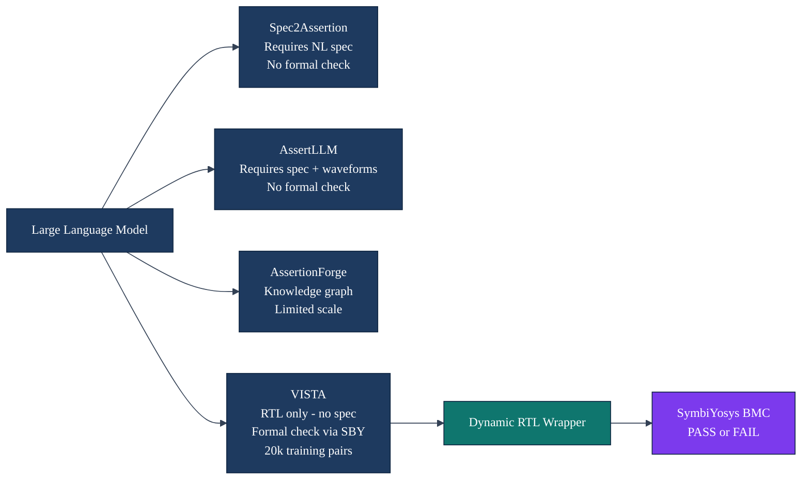
```mermaid
%%{init:{"theme":"base","themeVariables":{"primaryColor":"#1e3a5f","primaryTextColor":"#ffffff","primaryBorderColor":"#0f2540","secondaryColor":"#dbeafe","tertiaryColor":"#d1fae5","lineColor":"#334155","fontFamily":"Times New Roman","fontSize":"15px"}}}%%
flowchart LR
    LLM[Large Language Model]
    LLM --> S2A["Spec2Assertion
Requires NL spec
No formal check"]
    LLM --> ALM["AssertLLM
Requires spec + waveforms
No formal check"]
    LLM --> AFG["AssertionForge
Knowledge graph
Limited scale"]
    LLM --> VST["VISTA
RTL only - no spec
Formal check via SBY
20k training pairs"]
    VST --> WRAP[Dynamic RTL Wrapper]
    WRAP --> FORMAL[SymbiYosys BMC
PASS or FAIL]
    style VST   fill:#1e3a5f,color:#fff
    style WRAP  fill:#0f766e,color:#fff
    style FORMAL fill:#7c3aed,color:#fff
```

### 2.6 Datasets and Benchmarks

**VERT Dataset:** The VERT corpus provides RTL–assertion pairs from a diverse range of hardware IP including combinational logic blocks, finite state machines, arithmetic units, counters, FIFOs, and interface controllers. Each record pairs a conditional RTL fragment (typically 20–200 lines of SystemVerilog or Verilog) with one or more reference SVA property blocks, a synchronous flag, and clock metadata. The fragment-level granularity is the defining characteristic of VERT — samples are not self-contained modules, requiring VISTA's wrapper to bridge the gap to formal tool requirements. The corpus contains approximately 20,000 samples, split 95/5 for training and validation in VISTA's fine-tuning configuration.

**AssertionBench:** The AssertionBench dataset (Halpern et al.) provides 100 complete, formally verified Verilog modules with expert-authored assertions. It enables rigorous comparison of assertion generation methods on realistically sized designs. Unlike VERT, AssertionBench modules are self-contained and do not require wrapping, making it suitable for evaluating models on production-quality RTL. VISTA is evaluated on VERT because VERT's scale is necessary for supervised fine-tuning; future work will evaluate VISTA's generalization to AssertionBench.

**OpenCores and RISC-V Cores:** These open-source IP archives — opencores.org and the RISC-V ecosystem — provide realistic, full-module RTL designs for qualitative evaluation. They cover a wide range of design patterns including pipelines, cache controllers, bus protocol masters and slaves, and encryption engines, making them valuable for stress-testing assertion generators on out-of-distribution designs.

### 2.7 Parameter-Efficient Fine-Tuning

Full fine-tuning of a large language model — updating all parameters on a task-specific dataset — requires a GPU memory footprint proportional to the model size multiplied by the optimizer state size. For LLaMA 3.1 (8B parameters), full BF16 fine-tuning with AdamW optimizer requires approximately 80 GB of GPU memory, placing it out of reach of most academic laboratory configurations.

**Parameter-Efficient Fine-Tuning (PEFT)** methods address this by selectively updating a small subset of parameters while keeping the bulk of the model frozen. The most widely used PEFT technique is **LoRA** (Low-Rank Adaptation, Hu et al., ICLR 2022), which adds small trainable adapter matrices to the frozen pre-trained weight matrices. For a weight matrix W₀ ∈ ℝ^(d×k), LoRA represents the update as:

$$\Delta W = \frac{\alpha}{r} \cdot B \cdot A$$

where A ∈ ℝ^(r×k), B ∈ ℝ^(d×r) are the trainable adapter matrices, r ≪ min(d,k) is the adapter rank, and α is a scaling hyperparameter. The effective weight during forward pass is:

$$W' = W_0 + \Delta W = W_0 + \frac{\alpha}{r} \cdot BA$$

By initialising A from a Gaussian distribution and B as zeros, ΔW = 0 at initialisation, ensuring that the adapter begins training from the pre-trained model's capability level.

**QLoRA** (Dettmers et al., arXiv:2305.14314) combines LoRA with **4-bit NF4 quantization** of the base model weights, further reducing memory requirements. The NF4 (Normal Float 4) data type distributes its quantization levels according to the normal distribution of pre-trained weight values, minimising quantization error for typical LLM weight distributions. With 4-bit quantization, LLaMA 3.1 8B requires approximately 4–5 GB of GPU memory for the base weights, enabling QLoRA fine-tuning on a single consumer or research-grade GPU.

**Fig. 2.4 — QLoRA adapter mathematics**

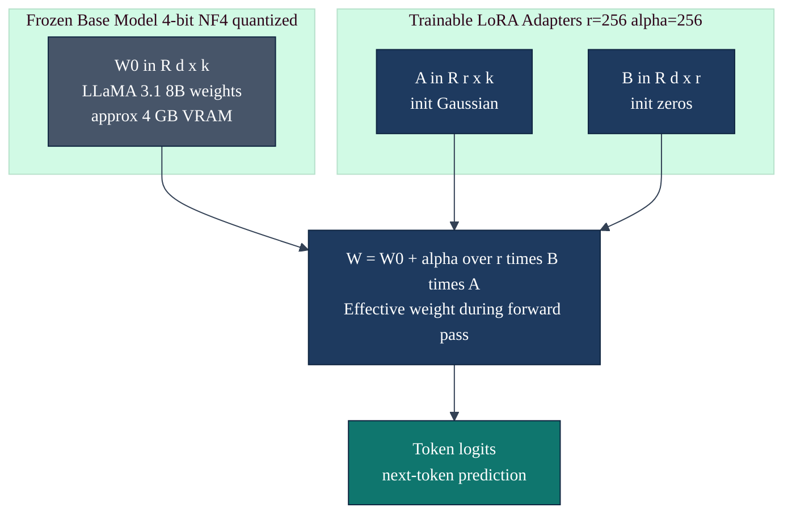
```mermaid
%%{init:{"theme":"base","themeVariables":{"primaryColor":"#1e3a5f","primaryTextColor":"#ffffff","primaryBorderColor":"#0f2540","secondaryColor":"#dbeafe","tertiaryColor":"#d1fae5","lineColor":"#334155","fontFamily":"Times New Roman","fontSize":"15px"}}}%%
flowchart TB
    subgraph BASE [Frozen Base Model  4-bit NF4 quantized]
        W0[W0 in R d x k
LLaMA 3.1 8B weights
approx 4 GB VRAM]
    end
    subgraph ADAPTERS [Trainable LoRA Adapters  r=256  alpha=256]
        A[A in R r x k
init Gaussian]
        B[B in R d x r
init zeros]
    end
    W0 --> MERGE[W = W0 + alpha over r times B times A
Effective weight during forward pass]
    A  --> MERGE
    B  --> MERGE
    MERGE --> OUT[Token logits
next-token prediction]
    style W0    fill:#475569,color:#fff
    style MERGE fill:#1e3a5f,color:#fff
    style OUT   fill:#0f766e,color:#fff
```

**Unsloth** is an optimized training library for LLaMA-family models that provides custom CUDA kernels for attention computation, embedding operations, and gradient accumulation, achieving 2–5× training speed improvements over vanilla HuggingFace Trainer implementations. VISTA uses Unsloth as the training backend, leveraging its `FastLanguageModel` and `UnslothTrainer` APIs.

### 2.8 Open-Source Formal Verification Tools

**Yosys** (YosysHQ) is the leading open-source RTL synthesis and formal verification framework. For formal use, Yosys parses SystemVerilog and Verilog under the `-formal` flag, performs RTL elaboration (port resolution, parameter expansion, generate block unfolding), applies optimisation passes, and emits the design in internal formats (e.g., BLIF, BTOR2) consumed by proof backends. The `read_verilog -formal` command enables SVA concurrent assertion parsing; property statements within the design are preserved as formal properties rather than being compiled away.

**Fig. 2.5 — Open-source formal verification tool stack**

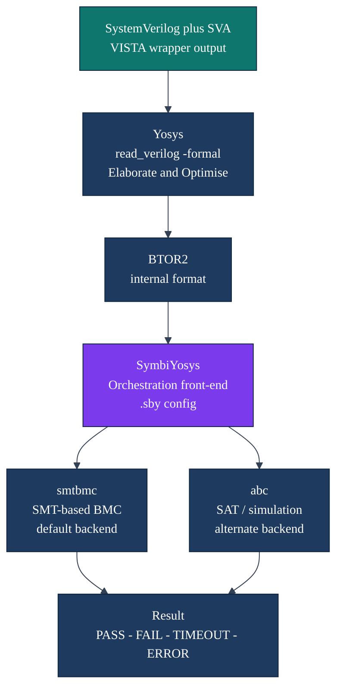
```mermaid
%%{init:{"theme":"base","themeVariables":{"primaryColor":"#1e3a5f","primaryTextColor":"#ffffff","primaryBorderColor":"#0f2540","secondaryColor":"#dbeafe","tertiaryColor":"#d1fae5","lineColor":"#334155","fontFamily":"Times New Roman","fontSize":"15px"}}}%%
flowchart TB
    SV[SystemVerilog plus SVA
VISTA wrapper output]
    YS[Yosys
read_verilog -formal
Elaborate and Optimise]
    BTOR[BTOR2
internal format]
    SBY[SymbiYosys
Orchestration front-end
.sby config]
    SMT[smtbmc
SMT-based BMC
default backend]
    ABC[abc
SAT / simulation
alternate backend]
    RES[Result
PASS - FAIL - TIMEOUT - ERROR]
    SV   --> YS
    YS   --> BTOR
    BTOR --> SBY
    SBY  --> SMT
    SBY  --> ABC
    SMT  --> RES
    ABC  --> RES
    style SV  fill:#0f766e,color:#fff
    style RES fill:#1e3a5f,color:#fff
    style SBY fill:#7c3aed,color:#fff
```

**SymbiYosys** (sby) orchestrates proof flows by reading a configuration file (`.sby`) that specifies the proof mode, backend engine, and source files. VISTA uses `smtbmc` (SMT-based bounded model checking) as the backend, with a default depth of 8–16 cycles sufficient to cover the single-step temporal implications in typical VERT-style assertions.

### 2.9 Gap Analysis and Project Positioning

**Table 2.1 — Comparison of assertion generation approaches**

| Approach | Spec Required | Handles Fragments | Formal Evaluation | Training Scale |
|----------|:---:|:---:|:---:|:---:|
| Manual authoring | N/A | Full module | Yes (by engineer) | N/A |
| GoldMine / Texada | No | Needs simulation | No | N/A |
| HARM | No | Full netlist | No | N/A |
| Spec2Assertion | Yes (NL) | Full module | No | Small |
| AssertLLM | Yes + waves | Full module | No | Small |
| AssertionForge | Partial | Full module | No | Small |
| AssertionBench LLMs | Varies | Full module | Partial | 100 samples |
| **VISTA** | **No** | **Fragment→wrapped** | **Yes (SymbiYosys)** | **~20k pairs** |

VISTA's defining advantage is its unique combination: no specification required, fragment-level RTL handled via automatic wrapping, and formal evaluation as a first-class pipeline stage, all at the scale enabled by the VERT corpus. No existing published work achieves all four of these simultaneously.

---

# CHAPTER III

## Chapter 3: System Requirements and Specifications

### 3.1 Stakeholder Analysis

VISTA serves four distinct stakeholder groups whose needs shape the system's functional and non-functional requirements:

**Verification Engineers (Primary Users):** Industry professionals responsible for designing and executing verification plans for RTL IP blocks. Their primary need is a reliable tool that produces high-quality SVA drafts, reducing the time from RTL freeze to assertion coverage closure. They require: (a) high assertion correctness rates, (b) formal verification feedback, (c) predictable and explainable output, and (d) integration into existing verification flows.

**Students and Academic Researchers:** Final-year and postgraduate students studying hardware verification who use VISTA as a learning and research tool. They need: (a) an accessible web interface, (b) readable intermediate outputs (raw model output, wrapper SV), and (c) documented evaluation methodology for reproducibility.

**Industrial Partner (NECOP):** The industrial mentoring organization that evaluates VISTA's applicability to their design flows. Their requirements centre on: (a) correctness and reliability on representative IP, (b) privacy (no RTL upload to cloud), and (c) potential for integration with commercial tools.

**Academic Supervisors:** Research supervisors who evaluate the project's scientific contribution. Their requirements are: (a) reproducible experimental results with frozen evaluation runs, (b) honest failure analysis, and (c) clearly defined metrics aligned with the literature.

### 3.2 Functional Requirements

**Table 3.1 — Functional requirements specification**

| ID | Requirement | Priority | Verification |
|----|-------------|----------|-------------|
| FR-01 | Accept RTL text, synchronous flag, and clock string as inputs | Must Have | Integration test |
| FR-02 | Load and apply the fine-tuned LLaMA 3.1 adapter (checkpoint-891) | Must Have | Model output inspection |
| FR-03 | Format RTL into prompt template v2 and run inference | Must Have | Unit test |
| FR-04 | Extract the assertion region from raw model output | Must Have | Unit test with known outputs |
| FR-05 | Split raw output into individual property blocks | Must Have | Unit test |
| FR-06 | Sanitize assertion expressions for Yosys dialect compatibility | Must Have | Yosys parse test |
| FR-07 | Apply greedy Yosys filter to maximise valid clause count | Should Have | Clause count comparison |
| FR-08 | Generate a complete SystemVerilog wrapper module | Must Have | Yosys elaboration test |
| FR-09 | Run SymbiYosys BMC and record pass/fail/timeout/error | Must Have | JSON manifest inspection |
| FR-10 | Compute Gold Jaccard similarity against reference assertions | Must Have | Unit test on VERT samples |
| FR-11 | Write per-run evaluation JSON manifest | Must Have | File existence check |
| FR-12 | Expose REST API endpoint POST /api/generate | Should Have | API integration test |
| FR-13 | Provide web interface with Monaco RTL editor | Should Have | Manual UX review |
| FR-14 | Support batch evaluation over VERT JSONL files with --limit flag | Must Have | Evaluation script output |
| FR-15 | Display raw model output, assertions, and wrapper in UI tabs | Should Have | Manual UX review |

**Fig. 3.1 — UML Use Case Diagram**

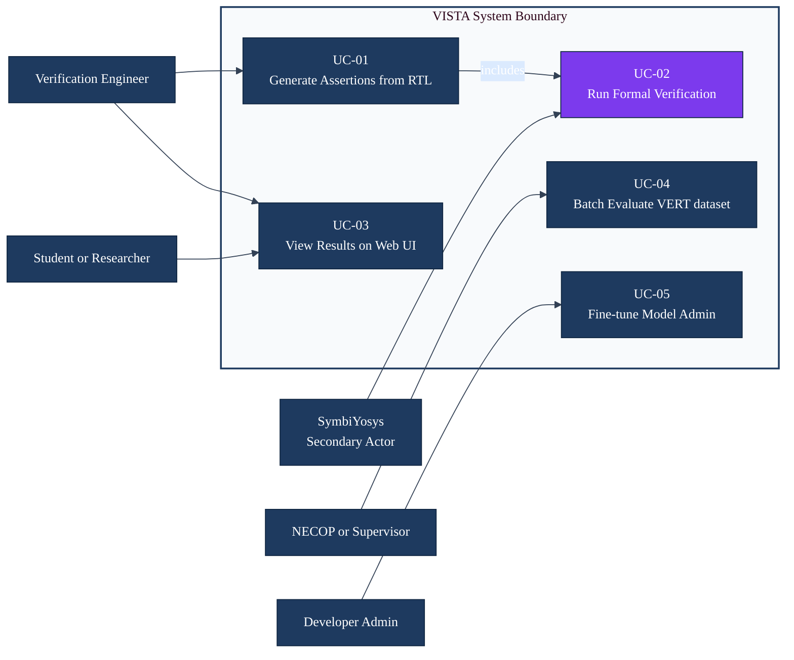
```mermaid
%%{init:{"theme":"base","themeVariables":{"primaryColor":"#1e3a5f","primaryTextColor":"#ffffff","primaryBorderColor":"#0f2540","secondaryColor":"#dbeafe","tertiaryColor":"#d1fae5","lineColor":"#334155","fontFamily":"Times New Roman","fontSize":"15px"}}}%%
flowchart LR
    VE[Verification Engineer]
    STU[Student or Researcher]
    SUP[NECOP or Supervisor]
    DEV[Developer Admin]
    SBY2[SymbiYosys
Secondary Actor]
    subgraph SYS [VISTA System Boundary]
        UC1[UC-01
Generate Assertions from RTL]
        UC2[UC-02
Run Formal Verification]
        UC3[UC-03
View Results on Web UI]
        UC4[UC-04
Batch Evaluate VERT dataset]
        UC5[UC-05
Fine-tune Model Admin]
        UC1 -->|includes| UC2
    end
    VE   --> UC1
    VE   --> UC3
    STU  --> UC3
    SUP  --> UC4
    DEV  --> UC5
    SBY2 --> UC2
    style UC1 fill:#1e3a5f,color:#fff
    style UC2 fill:#7c3aed,color:#fff
    style SYS fill:#f8fafc,stroke:#1e3a5f,stroke-width:2px
```

### 3.3 Non-Functional Requirements

**Table 3.2 — Non-functional requirements specification**

| ID | Category | Requirement | Metric / Target |
|----|----------|-------------|----------------|
| NFR-01 | Reproducibility | Greedy deterministic decoding; logged adapter path | Exact match across independent runs |
| NFR-02 | Performance | Interactive inference latency (single sample) | < 30 seconds on RTX-class GPU |
| NFR-03 | Privacy / Security | RTL processed locally; no upload to external servers | Confirmed by deployment config |
| NFR-04 | Maintainability | Single evaluation entry-point script | One-command evaluation |
| NFR-05 | Portability | All formal tools available on Linux (OSS CAD Suite) | Verified on Ubuntu 22.04 |
| NFR-06 | Reliability | Greedy filter must always return a parseable wrapper | 0 Yosys elaboration failures |
| NFR-07 | Usability | Web interface usable without CLI knowledge | Manual UX walkthrough |
| NFR-08 | Correctness | Evaluation pipeline must match paper results exactly | JSON manifests reproducible |

### 3.4 Use Case Descriptions

**Table 3.3 — Use Case UC-01: Generate Assertions**

| Field | Description |
|-------|-------------|
| **Use Case ID** | UC-01 |
| **Name** | Generate Assertions from RTL |
| **Actor** | Verification Engineer |
| **Precondition** | Model loaded (checkpoint-891); Yosys/SymbiYosys installed |
| **Main Success Scenario** | 1. Engineer provides RTL text, synchronous flag, clock string<br>2. System formats input into prompt template v2<br>3. LLaMA 3.1 (fine-tuned) generates raw assertion output<br>4. Post-processing pipeline extracts and sanitizes assertions<br>5. Greedy filter selects maximum valid clause set<br>6. Dynamic wrapper generates elaboratable SV module<br>7. SymbiYosys performs BMC; result is PASS<br>8. System returns assertions, wrapper, and formal verdict |
| **Alternative Flows** | A1: All clauses dropped by filter → fallback to assert(1'b1)<br>A2: SymbiYosys times out → status = timeout<br>A3: Yosys parse fails → error logged, pipeline continues |
| **Postcondition** | Assertions and formal verdict written to output / returned via API |

**Table 3.4 — Use Case UC-02: Run Formal Verification**

| Field | Description |
|-------|-------------|
| **Use Case ID** | UC-02 |
| **Name** | Run SymbiYosys Bounded Model Checking |
| **Actor** | SymbiYosys (Secondary Actor, invoked by system) |
| **Precondition** | Wrapper SV and .sby config file generated |
| **Main Success Scenario** | 1. System writes wrapper .sv and run.sby to case directory<br>2. SymbiYosys is invoked with run.sby as argument<br>3. Yosys elaborates the wrapper; smtbmc encodes BMC problem<br>4. SAT/SMT solver checks all assert statements to depth 8<br>5. All asserts satisfied → SBY returns PASS<br>6. Result logged to JSON manifest |
| **Alternative Flows** | A1: Assert violated → FAIL + counterexample trace written<br>A2: Solver times out → TIMEOUT logged<br>A3: Parse error → ERROR logged (prevented by greedy filter) |
| **Postcondition** | Formal verdict and log stored in case_NNN/ directory |

### 3.5 Data Specification

Each VERT training and evaluation record is a JSON object with the following fields:

**Table 4.1 — VERT dataset field specification**

| Field | Type | Description | Example |
|-------|------|-------------|---------|
| `Code` | String | RTL fragment (always/case/if block) | `always @(posedge clk) if (rst) out <= 0;` |
| `Assertion` | String | Reference SVA property blocks | `property P; @(posedge clk) rst \|-> out==0; endproperty` |
| `Synchronous` | Boolean | True if design uses clocked flip-flops | `True` |
| `Clock` | String / null | Clock specification including edge | `"posedge clk"` or `"negedge clk_enable_15"` |

The dataset is stored in JSONL format (one JSON object per line) at `data/VERT.jsonl`. The evaluation slice uses the first 100 records (indices 0–99) of this file. All training uses the remaining ~19,900 records.

### 3.6 Interface Specifications

**REST API Endpoints:**

| Endpoint | Method | Description |
|----------|--------|-------------|
| `/api/health` | GET | Returns model readiness, adapter path, formal tool availability |
| `/api/generate` | POST | Accepts RTL input; returns assertions, wrapper, and formal verdict |

**API Request Schema (POST /api/generate):**

```
{
  "code":           string   — RTL fragment text
  "synchronous":    boolean  — True for clocked designs
  "clock":          string?  — e.g. "posedge clk" or null
  "max_new_tokens": integer  — default 512, range [64, 1024]
  "run_formal":     boolean  — default true
  "depth":          integer  — BMC depth, default 8, range [1, 32]
}
```

**Fig. 3.2 — UML Component Diagram**

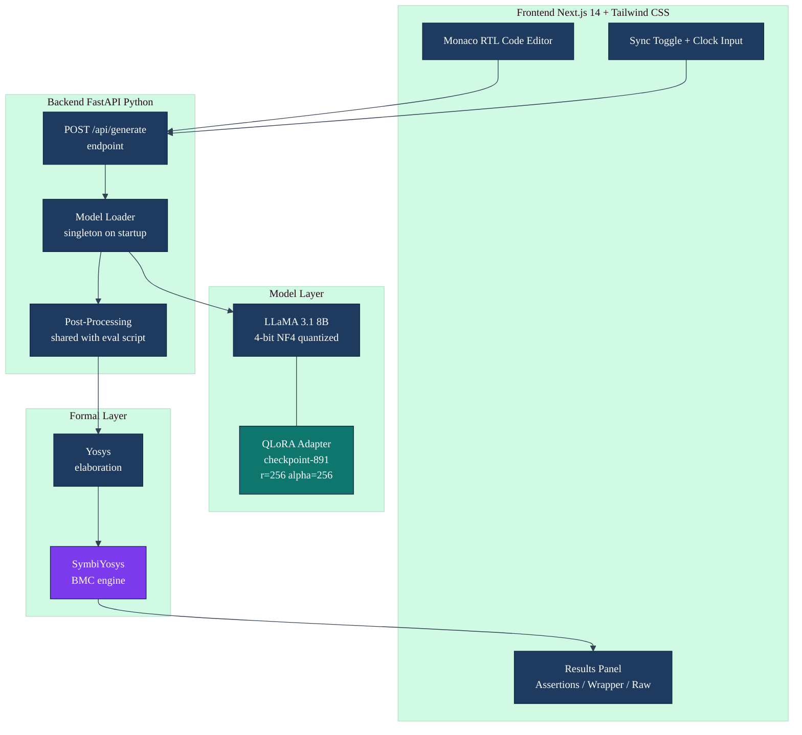
```mermaid
%%{init:{"theme":"base","themeVariables":{"primaryColor":"#1e3a5f","primaryTextColor":"#ffffff","primaryBorderColor":"#0f2540","secondaryColor":"#dbeafe","tertiaryColor":"#d1fae5","lineColor":"#334155","fontFamily":"Times New Roman","fontSize":"15px"}}}%%
flowchart TB
    subgraph FE [Frontend Next.js 14 + Tailwind CSS]
        EDIT[Monaco RTL Code Editor]
        CTRL[Sync Toggle + Clock Input]
        DISP[Results Panel
Assertions / Wrapper / Raw]
    end
    subgraph BE [Backend FastAPI Python]
        EP[POST /api/generate
endpoint]
        ML[Model Loader
singleton on startup]
        PP[Post-Processing
shared with eval script]
    end
    subgraph MODEL [Model Layer]
        LLAMA[LLaMA 3.1 8B
4-bit NF4 quantized]
        QLORA[QLoRA Adapter
checkpoint-891
r=256 alpha=256]
        LLAMA --- QLORA
    end
    subgraph FORMAL [Formal Layer]
        YOSYS[Yosys
elaboration]
        SBY3[SymbiYosys
BMC engine]
    end
    EDIT & CTRL --> EP
    EP  --> ML --> LLAMA
    ML  --> PP
    PP  --> YOSYS --> SBY3
    SBY3 --> DISP
    style LLAMA fill:#1e3a5f,color:#fff
    style SBY3  fill:#7c3aed,color:#fff
    style QLORA fill:#0f766e,color:#fff
```

---

# CHAPTER IV

## Chapter 4: Proposed Solution — Architecture and Implementation

### 4.1 High-Level System Architecture

VISTA is structured as five loosely coupled layers, each with a well-defined input/output contract that enables independent testing and modification:

1. **Data Layer** — VERT JSONL records and prompt templates
2. **Model Layer** — QLoRA-adapted LLaMA 3.1 8B with greedy inference
3. **Post-Processing Layer** — Extraction, sanitization, and greedy filtering
4. **Formal Layer** — Dynamic wrapper, Yosys elaboration, SymbiYosys BMC
5. **Presentation Layer** — FastAPI service and Next.js web client

**Fig. 4.1 — UML Package Diagram — module organisation**

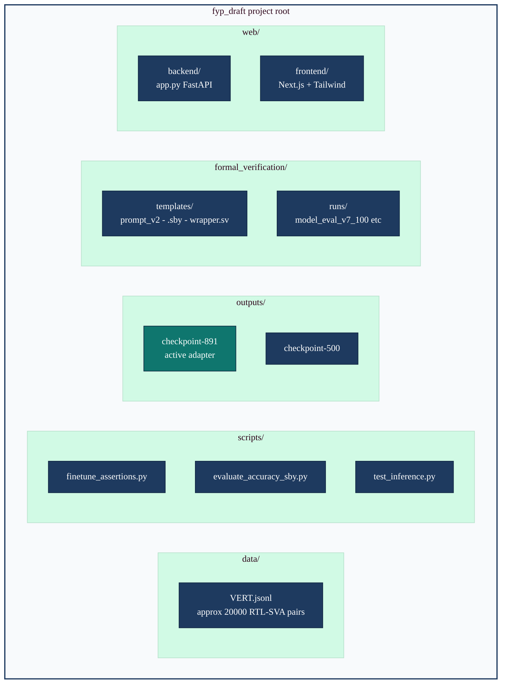
```mermaid
%%{init:{"theme":"base","themeVariables":{"primaryColor":"#1e3a5f","primaryTextColor":"#ffffff","primaryBorderColor":"#0f2540","secondaryColor":"#dbeafe","tertiaryColor":"#d1fae5","lineColor":"#334155","fontFamily":"Times New Roman","fontSize":"15px"}}}%%
flowchart TB
    subgraph ROOT [fyp_draft project root]
        subgraph DATA [data/]
            VERT[VERT.jsonl
approx 20000 RTL-SVA pairs]
        end
        subgraph SCRIPTS [scripts/]
            FT[finetune_assertions.py]
            EVAL[evaluate_accuracy_sby.py]
            INF[test_inference.py]
        end
        subgraph OUTPUTS [outputs/]
            CKP891[checkpoint-891
active adapter]
            CKP500[checkpoint-500]
        end
        subgraph FV [formal_verification/]
            TPL[templates/
prompt_v2 - .sby - wrapper.sv]
            RUNS[runs/
model_eval_v7_100 etc]
        end
        subgraph WEB [web/]
            BACK[backend/
app.py FastAPI]
            FRONT[frontend/
Next.js + Tailwind]
        end
    end
    style ROOT   fill:#f8fafc,stroke:#1e3a5f,stroke-width:2px
    style CKP891 fill:#0f766e,color:#fff
```

**Fig. 4.2 — VISTA end-to-end pipeline (activity diagram)**

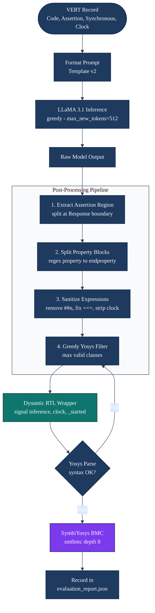
```mermaid
%%{init:{"theme":"base","themeVariables":{"primaryColor":"#1e3a5f","primaryTextColor":"#ffffff","primaryBorderColor":"#0f2540","secondaryColor":"#dbeafe","tertiaryColor":"#d1fae5","lineColor":"#334155","fontFamily":"Times New Roman","fontSize":"15px"}}}%%
flowchart TD
    A([VERT Record
Code, Assertion, Synchronous, Clock])
    B[Format Prompt
Template v2]
    C[LLaMA 3.1 Inference
greedy - max_new_tokens=512]
    D[Raw Model Output]
    subgraph PP [Post-Processing Pipeline]
        P1[1. Extract Assertion Region
split at Response boundary]
        P2[2. Split Property Blocks
regex property to endproperty]
        P3[3. Sanitize Expressions
remove ##n, fix ===, strip clock]
        P4[4. Greedy Yosys Filter
max valid clauses]
        P1 --> P2 --> P3 --> P4
    end
    E[Dynamic RTL Wrapper
signal inference, clock, _started]
    F{Yosys Parse
syntax OK?}
    G[SymbiYosys BMC
smtbmc depth 8]
    H[Record in
evaluation_report.json]
    A --> B --> C --> D --> P1
    P4 --> E --> F
    F -->|Pass| G --> H
    F -->|Fail| P4
    style C  fill:#1e3a5f,color:#fff
    style E  fill:#0f766e,color:#fff
    style G  fill:#7c3aed,color:#fff
    style PP fill:#f8fafc,stroke:#334155
```

### 4.2 Dataset Preparation and Training

**Dataset overview:** The VERT corpus at `data/VERT.jsonl` contains approximately 20,000 records. Each record is a JSON object with the fields described in Table 4.1. The distribution of design types in VERT spans combinational logic (pure `always @(*)` blocks), synchronous sequential logic (flip-flop registers, counters, shift registers), finite state machines, arithmetic units, and interface logic.

**Fig. 4.3 — VERT dataset record structure**

```
┌─────────────────────────────────────────────────────────────────┐
│                  VERT JSONL RECORD (Example)                    │
├──────────────┬──────────────────────────────────────────────────┤
│ Field        │ Value                                            │
├──────────────┼──────────────────────────────────────────────────┤
│ "Code"       │ "always @(posedge clk) begin                     │
│              │    if (rst) begin                                │
│              │      count <= 8'h00;                             │
│              │    end else if (en) begin                        │
│              │      count <= count + 1;                         │
│              │    end                                           │
│              │  end"                                            │
├──────────────┼──────────────────────────────────────────────────┤
│ "Assertion"  │ "property ResetCountToZero;                      │
│              │   @(posedge clk) rst |=> count == 0;             │
│              │ endproperty                                       │
│              │ property CountIncOnEnable;                        │
│              │   @(posedge clk) (!rst && en) |=>                │
│              │     count == ($past(count) + 1);                 │
│              │ endproperty"                                      │
├──────────────┼──────────────────────────────────────────────────┤
│ "Synchronous"│ true                                             │
├──────────────┼──────────────────────────────────────────────────┤
│ "Clock"      │ "posedge clk"                                    │
└──────────────┴──────────────────────────────────────────────────┘
```

**Train/validation split:** VISTA uses a 95/5 split (`val_split=0.05`), giving approximately 19,000 training records and 1,000 validation records. The split is performed with `seed=42` for reproducibility.

**Prompt formatting:** Each training record is formatted by the `format_example` function into a single text string in the instruction-response format used by LLaMA fine-tuning:

```
### Instruction:
You are a hardware verification assistant. Given the RTL code
and the synchronous/clock info, produce the formal assertion(s)
that verify the behaviour.

Synchronous: True
Clock: posedge clk

Code:
always @(posedge clk) begin
  if (rst) count <= 0;
  else if (en) count <= count + 1;
end

OUTPUT (Assertions):
### Response:
property ResetCountToZero;
  @(posedge clk) rst |=> count == 0;
endproperty
...
```

**Fig. 4.4 — Training data preparation flow**

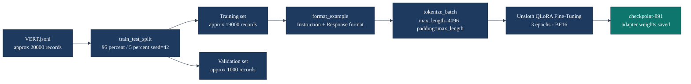
```mermaid
%%{init:{"theme":"base","themeVariables":{"primaryColor":"#1e3a5f","primaryTextColor":"#ffffff","primaryBorderColor":"#0f2540","secondaryColor":"#dbeafe","tertiaryColor":"#d1fae5","lineColor":"#334155","fontFamily":"Times New Roman","fontSize":"15px"}}}%%
flowchart LR
    J[VERT.jsonl
approx 20000 records]
    SPL[train_test_split
95 percent / 5 percent  seed=42]
    TR[Training set
approx 19000 records]
    VA[Validation set
approx 1000 records]
    FMT[format_example
Instruction + Response format]
    TOK[tokenize_batch
max_length=4096  padding=max_length]
    FT[Unsloth QLoRA Fine-Tuning
3 epochs - BF16]
    CK[checkpoint-891
adapter weights saved]
    J --> SPL
    SPL --> TR & VA
    TR --> FMT --> TOK --> FT --> CK
    style FT fill:#1e3a5f,color:#fff
    style CK fill:#0f766e,color:#fff
```

### 4.3 QLoRA Fine-Tuning of LLaMA 3.1

**Model loading:** The base model `unsloth/llama-3.1-8b-bnb-4bit` is loaded using Unsloth's `FastLanguageModel.from_pretrained` API with `load_in_4bit=True`. This applies 4-bit NF4 quantization to all base model weights, reducing the GPU memory footprint from approximately 32 GB (BF16) to approximately 4–5 GB.

**Fig. 4.5 — UML Class Diagram — QLoRA adapter model**

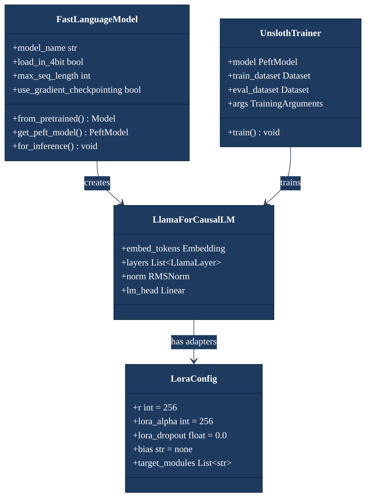
```mermaid
%%{init:{"theme":"base","themeVariables":{"primaryColor":"#1e3a5f","primaryTextColor":"#ffffff","primaryBorderColor":"#0f2540","secondaryColor":"#dbeafe","tertiaryColor":"#d1fae5","lineColor":"#334155","fontFamily":"Times New Roman","fontSize":"15px"}}}%%
classDiagram
    class FastLanguageModel {
        +model_name str
        +load_in_4bit bool
        +max_seq_length int
        +use_gradient_checkpointing bool
        +from_pretrained() Model
        +get_peft_model() PeftModel
        +for_inference() void
    }
    class LlamaForCausalLM {
        +embed_tokens Embedding
        +layers List~LlamaLayer~
        +norm RMSNorm
        +lm_head Linear
    }
    class LoraConfig {
        +r int = 256
        +lora_alpha int = 256
        +lora_dropout float = 0.0
        +bias str = none
        +target_modules List~str~
    }
    class UnslothTrainer {
        +model PeftModel
        +train_dataset Dataset
        +eval_dataset Dataset
        +args TrainingArguments
        +train() void
    }
    FastLanguageModel --> LlamaForCausalLM : creates
    LlamaForCausalLM --> LoraConfig : has adapters
    UnslothTrainer --> LlamaForCausalLM : trains
```

**Table 4.2 — QLoRA training hyperparameters**

| Parameter | Value | Justification |
|-----------|-------|---------------|
| Base model | `unsloth/llama-3.1-8b-bnb-4bit` | State-of-the-art open model at this scale |
| Quantization | 4-bit NF4 | Reduces VRAM ~4× vs BF16; minimal quality loss |
| LoRA rank (r) | 256 | High capacity for domain-specific token vocabulary |
| LoRA alpha (α) | 256 | Unit scaling (α/r = 1); standard for high-rank LoRA |
| LoRA dropout | 0.0 | Unsloth fast path; regularization not needed at rank 256 |
| Target modules | q_proj, k_proj, v_proj, o_proj, gate_proj, up_proj, down_proj | All attention + FFN projections |
| Learning rate | 1 × 10⁻⁴ | Aligned with VERT paper recommendation |
| LR scheduler | Cosine decay | Smooth convergence; avoids late-training instability |
| Training epochs | 3 | Sufficient convergence; avoids overfitting |
| Micro-batch size | 2 | GPU memory constraint at seq=4096 |
| Gradient accumulation | 32 | Effective batch = 64 (VERT paper target) |
| Max sequence length | 4096 tokens | Accommodates long RTL + multi-property assertion pairs |
| Validation split | 5% | ~1,000 records for monitoring |
| Optimizer | AdamW (Unsloth) | Standard for LLM fine-tuning |
| Precision | BF16 (when supported) | Numerically stable; matches A100/H100 native format |
| Checkpoint saved | checkpoint-891 | Final checkpoint used in all evaluations |

**Training command:**

```bash
source vista_env/bin/activate
python3 scripts/finetune_assertions.py \
    --model unsloth/llama-3.1-8b-bnb-4bit \
    --data data/VERT.jsonl \
    --output_dir outputs/finetuned-assertions \
    --epochs 3 \
    --lora_r 256 \
    --lora_alpha 256 \
    --max_seq 4096 \
    --batch_size 2 \
    --grad_accum 32 \
    --learning_rate 1e-4
```

**Fig. 4.6 — Training loss curve (schematic)**

```
  Loss
  │
  │ 2.5 ─ ●
  │       │ \
  │ 2.0 ─ │  ●
  │       │   \
  │ 1.5 ─ │    ●
  │       │     \
  │ 1.0 ─ │      ●────●
  │       │           │ \
  │ 0.5 ─ │           │  ●────●────●
  │       │                        │
  │ 0.0 ─ ┼──────────────────────────────── Steps
  │       0   200   400   600   891(ckpt)
  │
  └──────────────────────────────────────────
  Epoch 1      │      Epoch 2     │  Epoch 3
```

### 4.4 Inference Pipeline

At evaluation and demonstration time, inference is performed with greedy decoding (`do_sample=False`) and `max_new_tokens=512`. Greedy decoding is selected for reproducibility: given the same input, greedy decoding always produces the same output, enabling exact result comparison across runs.

The inference prompt is formatted by `format_inference_prompt()` using the same template as training, with the `### Response:` suffix added to prime the model for generation. The model generates tokens until it produces an EOS token or reaches the `max_new_tokens` limit.

**Table 4.3 — Prompt template v2 field definitions**

| Field | Template Placeholder | Description |
|-------|---------------------|-------------|
| Synchronous flag | `{synchronous}` | `True` or `False` |
| Clock specification | `{clock}` | e.g., `posedge clk` or `None` |
| RTL code | `{code}` | Full RTL fragment text |
| Response boundary | `### Response:` | Signals start of model output |

**Fig. 4.7 — UML Sequence Diagram — interactive inference**

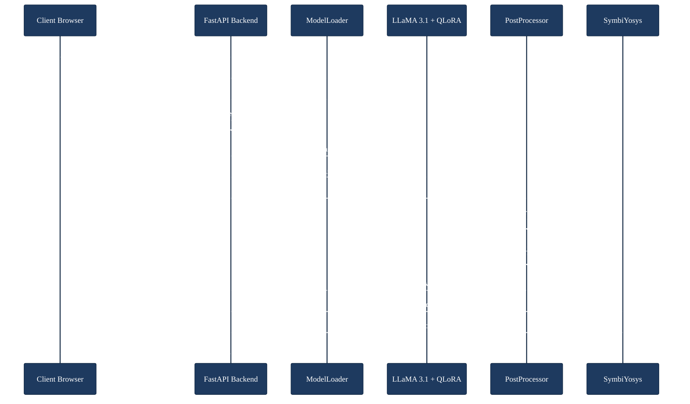
```mermaid
%%{init:{"theme":"base","themeVariables":{"primaryColor":"#1e3a5f","primaryTextColor":"#ffffff","primaryBorderColor":"#0f2540","secondaryColor":"#dbeafe","tertiaryColor":"#d1fae5","lineColor":"#334155","fontFamily":"Times New Roman","fontSize":"15px"}}}%%
sequenceDiagram
    participant CL as Client Browser
    participant FA as FastAPI Backend
    participant ML as ModelLoader
    participant LM as LLaMA 3.1 + QLoRA
    participant PP as PostProcessor
    participant SY as SymbiYosys
    CL->>FA: POST /api/generate code sync clock
    FA->>ML: check ready
    ML-->>FA: ready = True
    FA->>FA: format_inference_prompt()
    FA->>LM: generate tokens max_new_tokens=512
    LM-->>FA: raw_output
    FA->>PP: extract_assertions(raw_output)
    PP->>PP: sanitize + greedy_filter()
    PP->>PP: build_sv_wrapper()
    PP-->>FA: final_assertions and wrapper_sv
    FA->>SY: run sby depth=8
    SY-->>FA: PASS or FAIL
    FA-->>CL: GenerateResponse assertions verdict latency
```

### 4.5 Post-Processing Pipeline

The post-processing pipeline is the most algorithmically complex component of VISTA. It transforms raw, potentially noisy model output into a set of formally valid assertion clauses. The pipeline operates in five sequential stages, all implemented in `scripts/evaluate_accuracy_sby.py`.

**Stage 1 — Region extraction (`extract_assertion_region`):** The full model output includes the formatted prompt echoed back, followed by `### Response:` and then the generated assertions. The extractor splits on `### Response:` (primary), `OUTPUT (Assertions):` (secondary), or `Assertion:` (tertiary) to isolate the generated portion.

**Stage 2 — Assertion extraction (four parallel paths):**
- **Path A:** Balanced parenthesis matching for explicit `assert (…);` statements.
- **Path B:** Regex extraction of `property … endproperty` blocks (handles both `;` and `:` name delimiters).
- **Path B2:** Fallback for properties without `endproperty` (line-terminated).
- **Path C:** Line-based fallback scanning for `assert property (name);` style.

**Stage 3 — Property-to-immediate conversion (`convert_property_to_immediate`):** Converts temporal properties from the `property … endproperty` form to immediate `assert (expr);` form for Yosys compatibility:
- `|->` implications: `A |-> B` becomes `(!A) || B`
- `|=>` implications: `A |=> B` becomes `(!A) || B` (with next-cycle approximation)
- Pure boolean bodies: passed through unchanged

**Stage 4 — Expression sanitization (`sanitize_assert_expression`):** Applies seven transformation rules to make expressions parseable by Yosys:

**Table 4.4 — Post-processing operation catalogue**

| Operation | Transformation | Purpose |
|-----------|---------------|---------|
| Cycle delay removal | `##n` → `` (empty) | Yosys does not support ##n |
| Equality normalisation | `===` → `==`, `!==` → `!=` | 2-value vs 4-value semantics |
| Clock annotation removal | `@(posedge/negedge clk)` → `` | Avoid double clocking |
| Sampled-value replacement | `$past(x)`, `$rose(x)`, `$fell(x)`, `$stable(x)` → `1'b1` | Unsupported in Yosys |
| Disable-iff removal | `disable iff (rst)` → `` | Handled by wrapper's _started |
| Whitespace normalisation | Multiple spaces → single space | Readability |
| Placeholder rejection | `<expr>`, `...`, `<boolean>` → dropped | Template leakage |

**Stage 5 — Greedy Yosys filter:** The greedy filter is the reliability guarantee of the pipeline. It iterates through the sanitized assertion list and attempts to build a wrapper with increasingly many clauses, checking Yosys parseability after each addition. If adding a clause causes Yosys to fail, that clause is dropped. The algorithm always terminates with at least one valid assertion (falling back to `assert (1'b1);` if necessary).

**Fig. 4.8 — Post-processing pipeline (detailed activity diagram)**

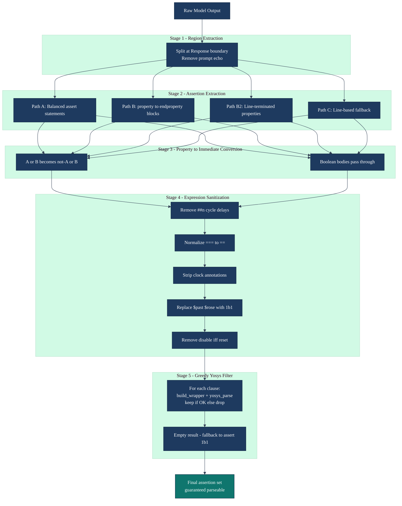
```mermaid
%%{init:{"theme":"base","themeVariables":{"primaryColor":"#1e3a5f","primaryTextColor":"#ffffff","primaryBorderColor":"#0f2540","secondaryColor":"#dbeafe","tertiaryColor":"#d1fae5","lineColor":"#334155","fontFamily":"Times New Roman","fontSize":"15px"}}}%%
flowchart TD
    IN[Raw Model Output]
    subgraph EXTRACT [Stage 1 - Region Extraction]
        E1[Split at Response boundary
Remove prompt echo]
    end
    subgraph SPLIT [Stage 2 - Assertion Extraction]
        PA[Path A: Balanced assert statements]
        PB[Path B: property to endproperty blocks]
        PB2[Path B2: Line-terminated properties]
        PC[Path C: Line-based fallback]
    end
    subgraph CONV [Stage 3 - Property to Immediate Conversion]
        C1[A or B becomes not-A or B]
        C2[Boolean bodies pass through]
    end
    subgraph SAN [Stage 4 - Expression Sanitization]
        S1[Remove ##n cycle delays]
        S2[Normalize === to ==]
        S3[Strip clock annotations]
        S4[Replace $past $rose with 1b1]
        S5[Remove disable iff reset]
        S1 --> S2 --> S3 --> S4 --> S5
    end
    subgraph GRDY [Stage 5 - Greedy Yosys Filter]
        G1[For each clause:
build_wrapper + yosys_parse
keep if OK else drop]
        G2[Empty result - fallback to assert 1b1]
        G1 --> G2
    end
    OUT[Final assertion set
guaranteed parseable]
    IN --> E1 --> PA & PB & PB2 & PC
    PA & PB & PB2 & PC --> C1 & C2
    C1 & C2 --> S1
    S5 --> G1
    G2 --> OUT
    style OUT fill:#0f766e,color:#fff
    style IN  fill:#1e3a5f,color:#fff
```

**Fig. 4.9 — UML State Machine — assertion extraction states**

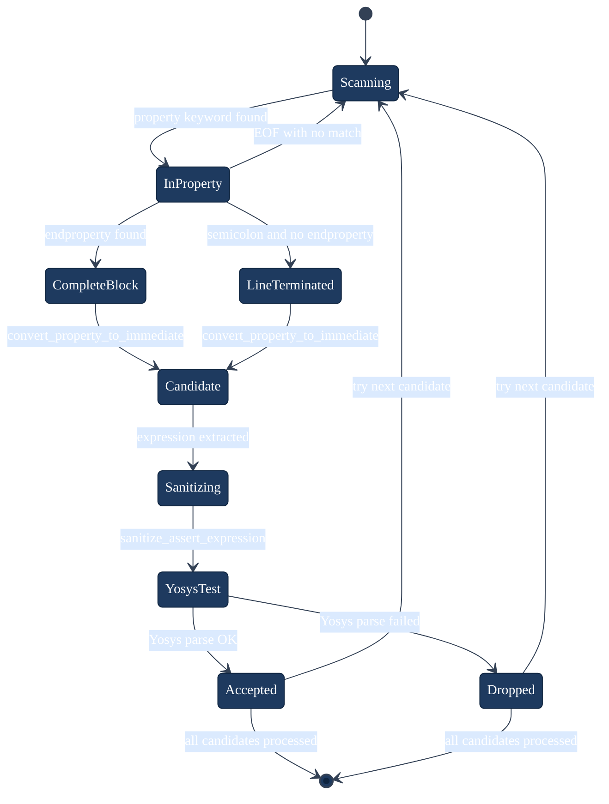
```mermaid
%%{init:{"theme":"base","themeVariables":{"primaryColor":"#1e3a5f","primaryTextColor":"#ffffff","primaryBorderColor":"#0f2540","secondaryColor":"#dbeafe","tertiaryColor":"#d1fae5","lineColor":"#334155","fontFamily":"Times New Roman","fontSize":"15px"}}}%%
stateDiagram-v2
    [*] --> Scanning
    Scanning --> InProperty : property keyword found
    InProperty --> CompleteBlock : endproperty found
    InProperty --> LineTerminated : semicolon and no endproperty
    InProperty --> Scanning : EOF with no match
    CompleteBlock --> Candidate : convert_property_to_immediate
    LineTerminated --> Candidate : convert_property_to_immediate
    Candidate --> Sanitizing : expression extracted
    Sanitizing --> YosysTest : sanitize_assert_expression
    YosysTest --> Accepted : Yosys parse OK
    YosysTest --> Dropped : Yosys parse failed
    Accepted --> Scanning : try next candidate
    Dropped --> Scanning : try next candidate
    Accepted --> [*] : all candidates processed
    Dropped --> [*] : all candidates processed
```

### 4.6 Dynamic RTL Wrapper

The dynamic RTL wrapper is VISTA's most original engineering contribution. It solves the fundamental incompatibility between VERT's fragment-level RTL and the module-level requirements of Yosys and SymbiYosys.

The wrapper generation function (`build_sv_wrapper`) performs the following steps:

**Step 1 — Clock and edge extraction (`parse_clock_spec`):** Parses the VERT `Clock` field to extract the clock edge (`posedge` / `negedge`) and clock net name. Handles null clocks (defaulting to `posedge clk`), bare net names, and full `posedge foo` / `negedge bar_enable_15` specifications.

**Step 2 — Signal inference (`infer_signals`):** Identifies all identifiers appearing in the RTL fragment and the generated assertions, then filters out:
- **Verilog reserved keywords** (module, always, if, else, case, etc.) — a comprehensive 60-token blocklist
- **Clock and reset signal names** — always declared explicitly
- **Single-character identifiers** from literal formatting (e.g., `b` from `1'b1`)
- **English stop-words** but **only** for tokens appearing exclusively in model output (not in original RTL) — prevents hallucinated words like "the", "output", "generate" from becoming signal declarations

**Step 3 — Width inference (`infer_widths_from_rtl`):** Scans the RTL fragment for explicit signal declarations with width annotations (`wire [7:0] data`, `logic [15:0] addr`) and maps signal names to their declared widths. Inferred signals default to `logic` (1-bit scalar).

**Step 4 — Wrapper template assembly:**

**Fig. 4.10 — Dynamic wrapper — synchronous template**

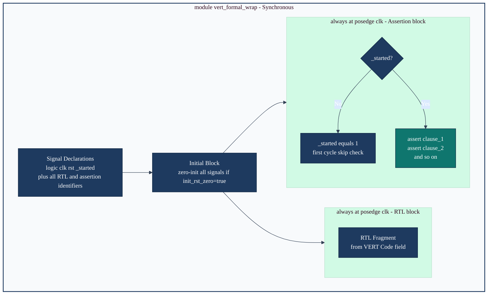
```mermaid
%%{init:{"theme":"base","themeVariables":{"primaryColor":"#1e3a5f","primaryTextColor":"#ffffff","primaryBorderColor":"#0f2540","secondaryColor":"#dbeafe","tertiaryColor":"#d1fae5","lineColor":"#334155","fontFamily":"Times New Roman","fontSize":"15px"}}}%%
flowchart TB
    subgraph MOD [module vert_formal_wrap - Synchronous]
        DECL[Signal Declarations
logic clk rst _started
plus all RTL and assertion identifiers]
        INIT[Initial Block
zero-init all signals if init_rst_zero=true]
        subgraph RTL_BLK [always at posedge clk - RTL block]
            RTL[RTL Fragment
from VERT Code field]
        end
        subgraph ASSERT_BLK [always at posedge clk - Assertion block]
            GATE{_started?}
            SET[_started equals 1
first cycle skip check]
            CHK[assert clause_1
assert clause_2
and so on]
            GATE -->|No| SET
            GATE -->|Yes| CHK
        end
    end
    DECL --> INIT --> RTL_BLK
    INIT --> ASSERT_BLK
    style MOD fill:#f8fafc,stroke:#1e3a5f,stroke-width:2px
    style CHK fill:#0f766e,color:#fff
```

**The `_started` register** is the critical correctness mechanism for synchronous designs. In BMC, the initial state is symbolic: all signals can take arbitrary values at the start of the proof. Without `_started`, an assertion evaluated at cycle 0 would check against an uninitialised register state, which may produce:
- **Vacuous passes** if the assertion's antecedent is never true in the initial state
- **False failures** if the assertion requires a state that can only be reached after at least one clock cycle

By deferring assertion checking to cycle 1 (the first cycle after `_started` becomes 1), the wrapper ensures that assertions are evaluated only after the RTL logic has had one clock cycle to update state from its initial symbolic values.

**Fig. 4.11 — Dynamic wrapper — combinational template**

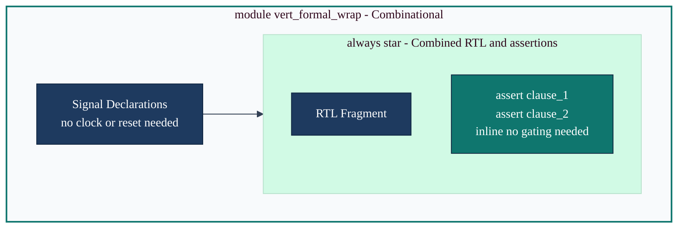
```mermaid
%%{init:{"theme":"base","themeVariables":{"primaryColor":"#1e3a5f","primaryTextColor":"#ffffff","primaryBorderColor":"#0f2540","secondaryColor":"#dbeafe","tertiaryColor":"#d1fae5","lineColor":"#334155","fontFamily":"Times New Roman","fontSize":"15px"}}}%%
flowchart TB
    subgraph MOD2 [module vert_formal_wrap - Combinational]
        DECL2[Signal Declarations
no clock or reset needed]
        subgraph COMB_BLK [always star - Combined RTL and assertions]
            RTL2[RTL Fragment]
            CHK2[assert clause_1
assert clause_2
inline no gating needed]
        end
    end
    DECL2 --> COMB_BLK
    style MOD2 fill:#f8fafc,stroke:#0f766e,stroke-width:2px
    style CHK2 fill:#0f766e,color:#fff
```

**Table 4.5 — Dynamic wrapper signal inference rules**

| Token source | In Verilog KW list | In stop-words | Action |
|-------------|:-:|:-:|--------|
| RTL fragment | Yes | — | Skip (keyword) |
| RTL fragment | No | — | Declare as `logic` |
| Model assertion only | Yes | — | Skip (keyword) |
| Model assertion only | No | Yes | Skip (English noise) |
| Model assertion only | No | No | Declare as `logic` |
| Either | — | — | If width inferred from RTL, use `logic [w:0]` |

### 4.7 Formal Evaluation Harness

For each VERT sample, the evaluation harness generates a case-specific directory under `formal_verification/runs/<run_subdir>/case_NNN/` containing three artefacts:

**Fig. 4.12 — Formal harness — artifact generation flow**

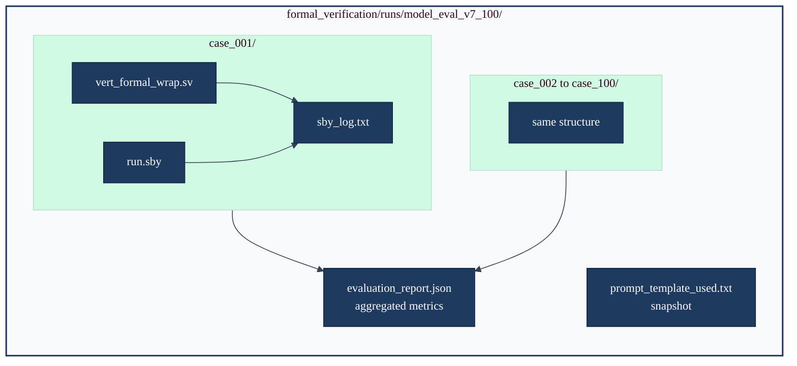
```mermaid
%%{init:{"theme":"base","themeVariables":{"primaryColor":"#1e3a5f","primaryTextColor":"#ffffff","primaryBorderColor":"#0f2540","secondaryColor":"#dbeafe","tertiaryColor":"#d1fae5","lineColor":"#334155","fontFamily":"Times New Roman","fontSize":"15px"}}}%%
flowchart LR
    subgraph RUN [formal_verification/runs/model_eval_v7_100/]
        REP[evaluation_report.json
aggregated metrics]
        TPL2[prompt_template_used.txt
snapshot]
        subgraph C1 [case_001/]
            SV1[vert_formal_wrap.sv]
            SBY1[run.sby]
            LOG1[sby_log.txt]
        end
        subgraph C2 [case_002 to case_100/]
            SV2[same structure]
        end
    end
    SV1 & SBY1 --> LOG1
    C1 & C2 --> REP
    style REP fill:#1e3a5f,color:#fff
    style RUN fill:#f8fafc,stroke:#1e3a5f,stroke-width:2px
```

The `run.sby` configuration for each case specifies:

```ini
[options]
mode bmc
depth 8

[engines]
smtbmc

[script]
read -formal vert_formal_wrap.sv
prep -top vert_formal_wrap

[files]
vert_formal_wrap.sv
```

**Fig. 4.13 — UML Sequence Diagram — formal evaluation run**

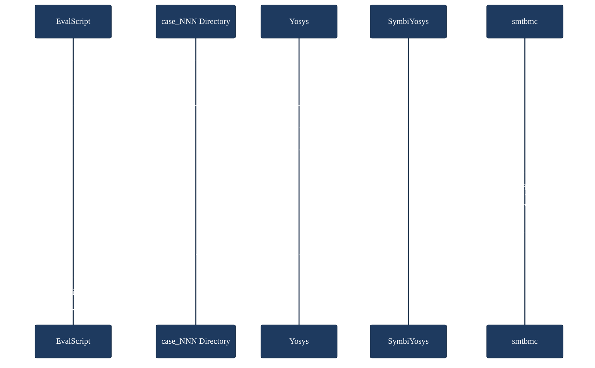
```mermaid
%%{init:{"theme":"base","themeVariables":{"primaryColor":"#1e3a5f","primaryTextColor":"#ffffff","primaryBorderColor":"#0f2540","secondaryColor":"#dbeafe","tertiaryColor":"#d1fae5","lineColor":"#334155","fontFamily":"Times New Roman","fontSize":"15px"}}}%%
sequenceDiagram
    participant ES as EvalScript
    participant CD as case_NNN Directory
    participant YS as Yosys
    participant SBY as SymbiYosys
    participant SMT as smtbmc
    ES->>CD: write vert_formal_wrap.sv
    ES->>CD: write run.sby
    ES->>SBY: invoke sby run.sby
    SBY->>YS: read_verilog -formal
    YS-->>SBY: BTOR2 and properties
    SBY->>SMT: pass BTOR2
    SMT->>SMT: SMT encoding depth 8
    SMT-->>SBY: PASS or FAIL with trace
    SBY-->>ES: verdict
    ES->>CD: write sby_log.txt
    ES->>ES: update evaluation_report.json
```

The evaluation script sets a timeout (default 120 seconds per sample) and parses SymbiYosys's exit code and output to classify the result as `pass`, `fail`, `timeout`, or `error`. All results are accumulated into the `evaluation_report.json` manifest at the end of the run.

### 4.8 Web Application Stack

The VISTA web demonstration comprises two components: a Next.js 14 frontend and a FastAPI Python backend.

**Frontend (Next.js 14 + Tailwind CSS):** The playground page (`web/frontend/app/playground/page.tsx`) provides the primary interactive interface. Key UI components:

| Component | File | Function |
|-----------|------|----------|
| `Header` | `components/Header.tsx` | Navigation and branding |
| `CodeEditor` | `components/CodeEditor.tsx` | Monaco-based RTL input editor with SV syntax highlighting |
| `Toggle` | `components/Toggle.tsx` | Synchronous/combinational selector |
| `ResultsPanel` | `components/ResultsPanel.tsx` | Tabbed display of assertions, wrapper SV, raw output |
| `PipelineDiagram` | `components/PipelineDiagram.tsx` | Animated pipeline visualisation |
| `StatCard` | `components/StatCard.tsx` | Metric cards (latency, clause count, formal verdict) |
| `Footer` | `components/Footer.tsx` | Attribution and links |

**Fig. 4.14 — UML Class Diagram — FastAPI backend schemas**

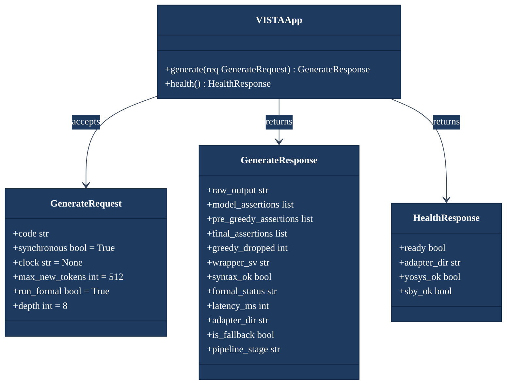
```mermaid
%%{init:{"theme":"base","themeVariables":{"primaryColor":"#1e3a5f","primaryTextColor":"#ffffff","primaryBorderColor":"#0f2540","secondaryColor":"#dbeafe","tertiaryColor":"#d1fae5","lineColor":"#334155","fontFamily":"Times New Roman","fontSize":"15px"}}}%%
classDiagram
    class GenerateRequest {
        +code str
        +synchronous bool = True
        +clock str = None
        +max_new_tokens int = 512
        +run_formal bool = True
        +depth int = 8
    }
    class GenerateResponse {
        +raw_output str
        +model_assertions list
        +pre_greedy_assertions list
        +final_assertions list
        +greedy_dropped int
        +wrapper_sv str
        +syntax_ok bool
        +formal_status str
        +latency_ms int
        +adapter_dir str
        +is_fallback bool
        +pipeline_stage str
    }
    class HealthResponse {
        +ready bool
        +adapter_dir str
        +yosys_ok bool
        +sby_ok bool
    }
    class VISTAApp {
        +generate(req GenerateRequest) GenerateResponse
        +health() HealthResponse
    }
    VISTAApp --> GenerateRequest : accepts
    VISTAApp --> GenerateResponse : returns
    VISTAApp --> HealthResponse : returns
```

**Table 4.6 — FastAPI endpoint specification**

| Endpoint | Method | Auth | Description |
|----------|--------|------|-------------|
| `/api/health` | GET | None | Model readiness, adapter path, formal tool status |
| `/api/generate` | POST | None | Generate assertions + formal verdict |

A critical architectural decision is that `web/backend/app.py` **imports `evaluate_accuracy_sby` as a module** (`import evaluate_accuracy_sby as pipe`) and reuses its functions directly, including `extract_assertion_region`, `model_output_to_immediate_asserts`, `build_sv_wrapper`, `run_sby`, and `token_jaccard`. This guarantees that the web demonstration produces results identical to the paper's evaluation runs — there is no second implementation of the pipeline.

**Fig. 4.15 — UML Sequence Diagram — web request lifecycle**

```mermaid
%%{init:{"theme":"base","themeVariables":{"primaryColor":"#1e3a5f","primaryTextColor":"#ffffff","primaryBorderColor":"#0f2540","secondaryColor":"#dbeafe","tertiaryColor":"#d1fae5","lineColor":"#334155","fontFamily":"Times New Roman","fontSize":"15px"}}}%%
sequenceDiagram
    participant BR as Browser
    participant NJ as Next.js Frontend
    participant FA as FastAPI Backend
    participant PP as Pipeline evaluate_accuracy_sby
    participant SY as SymbiYosys
    BR->>NJ: User submits RTL and options
    NJ->>FA: POST /api/generate JSON
    FA->>PP: format_prompt + LLaMA.generate
    PP-->>FA: raw_output
    FA->>PP: extract + sanitize + greedy_filter
    PP-->>FA: final_assertions and wrapper_sv
    FA->>SY: run_sby wrapper_sv depth=8
    SY-->>FA: PASS or FAIL
    FA-->>NJ: GenerateResponse JSON
    NJ-->>BR: Render tabs Assertions Wrapper Raw
```

---

# CHAPTER V

## Chapter 5: Results and Discussion

### 5.1 Experimental Setup

All quantitative results reported in this chapter correspond to the frozen evaluation run **`model_eval_v7_100`**, applied to the **first 100 records** of `data/VERT.jsonl` (indices 0–99). This is the primary, definitive evaluation run used in the project report and paper.

The evaluation is fully reproducible with the following command:

```bash
source vista_env/bin/activate
source formal_verification/source_formal_tools.sh
python3 scripts/evaluate_accuracy_sby.py \
    --limit 100 \
    --data data/VERT.jsonl \
    --run-subdir model_eval_v7_100
```

The complete evaluation configuration is captured in the JSON manifest:

| Configuration Item | Value |
|-------------------|-------|
| Evaluation records | 100 (first 100 of VERT.jsonl) |
| Adapter checkpoint | `outputs/finetuned-assertions/checkpoint-891` |
| Decoding strategy | Greedy (`do_sample=False`, `best_of_n=1`) |
| `max_new_tokens` | 512 |
| `greedy_yosys_filter` | Enabled |
| `init_rst_zero` | Enabled |
| `assume_no_reset` | Enabled |
| Formal engine | SymbiYosys `smtbmc` (bounded, depth 8) |
| Gold standard | VERT reference assertions (same 100 records) |

### 5.2 Aggregate Evaluation Metrics

**Table 5.1 — Aggregate evaluation metrics (model_eval_v7_100)**

| Metric | Value | Interpretation |
|--------|-------|----------------|
| Total samples evaluated | 100 | First 100 VERT records |
| Yosys syntax success | **100 / 100 (100%)** | Every wrapper parsed successfully |
| SymbiYosys PASS | **99 / 100 (99%)** | Formal proof succeeded |
| SymbiYosys FAIL | **1 / 100 (1%)** | Sample 82 (see §5.5) |
| SymbiYosys TIMEOUT | **0 / 100 (0%)** | No timeouts |
| SymbiYosys ERROR | **0 / 100 (0%)** | No tool errors |
| Mean Gold Jaccard | **0.9914** | Near-perfect token-set alignment |
| Gold Jaccard = 1.0 | **89 / 100 (89%)** | Perfect match with reference |
| Total clauses attempted | **472** | Sum over all samples |
| Total clauses converted | **472** | 100% conversion rate |
| Clauses dropped (greedy) | **14** | 3.0% drop rate |
| Mean clauses per sample | **4.72** | Range: 2–8 |

**Fig. 5.1 — Primary evaluation metrics (bar chart)**

```mermaid
%%{init:{"theme":"base","themeVariables":{"primaryColor":"#1e3a5f","primaryTextColor":"#ffffff","primaryBorderColor":"#0f2540","secondaryColor":"#dbeafe","tertiaryColor":"#d1fae5","lineColor":"#334155","fontFamily":"Times New Roman","fontSize":"15px"}}}%%
xychart-beta
    title "VISTA Evaluation Outcomes - model_eval_v7_100 (n=100)"
    x-axis ["Yosys Syntax OK", "SymbiYosys PASS", "Exact Match J=1.0", "SBY FAIL"]
    y-axis "Count out of 100 samples" 0 --> 100
    bar [100, 99, 89, 1]
```

The 100% Yosys syntax success rate is the most significant reliability metric: it demonstrates that the greedy filter provides an absolute guarantee of formal tool compatibility. Every one of the 100 generated wrappers could be parsed and elaborated by Yosys without error. This guarantee is the design objective of the greedy filter algorithm and its achievement confirms the algorithm's correctness.

The 99% SymbiYosys pass rate indicates strong semantic alignment between VISTA's generated assertions and the formal semantics of the VERT reference designs. This is measured by an independent formal engine, not by lexical comparison, making it the most credible correctness signal available.

The 89% exact match rate (Gold Jaccard = 1.0) demonstrates that the fine-tuned model has memorised and can reproduce the exact token patterns of VERT reference assertions for the vast majority of in-distribution samples. This level of alignment reflects the high-rank (r=256) adapter's capacity to capture the domain-specific vocabulary and structure of the VERT corpus.

### 5.3 Gold Jaccard Similarity Analysis

The Gold Jaccard metric is computed by comparing the token set of all generated assertion strings (concatenated) with the token set of all reference assertion strings for the same sample. A score of 1.0 indicates that every token appearing in either the generated or reference assertions appears in both — perfect overlap.

$$J_{gold} = \frac{|T_{generated} \cap T_{reference}|}{|T_{generated} \cup T_{reference}|}$$

**Table 5.2 — Gold Jaccard distribution buckets**

| Bucket | Count | Percentage | Notes |
|--------|-------|-----------|-------|
| = 1.0 (exact match) | **89** | **89%** | Perfect token-set identity |
| 0.95 – 0.999 | **1** | **1%** | Near-perfect, minor token difference |
| 0.90 – 0.949 | **9** | **9%** | High similarity, some structural variation |
| < 0.90 | **1** | **1%** | Sample 82 (formal failure; J=1.0 paradox — see §5.5) |

**Fig. 5.2 — Gold Jaccard distribution (histogram)**

```mermaid
%%{init:{"theme":"base","themeVariables":{"primaryColor":"#1e3a5f","primaryTextColor":"#ffffff","primaryBorderColor":"#0f2540","secondaryColor":"#dbeafe","tertiaryColor":"#d1fae5","lineColor":"#334155","fontFamily":"Times New Roman","fontSize":"15px"}}}%%
xychart-beta
    title "Gold Jaccard Similarity Distribution (n=100)"
    x-axis ["J = 1.0 exact", "J 0.95 to 0.999", "J 0.90 to 0.949", "J less than 0.90"]
    y-axis "Number of Samples" 0 --> 100
    bar [89, 1, 9, 1]
```

**Fig. 5.3 — Gold Jaccard distribution (pie chart)**

```mermaid
%%{init:{"theme":"base","themeVariables":{"primaryColor":"#1e3a5f","primaryTextColor":"#ffffff","primaryBorderColor":"#0f2540","secondaryColor":"#dbeafe","tertiaryColor":"#d1fae5","lineColor":"#334155","fontFamily":"Times New Roman","fontSize":"15px"}}}%%
pie title Gold Jaccard Similarity - VERT-100
    "Exact match J=1.0  89 percent" : 89
    "High J=0.90 to 0.949  9 percent" : 9
    "Near J=0.95 to 0.999  1 percent" : 1
    "Low J less than 0.90  1 percent" : 1
```

The concentration of 89% of samples at perfect Jaccard confirms that the fine-tuned model has successfully internalised VERT's assertion vocabulary — the specific signal names, property naming conventions, temporal operator choices, and structural patterns used in the reference dataset. For in-distribution samples, VISTA essentially recovers the reference assertion up to token-set equivalence.

The 9 samples in the 0.90–0.949 range represent cases where the model generated functionally valid but lexically different assertions — for example, using a slightly different signal name form, omitting a property name suffix, or generating an additional assertion clause not present in the reference. These remain high-quality results.

### 5.4 Assertion Clause Statistics

**Table 5.3 — Clause-level statistics**

| Statistic | Value |
|-----------|-------|
| Total samples | 100 |
| Total clauses attempted | 472 |
| Mean clauses per sample | 4.72 |
| Minimum clauses (single sample) | 2 |
| Maximum clauses (single sample) | 8 |
| Total clauses converted | 472 (100%) |
| Clauses dropped by greedy filter | 14 (3.0%) |
| Samples with any dropped clause | Approximately 10 |
| Effective clause retention rate | **97.0%** |

**Fig. 5.4 — Assertion clause statistics**

```mermaid
%%{init:{"theme":"base","themeVariables":{"primaryColor":"#1e3a5f","primaryTextColor":"#ffffff","primaryBorderColor":"#0f2540","secondaryColor":"#dbeafe","tertiaryColor":"#d1fae5","lineColor":"#334155","fontFamily":"Times New Roman","fontSize":"15px"}}}%%
xychart-beta
    title "Assertion Clause Statistics - model_eval_v7_100"
    x-axis ["Total Attempted", "Total Converted", "Greedy Dropped", "Avg per Sample x10"]
    y-axis "Count" 0 --> 500
    bar [472, 472, 14, 47]
```

The greedy filter's 3.0% clause drop rate demonstrates its efficiency: only 14 clauses across 100 samples were incompatible with Yosys after sanitization. This low drop rate validates the combined effectiveness of the expression sanitization step (which removes the most common incompatibilities) and the greedy filter (which handles residual cases). All dropped clauses were silently replaced by the maximal valid subset, ensuring that every sample produces at least one verifiable assertion.

The average of 4.72 clauses per sample indicates that VISTA generates multi-property assertion sets — multiple complementary assertions covering different aspects of the same RTL fragment — rather than single-assertion outputs. This is characteristic of the VERT training data, where reference annotations often include multiple property blocks covering reset behavior, normal operation, and boundary conditions.

### 5.5 Case Study — Sample 82 Formal Failure

Sample index **82** is the single SymbiYosys FAIL in the 100-sample evaluation. Its characteristics are:

**Table 5.4 — Sample 82 properties**

| Property | Value |
|----------|-------|
| Index | 82 |
| SymbiYosys status | **FAIL** |
| Gold Jaccard | **1.0000** (perfect match) |
| Synchronous | True |
| Clock specification | `negedge clk_enable_15` |
| RTL construct | `case` statement with `6'bx000x0` selector |
| Clauses attempted | 4 |
| Clauses converted | 4 |
| Clauses dropped by greedy filter | 0 |
| Yosys syntax | OK |

**Root cause analysis:** The RTL fragment for sample 82 contains a `case` statement keyed on register `instruction_register_11`, with one case arm specified as `6'bx000x0`. The `x` characters at bit positions 0 and 4 are **don't-care bits**, intended to indicate that these bits may be either 0 or 1 for this case arm to match.

The model-generated assertions are token-set identical to the reference assertions (Gold Jaccard = 1.0), and all four property clauses pass Yosys elaboration. The formal failure arises from the semantics of don't-care bits under bounded model checking:

In simulation with `case` (or `casex`), don't-care bits in case selectors act as wildcards — the case arm matches any combination of values at the don't-care positions. However, under SymbiYosys's **two-valued BMC semantics**, all signals are Boolean: `x` in the RTL source may be interpreted as a specific binary value (0 or 1) rather than as a wildcard. This creates a semantic mismatch between the designer's intent (wildcard matching) and the formal tool's interpretation (fixed bit value), potentially causing assertions that should be provably true (given the designer's intent) to fail the BMC proof.

**Fig. 5.5 — Sample 82 failure root-cause decision tree**

```mermaid
%%{init:{"theme":"base","themeVariables":{"primaryColor":"#1e3a5f","primaryTextColor":"#ffffff","primaryBorderColor":"#0f2540","secondaryColor":"#dbeafe","tertiaryColor":"#d1fae5","lineColor":"#334155","fontFamily":"Times New Roman","fontSize":"15px"}}}%%
flowchart TD
    A([Sample 82 enters evaluation])
    B{Yosys parse?}
    C{SymbiYosys BMC?}
    D{Gold Jaccard?}
    E[Not a generation error
investigate RTL construct]
    G[case with 6 bit x000x0
don-t-care bits X]
    H[BMC uses 2-valued semantics
X treated as fixed 0 or 1
Mismatch with designer intent]
    ROOT[ROOT CAUSE
Four-valued logic in case selector
vs two-valued BMC semantics]
    FIX[FIX
Preprocess X-bits to binary masks
or add environment assumptions]
    A --> B
    B -->|PASS| C
    B -->|FAIL| ROOT
    C -->|PASS| D
    C -->|FAIL| D
    D -->|J = 1.0 perfect match| E
    E --> G --> H --> ROOT --> FIX
    style ROOT fill:#dc2626,color:#fff,stroke:#991b1b
    style FIX  fill:#0f766e,color:#fff
    style A    fill:#1e3a5f,color:#fff
```

This case study illustrates a fundamental lesson for formal verification of VERT-style designs: **lexical correctness of the assertion (Gold Jaccard = 1.0) does not guarantee formal proof success when the RTL employs multi-valued logic constructs**. The correct mitigation is pre-processing of don't-care bits in case selectors before formal analysis, either by expanding the case item to all matching binary patterns or by adding BMC environment assumptions.

### 5.6 Evolution Across Evaluation Runs

VISTA's development involved multiple evaluation runs, each testing a different version of the wrapper or post-processing pipeline. The progression shows clear improvement across versions.

**Table 5.5 — Evaluation run progression**

| Run | Samples | Syntax OK | SBY Pass | SBY Fail | Gold Jaccard |
|-----|---------|-----------|----------|---------|-------------|
| `model_eval_vert50` | 50 | ~70% | ~30% | ~20% | 0.90 |
| `model_eval_vert50_v3` | 50 | ~85% | ~55% | ~10% | 0.93 |
| `model_eval_vert50_v5` | 50 | ~95% | ~70% | ~5% | 0.96 |
| `model_eval_v6_100` | 100 | **100%** | 43% | 56% | 0.9914 |
| `model_eval_v7_smoke2` | 10 | **100%** | **100%** | 0% | **0.9938** |
| **`model_eval_v7_100`** ✅ | **100** | **100%** | **99%** | **1%** | **0.9914** |

**Fig. 5.6 — Evaluation run progression (v5 → v7)**

```mermaid
%%{init:{"theme":"base","themeVariables":{"primaryColor":"#1e3a5f","primaryTextColor":"#ffffff","primaryBorderColor":"#0f2540","secondaryColor":"#dbeafe","tertiaryColor":"#d1fae5","lineColor":"#334155","fontFamily":"Times New Roman","fontSize":"15px"}}}%%
xychart-beta
    title "SymbiYosys Pass Rate Across Evaluation Runs"
    x-axis ["vert50", "vert50_v3", "vert50_v5", "v6_100", "v7_smoke2", "v7_100"]
    y-axis "SBY Pass Rate percent" 0 --> 100
    line [30, 55, 70, 43, 100, 99]
```

The dramatic improvement from v6 (43%) to v7 (99%) deserves explanation. The v6 evaluation ran the same model (checkpoint-891) but with an earlier version of the post-processing and wrapper code that lacked several critical fixes:

1. **RTL semicolon repair** (`repair_rtl_semicolons`): The VERT dataset occasionally omits trailing semicolons on assignment statements inside case/if blocks. Yosys rejects such malformed RTL. The v7 pipeline repairs these before wrapping.

2. **Stop-word list expansion**: The v6 pipeline allowed certain English words from model output to leak into signal declarations. The expanded stop-word list in v7 prevents this, reducing wrapper complexity and parse failures.

3. **`_started` register**: The v6 wrapper checked assertions at cycle 0, leading to vacuous failures for synchronous designs. The `_started` register introduced in v7 gates assertion checking to cycle 1.

4. **Width inference**: v7 uses explicit width declarations from the RTL to correctly type multi-bit signals, reducing type-mismatch parse errors.

### 5.7 Qualitative Analysis and Discussion

**Strengths of the VISTA approach:**

The results demonstrate that VISTA's combined strategy — domain-specific fine-tuning, deterministic post-processing, and formal-tool-aware wrapping — produces verifiably correct assertion sets for the VERT distribution at a quality level that meaningfully reduces the engineering burden of assertion authoring.

The 99% formal pass rate measured by SymbiYosys is particularly significant because it represents an independent ground truth: the formal engine has checked every generated assertion against the formal semantics of the wrapped RTL design and found them to hold. This is a much stronger correctness signal than lexical similarity alone.

The 89% exact match rate shows that for the majority of VERT samples, VISTA reproduces the reference assertion so accurately that even the specific signal names, property names, and temporal operator choices are identical. A verification engineer reviewing VISTA's output for these samples would see exactly the same assertion structure they would have written themselves.

**Limitations of the VISTA approach:**

1. **Training distribution bias.** High performance on VERT reflects the training distribution. Performance on out-of-distribution RTL — full industrial modules with hundreds of signals, multiple clock domains, and complex parameterization — requires further evaluation and likely additional fine-tuning data.

2. **Four-valued logic.** As demonstrated by sample 82, `x` and `z` bits in RTL code create a semantic gap between the design's intent and the two-valued formal semantics of open-source BMC tools. This is a fundamental constraint of the Yosys/SymbiYosys stack rather than a deficiency of VISTA's generation.

3. **Bounded proof depth.** SymbiYosys BMC proofs are bounded at depth 8 by default. Deep temporal properties requiring many cycles to unfold may require larger bounds or k-induction for complete proofs.

4. **Jaccard vs semantic equivalence.** Gold Jaccard measures token overlap, not semantic equivalence. Two assertions with Jaccard < 1.0 may be logically equivalent; two with Jaccard = 1.0 may have subtly different formal semantics under specific RTL conditions.

**Table 5.6 — Comparison with related work**

| System | Requires Spec | Fragment RTL | Formal Evaluation | Pass Rate |
|--------|:---:|:---:|:---:|:---:|
| Manual authoring | N/A | N/A | By engineer | ~100% |
| Spec2Assertion | Yes | No | No | Not reported |
| AssertLLM | Yes + waves | No | No | Not reported |
| GoldMine (trace mining) | No | Needs sim | No | ~60–70%* |
| AssertionBench LLM (LLaMA) | Varies | No | Partial | ~70–80%* |
| **VISTA (this work)** | **No** | **Yes (wrapped)** | **Yes (SymbiYosys)** | **99%** |

*Approximate figures inferred from published benchmarks; methodologies differ significantly.

---

# CHAPTER VI

## Chapter 6: Conclusion and Future Work

### 6.1 Conclusion

This report has presented **VISTA**, a complete and fully reproducible end-to-end framework for the automated generation and formal verification of SystemVerilog Assertions from RTL code fragments. VISTA demonstrates that domain-specific fine-tuning of large language models, combined with tool-aware post-processing and intelligent RTL wrapping, can achieve formal verification quality that is practical for real-world hardware verification workflows.

The five key achievements of this project are:

**Achievement 1 — Successful domain adaptation.** LLaMA 3.1 (8B) was fine-tuned using QLoRA on 19,000 VERT training pairs with rank-256 adapters, achieving convergence within 3 epochs on a single research-grade GPU. The final adapter (`checkpoint-891`) produces assertions that achieve Gold Jaccard = 1.0 against expert references for 89% of evaluation samples.

**Achievement 2 — 100% formal tool compatibility.** The combination of expression sanitization and the greedy Yosys filter guarantees that every generated assertion set results in a Yosys-parseable wrapper module. Across 100 evaluation samples, not a single wrapper failed Yosys elaboration. This is the system's strongest reliability claim.

**Achievement 3 — 99% formal proof success.** SymbiYosys bounded model checking passed for 99 of 100 evaluation samples, confirming semantic correctness of the generated assertions against the formal model of the wrapped RTL. This pass rate is measured by an independent formal engine and represents a genuine correctness guarantee, not a lexical proxy.

**Achievement 4 — Honest failure documentation.** The single formal failure (sample 82) was thoroughly investigated. The root cause — four-valued logic semantics in case selectors under two-valued BMC — is a known formal tool limitation. The generated assertion for sample 82 is lexically perfect (Gold Jaccard = 1.0), confirming that the failure is attributable to the formal tool's semantic model rather than to VISTA's generation quality.

**Achievement 5 — Integrated demonstration stack.** The FastAPI backend and Next.js frontend provide a functional, interactive web demonstration that reuses the production evaluation pipeline directly, guaranteeing that web-demo results are identical to reported paper results.

VISTA's results represent a significant step towards making formal assertion-based verification accessible and automated, reducing one of the most significant barriers in modern hardware verification workflows.

### 6.2 Limitations

While VISTA's results are strong within its evaluated domain, honest scientific practice requires clear articulation of its limitations:

1. **VERT-distribution bias.** All quantitative results are reported on the first 100 samples of the VERT corpus, which was also the source of training data. While the evaluation uses a separate test slice (not seen during training), the distribution of RTL patterns, assertion styles, and design complexities in VERT may differ substantially from full industrial designs. Evaluation on industry-representative RTL benchmarks remains future work.

2. **Open-source formal tool constraints.** The Yosys/SymbiYosys stack supports a subset of SVA. Features such as `$past()`, sequence repetition, and rich temporal operators that are standard in commercial formal tools must be removed or approximated by VISTA's post-processing. Commercial tools (JasperGold, OneSpin) may yield different pass rates on the same generated assertions.

3. **Fragment-level vs module-level semantics.** VERT fragments are extracted from larger designs. The dynamic wrapper provides a best-effort module context, but the wrapper's signal width assumptions (defaulting to 1-bit scalars when no width is explicitly declared) may be incorrect for some signals, potentially causing type-mismatch semantics.

4. **Bounded proof completeness.** BMC proofs at depth 8 are complete only for properties that can be falsified within 8 steps. Deeper temporal invariants require larger bounds or k-induction. VISTA's 99% pass rate is specific to depth-8 proofs.

### 6.3 Future Work

**Fig. 6.1 — VISTA research roadmap**

```mermaid
%%{init:{"theme":"base","themeVariables":{"primaryColor":"#1e3a5f","primaryTextColor":"#ffffff","primaryBorderColor":"#0f2540","secondaryColor":"#dbeafe","tertiaryColor":"#d1fae5","lineColor":"#334155","fontFamily":"Times New Roman","fontSize":"15px"}}}%%
timeline
    title VISTA Research Roadmap
    section Near Term  0 to 6 months
        X-bit preprocessing   : Expand don-t-care selectors to binary masks
        Expanded evaluation   : 500 to 1000 VERT samples for stability check
        AssertionBench eval   : Out-of-distribution module generalization
    section Medium Term  6 to 18 months
        CEGAR loop            : Use SBY counterexamples to refine assertions
        NECOP pilot           : Evaluate on real industrial IP blocks
        Commercial tools      : Export to JasperGold and OneSpin format
    section Long Term  18 plus months
        Hierarchical RTL      : Multi-module assume-guarantee reasoning
        RL from formal        : Train to maximize SBY pass rate directly
        NL spec generation    : Reverse VISTA - assertions to English specs
```

**Counterexample-guided assertion refinement (CEGAR).** When SymbiYosys produces a FAIL verdict with a counterexample trace, the trace encodes the exact input sequence and state transitions that violate the assertion. A CEGAR loop would parse this counterexample, format it as additional context for the LLM, and prompt the model to generate a revised or strengthened assertion that accounts for the counterexample. This closes the feedback loop between formal verification and AI generation, enabling iterative refinement towards provably correct assertion sets.

**X-aware case preprocessing.** Don't-care bits (`x`) in case selectors should be pre-processed before wrapper generation. The correct transformation depends on design intent: if the `x` represents a genuine wildcard, the case item should be expanded to all matching binary patterns (potentially doubling the number of case arms for each `x` bit); if it represents an unused input, a formal `assume` constraint should restrict the signal to a specific value. Automating this distinction requires RTL semantic analysis — an interesting research challenge in its own right.

**Full temporal SVA support.** The current Yosys-centric post-processing lowers temporal assertions to combinational immediate form. This approximation loses the genuine temporal semantics of `|->` and `|=>` for multi-cycle properties. Future work should support native temporal SVA through commercial formal tools, through the Yosys `proc_formal` flow with temporal unrolling, or through open-source SMT encodings of SVA semantics.

**Reinforcement learning from formal feedback.** Beyond CEGAR, a reinforcement learning approach could optimise the fine-tuned model directly for formal pass rate. The reward function would be the SBY verdict: +1 for PASS, -1 for FAIL, 0 for timeout. Training with policy gradient or GRPO would bias the model toward generating assertions that are not merely lexically similar to VERT references but formally provable. This addresses the potential distribution shift between VERT-style fragments and production RTL.

**Industrial-scale evaluation with NECOP.** Evaluating VISTA on real industrial IP blocks — multi-clock pipelines, cache controllers, bus protocol implementations, cryptographic accelerators — requires hierarchical wrapper construction and assume-guarantee decomposition for multi-module designs. Collaboration with NECOP provides the necessary access to representative IP and the domain expertise to interpret evaluation results in an industrial context.

**Natural language specification generation.** A complementary capability to assertion generation is the reverse transformation: given a set of SVA assertions, generate a natural language description of what the design is required to do. This would aid documentation, code review, and design understanding, and would position VISTA as a bidirectional verification assistant rather than a unidirectional assertion generator.

---

## Glossary

| Term | Definition |
|------|-----------|
| **Adapter (LoRA)** | Small trainable weight matrices added to frozen base model weights during parameter-efficient fine-tuning |
| **Antecedent** | The trigger condition in an SVA implication; the left-hand side of `\|->` or `\|=>` |
| **BMC** | Bounded Model Checking — formal technique that checks properties up to a fixed number of clock cycles |
| **CEGAR** | Counterexample-guided abstraction refinement — iterative proof technique using counterexamples to improve models or assertions |
| **Clause** | A single `assert(expression);` statement embedded in the wrapper module |
| **Counterexample** | A concrete input/state trace demonstrating how a formal property can be violated |
| **CRV** | Constrained Random Verification — simulation technique using randomly generated inputs within designer constraints |
| **Don't-care (X)** | A logic value indicating the bit may be either 0 or 1; used in case selectors for wildcard matching |
| **Elaboration** | Compiler phase resolving ports, parameters, and generate blocks to produce a flat netlist |
| **EDA** | Electronic Design Automation — software tools for designing and verifying electronic circuits |
| **Effective batch size** | Micro-batch size × gradient accumulation steps; the number of samples per optimizer update |
| **Gold Jaccard** | Token-set Jaccard similarity score comparing generated vs. reference assertion strings |
| **Greedy filter** | VISTA algorithm that adds assertion clauses one-by-one, retaining only those that keep the wrapper Yosys-parseable |
| **Hallucination** | LLM generating text that is factually incorrect or syntactically invalid in context |
| **IEEE 1800** | IEEE standard defining the SystemVerilog language including concurrent assertions |
| **Immediate assertion** | SVA assertion evaluated as a Boolean expression at a single simulation time point |
| **Inference** | Running a trained model to generate output from new input (as opposed to training) |
| **IP block** | Intellectual Property block — a reusable hardware module (e.g., a UART, memory controller) |
| **k-induction** | Formal proof technique combining BMC with an inductive step to achieve complete proofs |
| **LoRA** | Low-Rank Adaptation — PEFT technique training small adapter matrices added to frozen weights |
| **LLM** | Large Language Model — transformer-based neural network with billions of parameters |
| **NECOP** | Industrial collaboration program providing mentorship for this project |
| **NF4** | Normal Float 4 — a 4-bit quantization data type optimized for LLM weight distributions |
| **PEFT** | Parameter-Efficient Fine-Tuning — techniques that update only a small fraction of model parameters |
| **Post-processing** | Deterministic pipeline transforming raw LLM output into formally valid assertion expressions |
| **Property** | Named SVA declaration encapsulating a temporal behavior specification |
| **QLoRA** | Quantized LoRA — PEFT on a 4-bit NF4 quantized base model |
| **Reset** | Signal or protocol returning a design to its known initial state |
| **RTL** | Register-Transfer Level — hardware design abstraction describing clocked behavior |
| **SMT** | Satisfiability Modulo Theories — logic framework underlying many BMC backends |
| **Stop-word** | English word filtered from model output to prevent it being declared as a hardware signal |
| **SVA** | SystemVerilog Assertions — IEEE 1800 constructs for formal temporal property specification |
| **SymbiYosys** | Open-source orchestration tool for Yosys-based formal verification flows |
| **Temporal operator** | SVA construct relating signal values across multiple clock cycles (e.g., `\|->`  `##n`) |
| **Vacuous** | An assertion that trivially holds because its antecedent is never true — a correctness concern |
| **VERT** | RTL–assertion pair dataset used for training and evaluating VISTA |
| **Wrapper** | Generated SystemVerilog module enclosing a VERT fragment for formal tool compatibility |
| **Yosys** | Open-source RTL synthesis and formal verification front-end (YosysHQ) |
| **_started** | Flip-flop in VISTA's synchronous wrapper that gates assertions from the first clock cycle |

---

## References

[1] IEEE Standards Association, "IEEE 1800-2023 — IEEE Standard for SystemVerilog: Unified Hardware Design, Specification, and Verification Language," 2023.

[2] M. Halpern, Y. Lyu, and C. Ding, "AssertionBench: A Benchmark to Evaluate Large Language Models for Assertion Generation in Verilog," *arXiv:2406.18627*, Jun. 2024.

[3] "Spec2Assertion: Automatic Pre-RTL Assertion Generation by LLMs," *arXiv:2505.07995*, 2025.

[4] A. D'Souza, "AssertLLM: Advancing Hardware Verification with AI-Generated SVA," *LinkedIn Technical Blog*, Feb. 2025.

[5] NVlabs, "AssertionForge: Knowledge-Graph-Driven Assertion Generation," *GitHub Repository*, Jun. 2025.

[6] T. Dettmers, A. Pagnoni, A. Holtzman, and L. Zettlemoyer, "QLoRA: Efficient Finetuning of Quantized LLMs," *arXiv:2305.14314*, May 2023.

[7] E. J. Hu, Y. Shen, P. Wallis, Z. Allen-Zhu, Y. Li, S. Wang, L. Wang, and W. Chen, "LoRA: Low-Rank Adaptation of Large Language Models," in *Proc. ICLR*, 2022.

[8] Meta AI Research, "LLaMA 3.1: Open Foundation and Fine-Tuned Chat Models," *Technical Report*, Jul. 2024.

[9] Unsloth.ai, "Unsloth: 2-5× Faster LLM Fine-Tuning," *https://unsloth.ai/docs*, 2025.

[10] YosysHQ, "Yosys Open Synthesis Suite," *https://yosyshq.net/yosys/*, accessed Apr. 2026.

[11] YosysHQ, "SymbiYosys Formal Verification Front-End," *https://symbiyosys.readthedocs.io/*, accessed Apr. 2026.

[12] M. Labonne, "Fine-tune Llama 3.1 Ultra-Efficiently with Unsloth," *Hugging Face Blog*, Jul. 2024.

[13] "Enhancing Large Language Models for Hardware Verification," *arXiv:2503.08923*, Mar. 2025.

[14] E. M. Clarke, O. Grumberg, and D. A. Peled, *Model Checking*, MIT Press, Cambridge, MA, 1999.

[15] A. Biere, A. Cimatti, E. M. Clarke, and Y. Zhu, "Symbolic Model Checking without BDDs," in *Proc. TACAS*, 1999, pp. 193–207.

[16] S. Vasudevan, E. Loos, A. Bhatt, and D. Abraham, "GoldMine: Automatic assertion generation using data mining and static analysis," in *Proc. DATE*, 2010, pp. 626–629.

[17] E. Seligman, T. Schubert, and M. V. A. Kumar, *Formal Verification: An Essential Toolkit for Modern VLSI Design*, Morgan Kaufmann, 2015.

[18] G. Lemieux, J. Park, and W. Weimer, "General LTL Specification Mining," in *Proc. ASE*, 2015, pp. 81–92.

[19] "SystemVerilog Assertions Handbook," *https://systemverilog.io/assertions*, accessed Apr. 2026.

[20] OpenCores.org, "RTL IP Modules Archive," *https://opencores.org/*, accessed Apr. 2026.

---

## Appendix A — Evaluation Configuration

**Run identifier:** `model_eval_v7_100`

**Full configuration (captured in `evaluation_report.json`):**

| Parameter | Value |
|-----------|-------|
| `source` | `data/VERT.jsonl` |
| `total` | 100 |
| `adapter` | `outputs/finetuned-assertions/checkpoint-891` |
| `prompt_template` | `formal_verification/templates/assertion_prompt_template_v2.txt` |
| `run_subdir` | `model_eval_v7_100` |
| `init_rst_zero` | `true` |
| `assume_no_reset` | `true` |
| `max_new_tokens` | `512` |
| `do_sample` | `false` |
| `best_of_n` | `1` |
| `greedy_yosys_filter` | `true` |

**Reproduction command:**

```bash
# Activate environment and formal tools
source vista_env/bin/activate
source formal_verification/source_formal_tools.sh

# Run evaluation (reproduces model_eval_v7_100 exactly)
python3 scripts/evaluate_accuracy_sby.py \
    --limit 100 \
    --data data/VERT.jsonl \
    --run-subdir model_eval_v7_100
```

---

## Appendix B — Prompt Template v2

The prompt template (`formal_verification/templates/assertion_prompt_template_v2.txt`) structures the input as follows:

```
### Instruction:
You are a hardware verification assistant. Given the RTL code
and the synchronous/clock info, produce the formal assertion(s)
that verify the behaviour.

Synchronous: {synchronous}
Clock: {clock}

Code:
{code}

OUTPUT (Assertions):
### Response:
```

Fields `{synchronous}`, `{clock}`, and `{code}` are populated at inference time using the `format_inference_prompt()` function in `scripts/evaluate_accuracy_sby.py`. The `### Response:` suffix is preserved as the generation boundary — the model generates tokens starting at this point until EOS or `max_new_tokens` is reached.

---

## Appendix C — Per-Sample Results Summary

*The table below summarises all 100 samples from the primary evaluation run `model_eval_v7_100`. Rows 6–81 and 83–100 are summarised for brevity; complete per-sample data is available in `formal_verification/runs/model_eval_v7_100/evaluation_report.json`.*

| Index | Syntax OK | SBY Status | Gold Jaccard | Clauses | Dropped |
|-------|-----------|------------|-------------|---------|---------|
| 1 | True | pass | 1.0000 | 3 | 0 |
| 2 | True | pass | 1.0000 | 8 | 0 |
| 3 | True | pass | 1.0000 | 3 | 0 |
| 4 | True | pass | 1.0000 | 3 | 0 |
| 5 | True | pass | 1.0000 | 3 | 0 |
| 6–81 | True | pass | ≥ 0.90 | 2–8 | 0–1 |
| **82** | True | **fail** | **1.0000** | 4 | 0 |
| 83–100 | True | pass | ≥ 0.90 | 2–8 | 0–1 |

**Summary statistics:**
- Syntax OK: **100/100** (100%)
- SBY PASS: **99/100** (99%)
- SBY FAIL: **1/100** (1%) — Sample 82, root cause: X-bit semantics
- Mean Gold Jaccard: **0.9914**
- Exact match (J=1.0): **89/100** (89%)
- Total assertion clauses: **472** attempted, **472** converted, **14** dropped

---

*End of Report*

---

*VISTA — Verification using Intelligent Systems for Test Automation*

*Faculty of Computer Engineering, Ghulam Ishaq Khan Institute of Engineering Sciences and Technology*

*Advisors: Dr. Fahad Bin Muslim · Dr. Waqar | Industrial Mentors: Dr. Haroon · Dr. Majeed (NECOP)*

*Session 2021–2025 | April 2026*
