# VISTA: Verification using Intelligent Systems for Test Automation

## Senior Design Project Report — Draft 3 (GIKI format structure)

**Institute typography (apply in Microsoft Word per `Vista_Report_format.txt`):** Title page — Times New Roman **18 pt bold** (SDP title); student names and register numbers **14 pt bold**; advisor, faculty, and institute names **14 pt bold**; insert official **university logo**. Body text — Times New Roman **12 pt**, **1.5 line spacing**, **justified**. Abstract and Acknowledgements titles — **14 pt bold**. **Title page margins:** Top 1.5″, Bottom 0.39″, Left 2″, Right 1.33″. **Subsequent pages:** Top and Bottom 1.5″, Left 2″, Right 1.33″; section start **New Page** where required. **Paper:** Letter (8.5″ × 11″), Portrait. Number equations consecutively as (1.1), (1.2), … with symbols per institute guidance. **Figures:** cite before insertion (e.g., Fig. 1.1); caption **below** figure (10 pt in final Word). **Tables:** head **above** table (10 pt). Submit through **Turnitin** as required.

**Pagination estimate:** This Markdown is written for expansion to approximately **ninety** printed pages after Word formatting, insertion of official title and certificate pages, list of figures/tables with page numbers, and optional blank verso pages. Actual page count depends on figure sizes and heading styles.

## Title Page — Required content checklist

| Element | Content |
|---------|---------|
| SDP title (18 pt bold) | **VISTA: Verification using Intelligent Systems for Test Automation** |
| Students (14 pt bold) | **Asad Ali**, **Sheikh Abbas**, **Mian Arqam** — *add registration numbers* |
| Advisor | **Dr. Fahad Bin Muslim** |
| Co-advisor | **Dr. Waqar** *(if applicable)* |
| Industrial mentors | **Dr. Haroon**, **Dr. Majeed** — **NECOP** |
| Faculty name (14 pt bold) | Faculty of Computer Engineering *(verify official wording)* |
| Institute (14 pt bold) | **Ghulam Ishaq Khan Institute of Engineering Sciences and Technology (GIKI), Topi, Pakistan** |

*Insert university logo on the bound title page.*

## Certificate of Approval

It is certified that the work presented in this report was performed by **Asad Ali**, **Sheikh Abbas**, and **Mian Arqam** under the supervision of **Dr. Fahad Bin Muslim**. The work is adequate and lies within the scope of the **BS degree in Computer Engineering / Computer Science** at Ghulam Ishaq Khan Institute of Engineering Sciences and Technology.

Industrial collaboration was supported by **NECOP** with mentorship from **Dr. Haroon** and **Dr. Majeed**.

| Advisor | Co-Advisor *(if applicable)* |
|---------|-------------------------------|
| _________________________ | _________________________ |

**Prof. Dr. Qadeer Ul Hassan**  
Dean  
_________________________

## SDGs Inclusion — goals aimed for and achievements

### Sustainable Development Goal 4 — Quality education

**Aim:** Strengthen inclusive education and lifelong learning through engineering depth and reproducible teaching artifacts.

**Achievement:** VISTA packages a transparent pipeline from RTL fragments to formal checks, suitable for laboratory modules on assertion-based verification. Students can inspect inputs, outputs, and tool logs rather than treating the system as a black box.

### Sustainable Development Goal 9 — Industry, innovation and infrastructure

**Aim:** Build resilient infrastructure and foster innovation.

**Achievement:** The work couples **large language models** with **open-source formal tools** (Yosys, SymbiYosys), lowering the barrier to rigorous property generation for research groups that lack commercial formal licenses.

### Sustainable Development Goal 12 — Responsible consumption and production

**Aim:** Promote sustainable use of resources and energy.

**Achievement:** **QLoRA** fine-tuning reduces GPU memory footprint and training energy relative to full fine-tuning of an 8B-parameter base model, while retaining strong task performance on VERT-style assertion generation.

---

**SDG signature block (per template):** Advisor _________________ ; Co-Advisor _________________ .

## ABSTRACT

**Title (14 pt bold in Word):** VISTA: Verification using Intelligent Systems for Test Automation

Hardware verification remains a dominant cost in modern integrated-circuit design. **SystemVerilog Assertions (SVA)** express temporal design intent for both simulation and formal analysis, yet manual assertion authoring is slow, expertise-intensive, and difficult to scale with design complexity. This report presents **VISTA**, an integrated framework that **generates** SVA-style properties directly from **RTL fragments** using a **QLoRA**-adapted **LLaMA 3.1 (8B)** model trained on the **VERT** corpus (twenty thousand labeled pairs in this repository). Because VERT samples are often **non-modular** snippets, VISTA introduces a **dynamic wrapping** stage that infers interface signals, applies clock and reset semantics, and produces elaboratable SystemVerilog suitable for **Yosys** and **SymbiYosys**. Deterministic **post-processing** extracts clean property structure, adapts expressions to the formal front end, and applies a **greedy syntax filter** that preserves as many clauses as possible while retaining parseability.

On a **frozen** evaluation of **one hundred** consecutive VERT records, **all** generated wrappers achieved **Yosys** syntax success, **ninety-nine** **SymbiYosys** bounded model-checking runs returned **pass**, and **one** returned **fail**. Mean **gold Jaccard** similarity to reference assertions was **0.991**, with **eighty-nine** samples in the highest similarity bucket. The sole formal failure exhibits **gold Jaccard 1.0**, illustrating that **lexical identity** does not guarantee **proof success** when **don’t-care** bits appear in **case** selectors—a lesson in **four-valued semantics** and harness assumptions rather than a simple decoding error. A **Next.js** demonstration client and **Python** service support interactive use. The report concludes with limitations, ethics, and a roadmap toward counterexample-guided refinement.

**Keywords:** formal verification, SystemVerilog assertions, large language models, QLoRA, VERT, SymbiYosys, RTL wrapping, bounded model checking.

## ACKNOWLEDGEMENTS

The authors express sincere gratitude to **Dr. Fahad Bin Muslim** for academic supervision and to **Dr. Waqar** for co-supervision where applicable. Industrial mentorship from **Dr. Haroon** and **Dr. Majeed** through **NECOP** provided valuable perspective on verification productivity and adoption. The open-source communities behind **Yosys**, **SymbiYosys**, **Unsloth**, and **Hugging Face** are thanked for maintaining reproducible tooling and documentation. Finally, the authors acknowledge the **Faculty of Computer Engineering** and **GIKI** for laboratory and computational resources.

## TABLE OF CONTENTS

> **Microsoft Word:** Map `# CHAPTER …` to **Heading 1**, `## Chapter n: …` to **Heading 3**, and `###` / `####` to **Heading 4–5** per `Vista_Report_format.txt`. Then use **References → Table of Contents → Automatic** and delete this manual listing *or* keep it as a planning outline and update *TBD* page cells after pagination.

### Front matter *(roman numerals on bound copy)*

| Ref | Section | Page |
|-----|---------|------|
| (i) | Title page — required content checklist | *TBD* |
| (ii) | Certificate of Approval | *TBD* |
| (iii) | SDGs Inclusion — goals and achievements | *TBD* |
| (iv) | ABSTRACT | *TBD* |
| (v) | ACKNOWLEDGEMENTS | *TBD* |
| (vi) | TABLE OF CONTENTS (this listing) | *TBD* |
| (vii) | LIST OF FIGURES | *TBD* |
| (viii) | LIST OF TABLES | *TBD* |

### CHAPTER I — Introduction

| Ref | Section | Page |
|-----|---------|------|
| 1.1 | Background and motivation | *TBD* |
| 1.2 | Problem statement | *TBD* |
| 1.3 | Objectives and scope | *TBD* |
| 1.4 | Contributions | *TBD* |
| 1.5 | Report organization | *TBD* |
| Fig. | Figures 1.1–1.3 (within Chapter I) | *TBD* |

### CHAPTER II — Literature survey

| Ref | Section | Page |
|-----|---------|------|
| 2.1 | Overview | *TBD* |
| 2.2 | Foundational themes (diagrams) | *TBD* |
| 2.3 | Model checking and temporal logics | *TBD* |
| 2.4 | SAT-based and SMT-based bounded model checking | *TBD* |
| 2.5 | Inductive proof obligations and k-induction | *TBD* |
| 2.6 | SystemVerilog assertions in industrial flows | *TBD* |
| 2.7 | Assertion mining from simulation traces | *TBD* |
| 2.8 | Static analysis and invariant inference | *TBD* |
| 2.9 | GoldMine-style property discovery | *TBD* |
| 2.10 | Natural-language to assertion translation | *TBD* |
| 2.11 | Waveform-assisted assertion learning | *TBD* |
| 2.12 | Knowledge graphs and design intent alignment | *TBD* |
| 2.13 | AssertionBench and comparable benchmarks | *TBD* |
| 2.14 | The VERT corpus and fragment-level RTL | *TBD* |
| 2.15 | Open-source formal stacks (Yosys, SymbiYosys) | *TBD* |
| 2.16 | Vacuity, coverage, and meaningful formal results | *TBD* |
| 2.17 | Reset and initialization assumptions in BMC | *TBD* |
| 2.18 | Clock-domain alignment for concurrent assertions | *TBD* |
| 2.19 | Four-valued logic and X-propagation in formal runs | *TBD* |
| 2.20 | Parameter-efficient fine-tuning survey | *TBD* |
| 2.21 | QLoRA and memory-efficient adaptation | *TBD* |
| 2.22 | Instruction tuning for code and hardware domains | *TBD* |
| 2.23 | Evaluation contamination and benchmark hygiene | *TBD* |
| 2.24 | Reproducibility in ML-for-EDA research | *TBD* |
| 2.25 | Industrial adoption barriers for formal methods | *TBD* |
| 2.26 | NECOP-relevant verification productivity themes | *TBD* |
| 2.27 | Energy footprint of large-model training | *TBD* |
| 2.28 | Security of RTL when using local vs cloud inference | *TBD* |
| 2.29 | Documentation and traceability for student projects | *TBD* |
| 2.30 | Limitations of lexical similarity metrics | *TBD* |
| 2.31 | Counterexample-guided assertion refinement | *TBD* |
| 2.32 | Assume–guarantee and modular verification outlook | *TBD* |
| II–S1 | Supplement: Industrial verification metrics beyond pass rate | *TBD* |
| II–S2 | Supplement: Regression hygiene for ML-assisted flows | *TBD* |
| II–S3 | Supplement: Cross-corpus transfer and domain shift | *TBD* |
| II–S4 | Supplement: Replicability of OSS CAD versions | *TBD* |
| II–S5 | Supplement: Peer review expectations for ML-for-EDA | *TBD* |
| II–S6 | Supplement: Documentation standards for FYP repositories | *TBD* |
| II–S7 | Supplement: Turnitin and originality checks prior to submission | *TBD* |
| II–S8 | Supplement: Defense materials alignment with thesis claims | *TBD* |

### CHAPTER III — Design (requirements / specifications)

| Ref | Section | Page |
|-----|---------|------|
| 3.1 | System context | *TBD* |
| 3.2 | Functional requirements (Table 3.1) | *TBD* |
| 3.3 | Non-functional requirements (Table 3.2) | *TBD* |
| Fig. | Figures 3.1–3.3 | *TBD* |

### CHAPTER IV — Proposed solution (methodology, implementation)

| Ref | Section | Page |
|-----|---------|------|
| 4.1 | Scientific method and reproducibility | *TBD* |
| 4.2 | Dataset and training configuration (Table 4.1) | *TBD* |
| 4.3 | Core methodology narrative | *TBD* |
| Fig. | Figures 4.1–4.8 | *TBD* |
| 4.4 | Dataset curation and VERT record schema | *TBD* |
| 4.5 | Train/validation partitioning and leakage control | *TBD* |
| 4.6 | Prompt design and instruction–response alignment | *TBD* |
| 4.7 | Tokenization effects on hardware identifiers | *TBD* |
| 4.8 | LoRA adapter placement and trainable blocks | *TBD* |
| 4.9 | Optimizer choice and learning-rate schedules | *TBD* |
| 4.10 | Gradient accumulation and effective batch size | *TBD* |
| 4.11 | Mixed precision and numerical stability | *TBD* |
| 4.12 | Checkpoint selection and early stopping heuristics | *TBD* |
| 4.13 | Greedy decoding versus sampling for verification | *TBD* |
| 4.14 | Assertion extraction from verbose model outputs | *TBD* |
| 4.15 | Syntax sanitization for formal front ends | *TBD* |
| 4.16 | Temporal lowering and tool dialect mismatches | *TBD* |
| 4.17 | Greedy subset selection under parse constraints | *TBD* |
| 4.18 | Signal inference from RTL and assertion text | *TBD* |
| 4.19 | Keyword filtering and false signal candidates | *TBD* |
| 4.20 | Synchronous harness construction and two-phase updates | *TBD* |
| 4.21 | Combinational harness construction with always_comb semantics | *TBD* |
| 4.22 | First-cycle gating and vacuity mitigation | *TBD* |
| 4.23 | SymbiYosys engine configuration and proof depth | *TBD* |
| 4.24 | Per-case artifacts and regression packaging | *TBD* |
| 4.25 | Web demonstration architecture and separation of concerns | *TBD* |
| 4.26 | Operational security for proprietary RTL | *TBD* |
| IV–M1 | Supplement: Logging and experiment tracking practices | *TBD* |
| IV–M2 | Supplement: Version pinning for PyTorch and CUDA drivers | *TBD* |
| IV–M3 | Supplement: Timeout policies for long-running formal jobs | *TBD* |
| IV–M4 | Supplement: Unit tests for parsing and extraction | *TBD* |
| IV–M5 | Supplement: Continuous integration for evaluation scripts | *TBD* |
| IV–M6 | Supplement: Checksum verification for datasets | *TBD* |

### CHAPTER V — Results and discussion

| Ref | Section | Page |
|-----|---------|------|
| 5.1 | Metrics and equation for gold Jaccard | *TBD* |
| 5.2 | Aggregate results (Table 5.1) | *TBD* |
| 5.3 | Distribution of gold Jaccard (Table 5.2) | *TBD* |
| 5.4 | Discussion of formal failure (sample 82) | *TBD* |
| Fig. | Figures 5.1–5.4 | *TBD* |
| 5.6 | Reporting syntax success versus semantic proof | *TBD* |
| 5.7 | Interpreting SymbiYosys pass and fail verdicts | *TBD* |
| 5.8 | Gold Jaccard as a lexical alignment metric | *TBD* |
| 5.9 | Correlation between Jaccard and formal pass rate | *TBD* |
| 5.10 | Outlier analysis for low-Jaccard samples | *TBD* |
| 5.11 | Formal failure with high Jaccard: case semantics | *TBD* |
| 5.12 | Effect of greedy assertion filtering on yield | *TBD* |
| 5.13 | Clause-level counts and aggregation in the manifest | *TBD* |
| 5.14 | Bounded depth and completeness caveats | *TBD* |
| 5.15 | Threats to internal validity of the evaluation slice | *TBD* |
| 5.16 | Threats to external validity beyond VERT | *TBD* |
| 5.17 | Comparison to AssertionBench-style claims | *TBD* |
| 5.18 | Industrial metrics: review effort and time saved | *TBD* |
| 5.19 | Reproducibility checklist for independent auditors | *TBD* |
| 5.20 | Future statistical tests and confidence intervals | *TBD* |
| V–R1 | Supplement: Replication package structure for conferences | *TBD* |
| V–R2 | Supplement: Archiving SymbiYosys logs for long-term audit | *TBD* |
| V–R3 | Supplement: Redaction of proprietary RTL in appendices | *TBD* |

### CHAPTER VI — Conclusion and future work

| Ref | Section | Page |
|-----|---------|------|
| 6.1 | Conclusion | *TBD* |
| 6.2 | Future work | *TBD* |
| Fig. | Figure 6.1 — roadmap | *TBD* |

### Back matter

| Ref | Section | Page |
|-----|---------|------|
| — | Glossary (49 entries) | *TBD* |
| — | References | *TBD* |
| App. A | Institute formatting checklist | *TBD* |
| App. B | Reproducibility statement | *TBD* |
| App. C | Ethics, risk, limitations + Table A.1 outliers | *TBD* |
| App. D | Threats to validity | *TBD* |
| App. E | Table B.1 — Per-sample log (n = 100) | *TBD* |

## LIST OF FIGURES

*Format per institute template (Number — Caption — Page). Page numbers are placeholders (TBD).*

| Fig. | Caption | Page |
|------|---------|------|
| 1.1 | Verification lifecycle and VISTA placement | TBD |
| 1.2 | Stakeholder map | TBD |
| 1.3 | SDG contribution mapping | TBD |
| 2.1 | Research timeline (themes) | TBD |
| 2.2 | Sources of assertion knowledge | TBD |
| 2.3 | Formal verification stack layers | TBD |
| 2.4 | Positioning: NL-driven vs RTL-only generation | TBD |
| 3.1 | System boundary and external interfaces | TBD |
| 3.2 | Functional requirements traceability | TBD |
| 3.3 | Non-functional requirement categories | TBD |
| 4.1 | End-to-end methodology overview | TBD |
| 4.2 | Dataset and training data flow | TBD |
| 4.3 | QLoRA adaptation concept | TBD |
| 4.4 | Inference and service interaction (sequence) | TBD |
| 4.5 | Post-processing and filter stages | TBD |
| 4.6 | Synchronous wrapper and clock alignment | TBD |
| 4.7 | Evaluation harness and artifacts | TBD |
| 4.8 | Demonstration deployment layers | TBD |
| 5.1 | Evaluation workflow from record to verdict | TBD |
| 5.2 | Aggregate syntax and formal outcomes (n = 100) | TBD |
| 5.3 | Gold Jaccard distribution | TBD |
| 5.4 | Interpreting pass vs fail vs lexical match | TBD |
| 6.1 | Research and engineering roadmap | TBD |

## LIST OF TABLES

| Table | Caption | Page |
|-------|---------|------|
| 3.1 | Functional requirements summary | TBD |
| 3.2 | Non-functional requirements summary | TBD |
| 4.1 | Training hyperparameters (project defaults) | TBD |
| 5.1 | Aggregate metrics (model_eval_v7_100) | TBD |
| 5.2 | Gold Jaccard buckets | TBD |
| A.1 | Outlier cases (formal fail or Jaccard < 0.95) | TBD |
| B.1 | Per-sample evaluation log (n = 100) | TBD |

# CHAPTER I

## Chapter 1: Introduction

### 1.1 Background and motivation

Register-transfer level (RTL) design captures the structure and cycle-accurate behavior of digital hardware before fabrication. Verification—demonstrating that the RTL satisfies intent under stated assumptions—consumes a large fraction of project schedule and staffing. **Assertions** operationalize intent: they can be simulated, constrained in randomized testbenches, and, when supported, analyzed by formal engines. **SystemVerilog Assertions** are the de facto standard for expressing temporal properties in modern digital flows.

Despite mature tooling, teams still struggle to write **enough** high-quality assertions **early enough**. Manual authoring is error-prone; reviews are expensive; and knowledge is uneven across sites. **Machine learning**, and specifically **large language models**, offer a complementary path: learn regularities from corpora of RTL and assertions, then **propose** candidate properties for engineer review. The scientific question is how to connect such proposals to **credible** verification outcomes rather than anecdotal demos.

### 1.2 Problem statement

The VERT dataset provides **paired** RTL fragments and reference assertions together with **synchronization** and **clock** metadata. However, VERT fragments are not necessarily complete modules; open formal flows expect **declarations**, **consistent clocking**, and **parseable** SVA. The core problem addressed here is therefore **threefold**: (i) generate assertion text aligned with VERT’s distribution; (ii) **normalize** and **repair** model outputs for tool consumption; and (iii) **wrap** fragments into a harness that supports reproducible **bounded** proofs.

### 1.3 Objectives and scope

**Objectives:** (1) fine-tune an 8B-class LLM with QLoRA for RTL-to-assertion generation; (2) implement post-processing and a dynamic wrapper; (3) evaluate with Yosys and SymbiYosys on a fixed hundred-sample slice; (4) deliver a demonstration interface.

**Scope:** VERT-style control-flow fragments, local or laboratory GPU inference, and OSS formal tools. **Out of scope:** full-chip hierarchical verification sign-off, analog/mixed-signal, and proprietary timing closure.

### 1.4 Contributions

The project contributes an **end-to-end** pipeline, a **reproducible** evaluation snapshot, and an **honest** discussion of failure modes—including a formal failure with **perfect** lexical agreement—highlighting semantics and assumptions.

### 1.5 Report organization

Chapter II reviews literature. Chapter III specifies requirements. Chapter IV details methodology and implementation. Chapter V presents results. Chapter VI concludes. Glossary, references, and appendices follow.

**Fig. 1.1 — Verification lifecycle and placement of VISTA.**

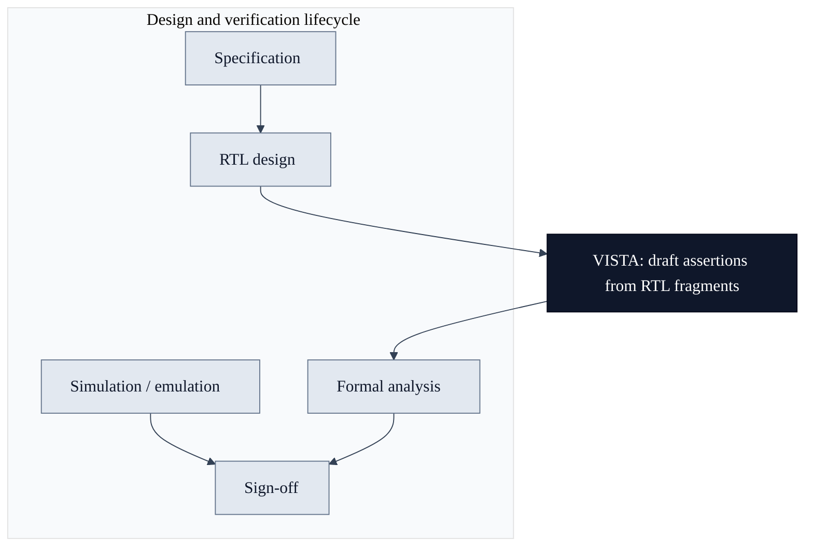

**Fig. 1.2 — Primary stakeholders.**

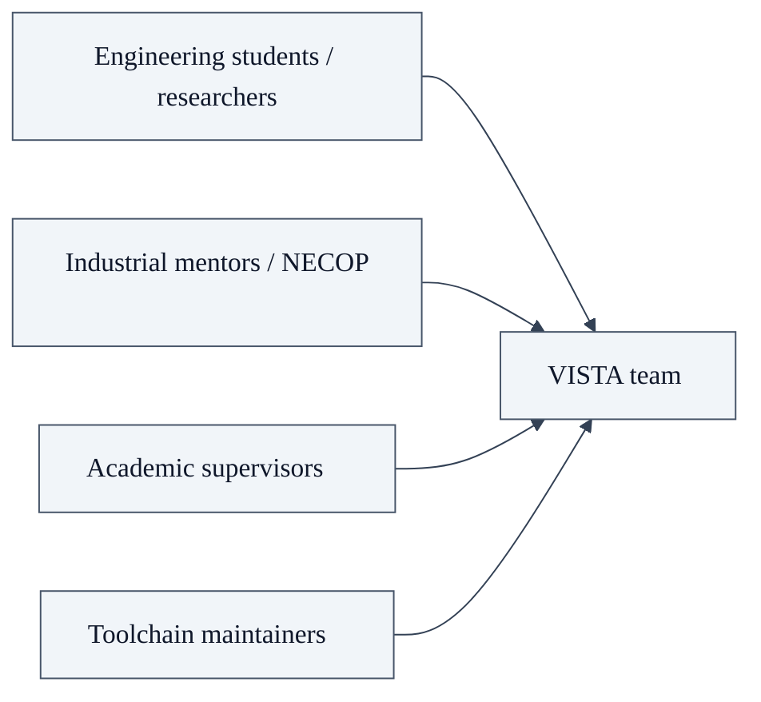

**Fig. 1.3 — SDG contribution mapping.**

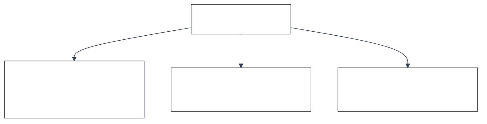

# CHAPTER II

## Chapter 2: Literature survey

### 2.1 Overview

This chapter situates VISTA within formal methods, assertion generation research, benchmarking practice, and parameter-efficient learning. Each following subsection deepens one theme and cites where the thesis should connect to primary literature in IEEE format.

### 2.2 Foundational themes (diagrams)

**Fig. 2.1 — Thematic timeline (conceptual).**

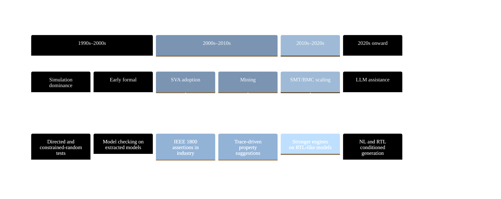

**Fig. 2.2 — Where assertion knowledge can originate.**

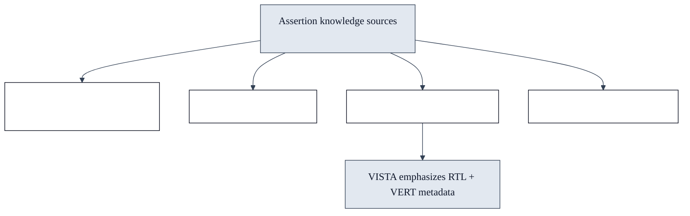

**Fig. 2.3 — Layered formal verification stack (simplified).**

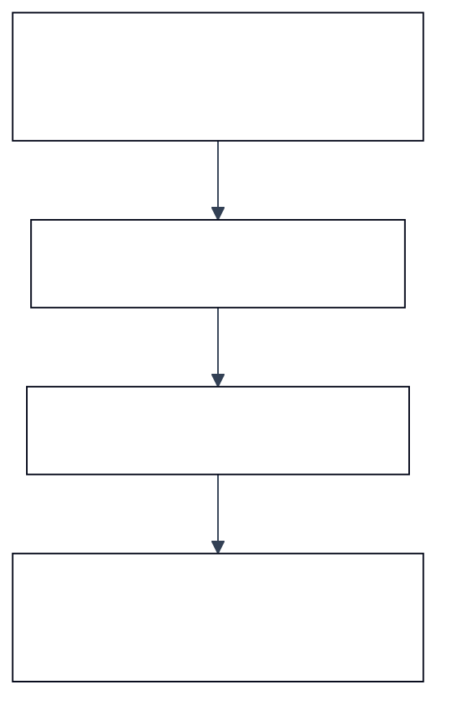

**Fig. 2.4 — NL-driven vs RTL-only assertion generation (positioning).**

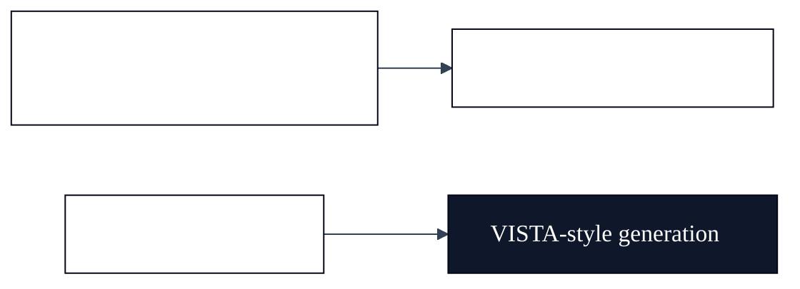

#### 2.3 Model checking and temporal logics

This subsection discusses **Model checking and temporal logics** as it relates to Chapter II (literature survey). Hardware verification research consistently shows that assertion quality—not raw engine throughput—often limits effective defect discovery. Automated generators must therefore be judged along multiple axes: syntactic acceptability, semantic alignment with designer intent on benchmark corpora, and stability under formal encodings that expose corner cases such as unknown bits and reset interactions. Review committees additionally expect clarity on dataset provenance, train–test overlap risks, and whether metrics are reported on a frozen slice or on a continuously moving checkpoint.

Within **Model checking and temporal logics**, the VISTA project adopts a pragmatic stance aligned with open-source tooling: the VERT distribution supplies paired RTL and reference assertions, while SymbiYosys supplies bounded checks that are easy to reproduce in academic laboratories. This does not replace industrial sign-off flows; it provides a transparent yardstick for iterative model and pipeline improvements. Students extending this report should cite peer-reviewed and standard references in IEEE format, critique assumptions explicitly, and avoid overstating claims beyond the frozen evaluation slice reported in Chapter V.

#### 2.4 SAT-based and SMT-based bounded model checking

This subsection discusses **SAT-based and SMT-based bounded model checking** as it relates to Chapter II (literature survey). Hardware verification research consistently shows that assertion quality—not raw engine throughput—often limits effective defect discovery. Automated generators must therefore be judged along multiple axes: syntactic acceptability, semantic alignment with designer intent on benchmark corpora, and stability under formal encodings that expose corner cases such as unknown bits and reset interactions. Review committees additionally expect clarity on dataset provenance, train–test overlap risks, and whether metrics are reported on a frozen slice or on a continuously moving checkpoint.

Within **SAT-based and SMT-based bounded model checking**, the VISTA project adopts a pragmatic stance aligned with open-source tooling: the VERT distribution supplies paired RTL and reference assertions, while SymbiYosys supplies bounded checks that are easy to reproduce in academic laboratories. This does not replace industrial sign-off flows; it provides a transparent yardstick for iterative model and pipeline improvements. Students extending this report should cite peer-reviewed and standard references in IEEE format, critique assumptions explicitly, and avoid overstating claims beyond the frozen evaluation slice reported in Chapter V.

#### 2.5 Inductive proof obligations and k-induction

This subsection discusses **Inductive proof obligations and k-induction** as it relates to Chapter II (literature survey). Hardware verification research consistently shows that assertion quality—not raw engine throughput—often limits effective defect discovery. Automated generators must therefore be judged along multiple axes: syntactic acceptability, semantic alignment with designer intent on benchmark corpora, and stability under formal encodings that expose corner cases such as unknown bits and reset interactions. Review committees additionally expect clarity on dataset provenance, train–test overlap risks, and whether metrics are reported on a frozen slice or on a continuously moving checkpoint.

Within **Inductive proof obligations and k-induction**, the VISTA project adopts a pragmatic stance aligned with open-source tooling: the VERT distribution supplies paired RTL and reference assertions, while SymbiYosys supplies bounded checks that are easy to reproduce in academic laboratories. This does not replace industrial sign-off flows; it provides a transparent yardstick for iterative model and pipeline improvements. Students extending this report should cite peer-reviewed and standard references in IEEE format, critique assumptions explicitly, and avoid overstating claims beyond the frozen evaluation slice reported in Chapter V.

#### 2.6 SystemVerilog assertions in industrial flows

This subsection discusses **SystemVerilog assertions in industrial flows** as it relates to Chapter II (literature survey). Hardware verification research consistently shows that assertion quality—not raw engine throughput—often limits effective defect discovery. Automated generators must therefore be judged along multiple axes: syntactic acceptability, semantic alignment with designer intent on benchmark corpora, and stability under formal encodings that expose corner cases such as unknown bits and reset interactions. Review committees additionally expect clarity on dataset provenance, train–test overlap risks, and whether metrics are reported on a frozen slice or on a continuously moving checkpoint.

Within **SystemVerilog assertions in industrial flows**, the VISTA project adopts a pragmatic stance aligned with open-source tooling: the VERT distribution supplies paired RTL and reference assertions, while SymbiYosys supplies bounded checks that are easy to reproduce in academic laboratories. This does not replace industrial sign-off flows; it provides a transparent yardstick for iterative model and pipeline improvements. Students extending this report should cite peer-reviewed and standard references in IEEE format, critique assumptions explicitly, and avoid overstating claims beyond the frozen evaluation slice reported in Chapter V.

#### 2.7 Assertion mining from simulation traces

This subsection discusses **Assertion mining from simulation traces** as it relates to Chapter II (literature survey). Hardware verification research consistently shows that assertion quality—not raw engine throughput—often limits effective defect discovery. Automated generators must therefore be judged along multiple axes: syntactic acceptability, semantic alignment with designer intent on benchmark corpora, and stability under formal encodings that expose corner cases such as unknown bits and reset interactions. Review committees additionally expect clarity on dataset provenance, train–test overlap risks, and whether metrics are reported on a frozen slice or on a continuously moving checkpoint.

Within **Assertion mining from simulation traces**, the VISTA project adopts a pragmatic stance aligned with open-source tooling: the VERT distribution supplies paired RTL and reference assertions, while SymbiYosys supplies bounded checks that are easy to reproduce in academic laboratories. This does not replace industrial sign-off flows; it provides a transparent yardstick for iterative model and pipeline improvements. Students extending this report should cite peer-reviewed and standard references in IEEE format, critique assumptions explicitly, and avoid overstating claims beyond the frozen evaluation slice reported in Chapter V.

#### 2.8 Static analysis and invariant inference

This subsection discusses **Static analysis and invariant inference** as it relates to Chapter II (literature survey). Hardware verification research consistently shows that assertion quality—not raw engine throughput—often limits effective defect discovery. Automated generators must therefore be judged along multiple axes: syntactic acceptability, semantic alignment with designer intent on benchmark corpora, and stability under formal encodings that expose corner cases such as unknown bits and reset interactions. Review committees additionally expect clarity on dataset provenance, train–test overlap risks, and whether metrics are reported on a frozen slice or on a continuously moving checkpoint.

Within **Static analysis and invariant inference**, the VISTA project adopts a pragmatic stance aligned with open-source tooling: the VERT distribution supplies paired RTL and reference assertions, while SymbiYosys supplies bounded checks that are easy to reproduce in academic laboratories. This does not replace industrial sign-off flows; it provides a transparent yardstick for iterative model and pipeline improvements. Students extending this report should cite peer-reviewed and standard references in IEEE format, critique assumptions explicitly, and avoid overstating claims beyond the frozen evaluation slice reported in Chapter V.

#### 2.9 GoldMine-style property discovery

This subsection discusses **GoldMine-style property discovery** as it relates to Chapter II (literature survey). Hardware verification research consistently shows that assertion quality—not raw engine throughput—often limits effective defect discovery. Automated generators must therefore be judged along multiple axes: syntactic acceptability, semantic alignment with designer intent on benchmark corpora, and stability under formal encodings that expose corner cases such as unknown bits and reset interactions. Review committees additionally expect clarity on dataset provenance, train–test overlap risks, and whether metrics are reported on a frozen slice or on a continuously moving checkpoint.

Within **GoldMine-style property discovery**, the VISTA project adopts a pragmatic stance aligned with open-source tooling: the VERT distribution supplies paired RTL and reference assertions, while SymbiYosys supplies bounded checks that are easy to reproduce in academic laboratories. This does not replace industrial sign-off flows; it provides a transparent yardstick for iterative model and pipeline improvements. Students extending this report should cite peer-reviewed and standard references in IEEE format, critique assumptions explicitly, and avoid overstating claims beyond the frozen evaluation slice reported in Chapter V.

#### 2.10 Natural-language to assertion translation

This subsection discusses **Natural-language to assertion translation** as it relates to Chapter II (literature survey). Hardware verification research consistently shows that assertion quality—not raw engine throughput—often limits effective defect discovery. Automated generators must therefore be judged along multiple axes: syntactic acceptability, semantic alignment with designer intent on benchmark corpora, and stability under formal encodings that expose corner cases such as unknown bits and reset interactions. Review committees additionally expect clarity on dataset provenance, train–test overlap risks, and whether metrics are reported on a frozen slice or on a continuously moving checkpoint.

Within **Natural-language to assertion translation**, the VISTA project adopts a pragmatic stance aligned with open-source tooling: the VERT distribution supplies paired RTL and reference assertions, while SymbiYosys supplies bounded checks that are easy to reproduce in academic laboratories. This does not replace industrial sign-off flows; it provides a transparent yardstick for iterative model and pipeline improvements. Students extending this report should cite peer-reviewed and standard references in IEEE format, critique assumptions explicitly, and avoid overstating claims beyond the frozen evaluation slice reported in Chapter V.

#### 2.11 Waveform-assisted assertion learning

This subsection discusses **Waveform-assisted assertion learning** as it relates to Chapter II (literature survey). Hardware verification research consistently shows that assertion quality—not raw engine throughput—often limits effective defect discovery. Automated generators must therefore be judged along multiple axes: syntactic acceptability, semantic alignment with designer intent on benchmark corpora, and stability under formal encodings that expose corner cases such as unknown bits and reset interactions. Review committees additionally expect clarity on dataset provenance, train–test overlap risks, and whether metrics are reported on a frozen slice or on a continuously moving checkpoint.

Within **Waveform-assisted assertion learning**, the VISTA project adopts a pragmatic stance aligned with open-source tooling: the VERT distribution supplies paired RTL and reference assertions, while SymbiYosys supplies bounded checks that are easy to reproduce in academic laboratories. This does not replace industrial sign-off flows; it provides a transparent yardstick for iterative model and pipeline improvements. Students extending this report should cite peer-reviewed and standard references in IEEE format, critique assumptions explicitly, and avoid overstating claims beyond the frozen evaluation slice reported in Chapter V.

#### 2.12 Knowledge graphs and design intent alignment

This subsection discusses **Knowledge graphs and design intent alignment** as it relates to Chapter II (literature survey). Hardware verification research consistently shows that assertion quality—not raw engine throughput—often limits effective defect discovery. Automated generators must therefore be judged along multiple axes: syntactic acceptability, semantic alignment with designer intent on benchmark corpora, and stability under formal encodings that expose corner cases such as unknown bits and reset interactions. Review committees additionally expect clarity on dataset provenance, train–test overlap risks, and whether metrics are reported on a frozen slice or on a continuously moving checkpoint.

Within **Knowledge graphs and design intent alignment**, the VISTA project adopts a pragmatic stance aligned with open-source tooling: the VERT distribution supplies paired RTL and reference assertions, while SymbiYosys supplies bounded checks that are easy to reproduce in academic laboratories. This does not replace industrial sign-off flows; it provides a transparent yardstick for iterative model and pipeline improvements. Students extending this report should cite peer-reviewed and standard references in IEEE format, critique assumptions explicitly, and avoid overstating claims beyond the frozen evaluation slice reported in Chapter V.

#### 2.13 AssertionBench and comparable benchmarks

This subsection discusses **AssertionBench and comparable benchmarks** as it relates to Chapter II (literature survey). Hardware verification research consistently shows that assertion quality—not raw engine throughput—often limits effective defect discovery. Automated generators must therefore be judged along multiple axes: syntactic acceptability, semantic alignment with designer intent on benchmark corpora, and stability under formal encodings that expose corner cases such as unknown bits and reset interactions. Review committees additionally expect clarity on dataset provenance, train–test overlap risks, and whether metrics are reported on a frozen slice or on a continuously moving checkpoint.

Within **AssertionBench and comparable benchmarks**, the VISTA project adopts a pragmatic stance aligned with open-source tooling: the VERT distribution supplies paired RTL and reference assertions, while SymbiYosys supplies bounded checks that are easy to reproduce in academic laboratories. This does not replace industrial sign-off flows; it provides a transparent yardstick for iterative model and pipeline improvements. Students extending this report should cite peer-reviewed and standard references in IEEE format, critique assumptions explicitly, and avoid overstating claims beyond the frozen evaluation slice reported in Chapter V.

#### 2.14 The VERT corpus and fragment-level RTL

This subsection discusses **The VERT corpus and fragment-level RTL** as it relates to Chapter II (literature survey). Hardware verification research consistently shows that assertion quality—not raw engine throughput—often limits effective defect discovery. Automated generators must therefore be judged along multiple axes: syntactic acceptability, semantic alignment with designer intent on benchmark corpora, and stability under formal encodings that expose corner cases such as unknown bits and reset interactions. Review committees additionally expect clarity on dataset provenance, train–test overlap risks, and whether metrics are reported on a frozen slice or on a continuously moving checkpoint.

Within **The VERT corpus and fragment-level RTL**, the VISTA project adopts a pragmatic stance aligned with open-source tooling: the VERT distribution supplies paired RTL and reference assertions, while SymbiYosys supplies bounded checks that are easy to reproduce in academic laboratories. This does not replace industrial sign-off flows; it provides a transparent yardstick for iterative model and pipeline improvements. Students extending this report should cite peer-reviewed and standard references in IEEE format, critique assumptions explicitly, and avoid overstating claims beyond the frozen evaluation slice reported in Chapter V.

#### 2.15 Open-source formal stacks (Yosys, SymbiYosys)

This subsection discusses **Open-source formal stacks (Yosys, SymbiYosys)** as it relates to Chapter II (literature survey). Hardware verification research consistently shows that assertion quality—not raw engine throughput—often limits effective defect discovery. Automated generators must therefore be judged along multiple axes: syntactic acceptability, semantic alignment with designer intent on benchmark corpora, and stability under formal encodings that expose corner cases such as unknown bits and reset interactions. Review committees additionally expect clarity on dataset provenance, train–test overlap risks, and whether metrics are reported on a frozen slice or on a continuously moving checkpoint.

Within **Open-source formal stacks (Yosys, SymbiYosys)**, the VISTA project adopts a pragmatic stance aligned with open-source tooling: the VERT distribution supplies paired RTL and reference assertions, while SymbiYosys supplies bounded checks that are easy to reproduce in academic laboratories. This does not replace industrial sign-off flows; it provides a transparent yardstick for iterative model and pipeline improvements. Students extending this report should cite peer-reviewed and standard references in IEEE format, critique assumptions explicitly, and avoid overstating claims beyond the frozen evaluation slice reported in Chapter V.

#### 2.16 Vacuity, coverage, and meaningful formal results

This subsection discusses **Vacuity, coverage, and meaningful formal results** as it relates to Chapter II (literature survey). Hardware verification research consistently shows that assertion quality—not raw engine throughput—often limits effective defect discovery. Automated generators must therefore be judged along multiple axes: syntactic acceptability, semantic alignment with designer intent on benchmark corpora, and stability under formal encodings that expose corner cases such as unknown bits and reset interactions. Review committees additionally expect clarity on dataset provenance, train–test overlap risks, and whether metrics are reported on a frozen slice or on a continuously moving checkpoint.

Within **Vacuity, coverage, and meaningful formal results**, the VISTA project adopts a pragmatic stance aligned with open-source tooling: the VERT distribution supplies paired RTL and reference assertions, while SymbiYosys supplies bounded checks that are easy to reproduce in academic laboratories. This does not replace industrial sign-off flows; it provides a transparent yardstick for iterative model and pipeline improvements. Students extending this report should cite peer-reviewed and standard references in IEEE format, critique assumptions explicitly, and avoid overstating claims beyond the frozen evaluation slice reported in Chapter V.

#### 2.17 Reset and initialization assumptions in BMC

This subsection discusses **Reset and initialization assumptions in BMC** as it relates to Chapter II (literature survey). Hardware verification research consistently shows that assertion quality—not raw engine throughput—often limits effective defect discovery. Automated generators must therefore be judged along multiple axes: syntactic acceptability, semantic alignment with designer intent on benchmark corpora, and stability under formal encodings that expose corner cases such as unknown bits and reset interactions. Review committees additionally expect clarity on dataset provenance, train–test overlap risks, and whether metrics are reported on a frozen slice or on a continuously moving checkpoint.

Within **Reset and initialization assumptions in BMC**, the VISTA project adopts a pragmatic stance aligned with open-source tooling: the VERT distribution supplies paired RTL and reference assertions, while SymbiYosys supplies bounded checks that are easy to reproduce in academic laboratories. This does not replace industrial sign-off flows; it provides a transparent yardstick for iterative model and pipeline improvements. Students extending this report should cite peer-reviewed and standard references in IEEE format, critique assumptions explicitly, and avoid overstating claims beyond the frozen evaluation slice reported in Chapter V.

#### 2.18 Clock-domain alignment for concurrent assertions

This subsection discusses **Clock-domain alignment for concurrent assertions** as it relates to Chapter II (literature survey). Hardware verification research consistently shows that assertion quality—not raw engine throughput—often limits effective defect discovery. Automated generators must therefore be judged along multiple axes: syntactic acceptability, semantic alignment with designer intent on benchmark corpora, and stability under formal encodings that expose corner cases such as unknown bits and reset interactions. Review committees additionally expect clarity on dataset provenance, train–test overlap risks, and whether metrics are reported on a frozen slice or on a continuously moving checkpoint.

Within **Clock-domain alignment for concurrent assertions**, the VISTA project adopts a pragmatic stance aligned with open-source tooling: the VERT distribution supplies paired RTL and reference assertions, while SymbiYosys supplies bounded checks that are easy to reproduce in academic laboratories. This does not replace industrial sign-off flows; it provides a transparent yardstick for iterative model and pipeline improvements. Students extending this report should cite peer-reviewed and standard references in IEEE format, critique assumptions explicitly, and avoid overstating claims beyond the frozen evaluation slice reported in Chapter V.

#### 2.19 Four-valued logic and X-propagation in formal runs

This subsection discusses **Four-valued logic and X-propagation in formal runs** as it relates to Chapter II (literature survey). Hardware verification research consistently shows that assertion quality—not raw engine throughput—often limits effective defect discovery. Automated generators must therefore be judged along multiple axes: syntactic acceptability, semantic alignment with designer intent on benchmark corpora, and stability under formal encodings that expose corner cases such as unknown bits and reset interactions. Review committees additionally expect clarity on dataset provenance, train–test overlap risks, and whether metrics are reported on a frozen slice or on a continuously moving checkpoint.

Within **Four-valued logic and X-propagation in formal runs**, the VISTA project adopts a pragmatic stance aligned with open-source tooling: the VERT distribution supplies paired RTL and reference assertions, while SymbiYosys supplies bounded checks that are easy to reproduce in academic laboratories. This does not replace industrial sign-off flows; it provides a transparent yardstick for iterative model and pipeline improvements. Students extending this report should cite peer-reviewed and standard references in IEEE format, critique assumptions explicitly, and avoid overstating claims beyond the frozen evaluation slice reported in Chapter V.

#### 2.20 Parameter-efficient fine-tuning survey

This subsection discusses **Parameter-efficient fine-tuning survey** as it relates to Chapter II (literature survey). Hardware verification research consistently shows that assertion quality—not raw engine throughput—often limits effective defect discovery. Automated generators must therefore be judged along multiple axes: syntactic acceptability, semantic alignment with designer intent on benchmark corpora, and stability under formal encodings that expose corner cases such as unknown bits and reset interactions. Review committees additionally expect clarity on dataset provenance, train–test overlap risks, and whether metrics are reported on a frozen slice or on a continuously moving checkpoint.

Within **Parameter-efficient fine-tuning survey**, the VISTA project adopts a pragmatic stance aligned with open-source tooling: the VERT distribution supplies paired RTL and reference assertions, while SymbiYosys supplies bounded checks that are easy to reproduce in academic laboratories. This does not replace industrial sign-off flows; it provides a transparent yardstick for iterative model and pipeline improvements. Students extending this report should cite peer-reviewed and standard references in IEEE format, critique assumptions explicitly, and avoid overstating claims beyond the frozen evaluation slice reported in Chapter V.

#### 2.21 QLoRA and memory-efficient adaptation

This subsection discusses **QLoRA and memory-efficient adaptation** as it relates to Chapter II (literature survey). Hardware verification research consistently shows that assertion quality—not raw engine throughput—often limits effective defect discovery. Automated generators must therefore be judged along multiple axes: syntactic acceptability, semantic alignment with designer intent on benchmark corpora, and stability under formal encodings that expose corner cases such as unknown bits and reset interactions. Review committees additionally expect clarity on dataset provenance, train–test overlap risks, and whether metrics are reported on a frozen slice or on a continuously moving checkpoint.

Within **QLoRA and memory-efficient adaptation**, the VISTA project adopts a pragmatic stance aligned with open-source tooling: the VERT distribution supplies paired RTL and reference assertions, while SymbiYosys supplies bounded checks that are easy to reproduce in academic laboratories. This does not replace industrial sign-off flows; it provides a transparent yardstick for iterative model and pipeline improvements. Students extending this report should cite peer-reviewed and standard references in IEEE format, critique assumptions explicitly, and avoid overstating claims beyond the frozen evaluation slice reported in Chapter V.

#### 2.22 Instruction tuning for code and hardware domains

This subsection discusses **Instruction tuning for code and hardware domains** as it relates to Chapter II (literature survey). Hardware verification research consistently shows that assertion quality—not raw engine throughput—often limits effective defect discovery. Automated generators must therefore be judged along multiple axes: syntactic acceptability, semantic alignment with designer intent on benchmark corpora, and stability under formal encodings that expose corner cases such as unknown bits and reset interactions. Review committees additionally expect clarity on dataset provenance, train–test overlap risks, and whether metrics are reported on a frozen slice or on a continuously moving checkpoint.

Within **Instruction tuning for code and hardware domains**, the VISTA project adopts a pragmatic stance aligned with open-source tooling: the VERT distribution supplies paired RTL and reference assertions, while SymbiYosys supplies bounded checks that are easy to reproduce in academic laboratories. This does not replace industrial sign-off flows; it provides a transparent yardstick for iterative model and pipeline improvements. Students extending this report should cite peer-reviewed and standard references in IEEE format, critique assumptions explicitly, and avoid overstating claims beyond the frozen evaluation slice reported in Chapter V.

#### 2.23 Evaluation contamination and benchmark hygiene

This subsection discusses **Evaluation contamination and benchmark hygiene** as it relates to Chapter II (literature survey). Hardware verification research consistently shows that assertion quality—not raw engine throughput—often limits effective defect discovery. Automated generators must therefore be judged along multiple axes: syntactic acceptability, semantic alignment with designer intent on benchmark corpora, and stability under formal encodings that expose corner cases such as unknown bits and reset interactions. Review committees additionally expect clarity on dataset provenance, train–test overlap risks, and whether metrics are reported on a frozen slice or on a continuously moving checkpoint.

Within **Evaluation contamination and benchmark hygiene**, the VISTA project adopts a pragmatic stance aligned with open-source tooling: the VERT distribution supplies paired RTL and reference assertions, while SymbiYosys supplies bounded checks that are easy to reproduce in academic laboratories. This does not replace industrial sign-off flows; it provides a transparent yardstick for iterative model and pipeline improvements. Students extending this report should cite peer-reviewed and standard references in IEEE format, critique assumptions explicitly, and avoid overstating claims beyond the frozen evaluation slice reported in Chapter V.

#### 2.24 Reproducibility in ML-for-EDA research

This subsection discusses **Reproducibility in ML-for-EDA research** as it relates to Chapter II (literature survey). Hardware verification research consistently shows that assertion quality—not raw engine throughput—often limits effective defect discovery. Automated generators must therefore be judged along multiple axes: syntactic acceptability, semantic alignment with designer intent on benchmark corpora, and stability under formal encodings that expose corner cases such as unknown bits and reset interactions. Review committees additionally expect clarity on dataset provenance, train–test overlap risks, and whether metrics are reported on a frozen slice or on a continuously moving checkpoint.

Within **Reproducibility in ML-for-EDA research**, the VISTA project adopts a pragmatic stance aligned with open-source tooling: the VERT distribution supplies paired RTL and reference assertions, while SymbiYosys supplies bounded checks that are easy to reproduce in academic laboratories. This does not replace industrial sign-off flows; it provides a transparent yardstick for iterative model and pipeline improvements. Students extending this report should cite peer-reviewed and standard references in IEEE format, critique assumptions explicitly, and avoid overstating claims beyond the frozen evaluation slice reported in Chapter V.

#### 2.25 Industrial adoption barriers for formal methods

This subsection discusses **Industrial adoption barriers for formal methods** as it relates to Chapter II (literature survey). Hardware verification research consistently shows that assertion quality—not raw engine throughput—often limits effective defect discovery. Automated generators must therefore be judged along multiple axes: syntactic acceptability, semantic alignment with designer intent on benchmark corpora, and stability under formal encodings that expose corner cases such as unknown bits and reset interactions. Review committees additionally expect clarity on dataset provenance, train–test overlap risks, and whether metrics are reported on a frozen slice or on a continuously moving checkpoint.

Within **Industrial adoption barriers for formal methods**, the VISTA project adopts a pragmatic stance aligned with open-source tooling: the VERT distribution supplies paired RTL and reference assertions, while SymbiYosys supplies bounded checks that are easy to reproduce in academic laboratories. This does not replace industrial sign-off flows; it provides a transparent yardstick for iterative model and pipeline improvements. Students extending this report should cite peer-reviewed and standard references in IEEE format, critique assumptions explicitly, and avoid overstating claims beyond the frozen evaluation slice reported in Chapter V.

#### 2.26 NECOP-relevant verification productivity themes

This subsection discusses **NECOP-relevant verification productivity themes** as it relates to Chapter II (literature survey). Hardware verification research consistently shows that assertion quality—not raw engine throughput—often limits effective defect discovery. Automated generators must therefore be judged along multiple axes: syntactic acceptability, semantic alignment with designer intent on benchmark corpora, and stability under formal encodings that expose corner cases such as unknown bits and reset interactions. Review committees additionally expect clarity on dataset provenance, train–test overlap risks, and whether metrics are reported on a frozen slice or on a continuously moving checkpoint.

Within **NECOP-relevant verification productivity themes**, the VISTA project adopts a pragmatic stance aligned with open-source tooling: the VERT distribution supplies paired RTL and reference assertions, while SymbiYosys supplies bounded checks that are easy to reproduce in academic laboratories. This does not replace industrial sign-off flows; it provides a transparent yardstick for iterative model and pipeline improvements. Students extending this report should cite peer-reviewed and standard references in IEEE format, critique assumptions explicitly, and avoid overstating claims beyond the frozen evaluation slice reported in Chapter V.

#### 2.27 Energy footprint of large-model training

This subsection discusses **Energy footprint of large-model training** as it relates to Chapter II (literature survey). Hardware verification research consistently shows that assertion quality—not raw engine throughput—often limits effective defect discovery. Automated generators must therefore be judged along multiple axes: syntactic acceptability, semantic alignment with designer intent on benchmark corpora, and stability under formal encodings that expose corner cases such as unknown bits and reset interactions. Review committees additionally expect clarity on dataset provenance, train–test overlap risks, and whether metrics are reported on a frozen slice or on a continuously moving checkpoint.

Within **Energy footprint of large-model training**, the VISTA project adopts a pragmatic stance aligned with open-source tooling: the VERT distribution supplies paired RTL and reference assertions, while SymbiYosys supplies bounded checks that are easy to reproduce in academic laboratories. This does not replace industrial sign-off flows; it provides a transparent yardstick for iterative model and pipeline improvements. Students extending this report should cite peer-reviewed and standard references in IEEE format, critique assumptions explicitly, and avoid overstating claims beyond the frozen evaluation slice reported in Chapter V.

#### 2.28 Security of RTL when using local vs cloud inference

This subsection discusses **Security of RTL when using local vs cloud inference** as it relates to Chapter II (literature survey). Hardware verification research consistently shows that assertion quality—not raw engine throughput—often limits effective defect discovery. Automated generators must therefore be judged along multiple axes: syntactic acceptability, semantic alignment with designer intent on benchmark corpora, and stability under formal encodings that expose corner cases such as unknown bits and reset interactions. Review committees additionally expect clarity on dataset provenance, train–test overlap risks, and whether metrics are reported on a frozen slice or on a continuously moving checkpoint.

Within **Security of RTL when using local vs cloud inference**, the VISTA project adopts a pragmatic stance aligned with open-source tooling: the VERT distribution supplies paired RTL and reference assertions, while SymbiYosys supplies bounded checks that are easy to reproduce in academic laboratories. This does not replace industrial sign-off flows; it provides a transparent yardstick for iterative model and pipeline improvements. Students extending this report should cite peer-reviewed and standard references in IEEE format, critique assumptions explicitly, and avoid overstating claims beyond the frozen evaluation slice reported in Chapter V.

#### 2.29 Documentation and traceability for student projects

This subsection discusses **Documentation and traceability for student projects** as it relates to Chapter II (literature survey). Hardware verification research consistently shows that assertion quality—not raw engine throughput—often limits effective defect discovery. Automated generators must therefore be judged along multiple axes: syntactic acceptability, semantic alignment with designer intent on benchmark corpora, and stability under formal encodings that expose corner cases such as unknown bits and reset interactions. Review committees additionally expect clarity on dataset provenance, train–test overlap risks, and whether metrics are reported on a frozen slice or on a continuously moving checkpoint.

Within **Documentation and traceability for student projects**, the VISTA project adopts a pragmatic stance aligned with open-source tooling: the VERT distribution supplies paired RTL and reference assertions, while SymbiYosys supplies bounded checks that are easy to reproduce in academic laboratories. This does not replace industrial sign-off flows; it provides a transparent yardstick for iterative model and pipeline improvements. Students extending this report should cite peer-reviewed and standard references in IEEE format, critique assumptions explicitly, and avoid overstating claims beyond the frozen evaluation slice reported in Chapter V.

#### 2.30 Limitations of lexical similarity metrics

This subsection discusses **Limitations of lexical similarity metrics** as it relates to Chapter II (literature survey). Hardware verification research consistently shows that assertion quality—not raw engine throughput—often limits effective defect discovery. Automated generators must therefore be judged along multiple axes: syntactic acceptability, semantic alignment with designer intent on benchmark corpora, and stability under formal encodings that expose corner cases such as unknown bits and reset interactions. Review committees additionally expect clarity on dataset provenance, train–test overlap risks, and whether metrics are reported on a frozen slice or on a continuously moving checkpoint.

Within **Limitations of lexical similarity metrics**, the VISTA project adopts a pragmatic stance aligned with open-source tooling: the VERT distribution supplies paired RTL and reference assertions, while SymbiYosys supplies bounded checks that are easy to reproduce in academic laboratories. This does not replace industrial sign-off flows; it provides a transparent yardstick for iterative model and pipeline improvements. Students extending this report should cite peer-reviewed and standard references in IEEE format, critique assumptions explicitly, and avoid overstating claims beyond the frozen evaluation slice reported in Chapter V.

#### 2.31 Counterexample-guided assertion refinement

This subsection discusses **Counterexample-guided assertion refinement** as it relates to Chapter II (literature survey). Hardware verification research consistently shows that assertion quality—not raw engine throughput—often limits effective defect discovery. Automated generators must therefore be judged along multiple axes: syntactic acceptability, semantic alignment with designer intent on benchmark corpora, and stability under formal encodings that expose corner cases such as unknown bits and reset interactions. Review committees additionally expect clarity on dataset provenance, train–test overlap risks, and whether metrics are reported on a frozen slice or on a continuously moving checkpoint.

Within **Counterexample-guided assertion refinement**, the VISTA project adopts a pragmatic stance aligned with open-source tooling: the VERT distribution supplies paired RTL and reference assertions, while SymbiYosys supplies bounded checks that are easy to reproduce in academic laboratories. This does not replace industrial sign-off flows; it provides a transparent yardstick for iterative model and pipeline improvements. Students extending this report should cite peer-reviewed and standard references in IEEE format, critique assumptions explicitly, and avoid overstating claims beyond the frozen evaluation slice reported in Chapter V.

#### 2.32 Assume–guarantee and modular verification outlook

This subsection discusses **Assume–guarantee and modular verification outlook** as it relates to Chapter II (literature survey). Hardware verification research consistently shows that assertion quality—not raw engine throughput—often limits effective defect discovery. Automated generators must therefore be judged along multiple axes: syntactic acceptability, semantic alignment with designer intent on benchmark corpora, and stability under formal encodings that expose corner cases such as unknown bits and reset interactions. Review committees additionally expect clarity on dataset provenance, train–test overlap risks, and whether metrics are reported on a frozen slice or on a continuously moving checkpoint.

Within **Assume–guarantee and modular verification outlook**, the VISTA project adopts a pragmatic stance aligned with open-source tooling: the VERT distribution supplies paired RTL and reference assertions, while SymbiYosys supplies bounded checks that are easy to reproduce in academic laboratories. This does not replace industrial sign-off flows; it provides a transparent yardstick for iterative model and pipeline improvements. Students extending this report should cite peer-reviewed and standard references in IEEE format, critique assumptions explicitly, and avoid overstating claims beyond the frozen evaluation slice reported in Chapter V.

#### Chapter II supplement — S1: Industrial verification metrics beyond pass rate

This subsection discusses **Industrial verification metrics beyond pass rate** as it relates to Chapter II extended literature. Hardware verification research consistently shows that assertion quality—not raw engine throughput—often limits effective defect discovery. Automated generators must therefore be judged along multiple axes: syntactic acceptability, semantic alignment with designer intent on benchmark corpora, and stability under formal encodings that expose corner cases such as unknown bits and reset interactions. Review committees additionally expect clarity on dataset provenance, train–test overlap risks, and whether metrics are reported on a frozen slice or on a continuously moving checkpoint.

Within **Industrial verification metrics beyond pass rate**, the VISTA project adopts a pragmatic stance aligned with open-source tooling: the VERT distribution supplies paired RTL and reference assertions, while SymbiYosys supplies bounded checks that are easy to reproduce in academic laboratories. This does not replace industrial sign-off flows; it provides a transparent yardstick for iterative model and pipeline improvements. Students extending this report should cite peer-reviewed and standard references in IEEE format, critique assumptions explicitly, and avoid overstating claims beyond the frozen evaluation slice reported in Chapter V.

#### Chapter II supplement — S2: Regression hygiene for ML-assisted flows

This subsection discusses **Regression hygiene for ML-assisted flows** as it relates to Chapter II extended literature. Hardware verification research consistently shows that assertion quality—not raw engine throughput—often limits effective defect discovery. Automated generators must therefore be judged along multiple axes: syntactic acceptability, semantic alignment with designer intent on benchmark corpora, and stability under formal encodings that expose corner cases such as unknown bits and reset interactions. Review committees additionally expect clarity on dataset provenance, train–test overlap risks, and whether metrics are reported on a frozen slice or on a continuously moving checkpoint.

Within **Regression hygiene for ML-assisted flows**, the VISTA project adopts a pragmatic stance aligned with open-source tooling: the VERT distribution supplies paired RTL and reference assertions, while SymbiYosys supplies bounded checks that are easy to reproduce in academic laboratories. This does not replace industrial sign-off flows; it provides a transparent yardstick for iterative model and pipeline improvements. Students extending this report should cite peer-reviewed and standard references in IEEE format, critique assumptions explicitly, and avoid overstating claims beyond the frozen evaluation slice reported in Chapter V.

#### Chapter II supplement — S3: Cross-corpus transfer and domain shift

This subsection discusses **Cross-corpus transfer and domain shift** as it relates to Chapter II extended literature. Hardware verification research consistently shows that assertion quality—not raw engine throughput—often limits effective defect discovery. Automated generators must therefore be judged along multiple axes: syntactic acceptability, semantic alignment with designer intent on benchmark corpora, and stability under formal encodings that expose corner cases such as unknown bits and reset interactions. Review committees additionally expect clarity on dataset provenance, train–test overlap risks, and whether metrics are reported on a frozen slice or on a continuously moving checkpoint.

Within **Cross-corpus transfer and domain shift**, the VISTA project adopts a pragmatic stance aligned with open-source tooling: the VERT distribution supplies paired RTL and reference assertions, while SymbiYosys supplies bounded checks that are easy to reproduce in academic laboratories. This does not replace industrial sign-off flows; it provides a transparent yardstick for iterative model and pipeline improvements. Students extending this report should cite peer-reviewed and standard references in IEEE format, critique assumptions explicitly, and avoid overstating claims beyond the frozen evaluation slice reported in Chapter V.

#### Chapter II supplement — S4: Replicability of OSS CAD versions

This subsection discusses **Replicability of OSS CAD versions** as it relates to Chapter II extended literature. Hardware verification research consistently shows that assertion quality—not raw engine throughput—often limits effective defect discovery. Automated generators must therefore be judged along multiple axes: syntactic acceptability, semantic alignment with designer intent on benchmark corpora, and stability under formal encodings that expose corner cases such as unknown bits and reset interactions. Review committees additionally expect clarity on dataset provenance, train–test overlap risks, and whether metrics are reported on a frozen slice or on a continuously moving checkpoint.

Within **Replicability of OSS CAD versions**, the VISTA project adopts a pragmatic stance aligned with open-source tooling: the VERT distribution supplies paired RTL and reference assertions, while SymbiYosys supplies bounded checks that are easy to reproduce in academic laboratories. This does not replace industrial sign-off flows; it provides a transparent yardstick for iterative model and pipeline improvements. Students extending this report should cite peer-reviewed and standard references in IEEE format, critique assumptions explicitly, and avoid overstating claims beyond the frozen evaluation slice reported in Chapter V.

#### Chapter II supplement — S5: Peer review expectations for ML-for-EDA

This subsection discusses **Peer review expectations for ML-for-EDA** as it relates to Chapter II extended literature. Hardware verification research consistently shows that assertion quality—not raw engine throughput—often limits effective defect discovery. Automated generators must therefore be judged along multiple axes: syntactic acceptability, semantic alignment with designer intent on benchmark corpora, and stability under formal encodings that expose corner cases such as unknown bits and reset interactions. Review committees additionally expect clarity on dataset provenance, train–test overlap risks, and whether metrics are reported on a frozen slice or on a continuously moving checkpoint.

Within **Peer review expectations for ML-for-EDA**, the VISTA project adopts a pragmatic stance aligned with open-source tooling: the VERT distribution supplies paired RTL and reference assertions, while SymbiYosys supplies bounded checks that are easy to reproduce in academic laboratories. This does not replace industrial sign-off flows; it provides a transparent yardstick for iterative model and pipeline improvements. Students extending this report should cite peer-reviewed and standard references in IEEE format, critique assumptions explicitly, and avoid overstating claims beyond the frozen evaluation slice reported in Chapter V.

#### Chapter II supplement — S6: Documentation standards for FYP repositories

This subsection discusses **Documentation standards for FYP repositories** as it relates to Chapter II extended literature. Hardware verification research consistently shows that assertion quality—not raw engine throughput—often limits effective defect discovery. Automated generators must therefore be judged along multiple axes: syntactic acceptability, semantic alignment with designer intent on benchmark corpora, and stability under formal encodings that expose corner cases such as unknown bits and reset interactions. Review committees additionally expect clarity on dataset provenance, train–test overlap risks, and whether metrics are reported on a frozen slice or on a continuously moving checkpoint.

Within **Documentation standards for FYP repositories**, the VISTA project adopts a pragmatic stance aligned with open-source tooling: the VERT distribution supplies paired RTL and reference assertions, while SymbiYosys supplies bounded checks that are easy to reproduce in academic laboratories. This does not replace industrial sign-off flows; it provides a transparent yardstick for iterative model and pipeline improvements. Students extending this report should cite peer-reviewed and standard references in IEEE format, critique assumptions explicitly, and avoid overstating claims beyond the frozen evaluation slice reported in Chapter V.

#### Chapter II supplement — S7: Turnitin and originality checks prior to submission

This subsection discusses **Turnitin and originality checks prior to submission** as it relates to Chapter II extended literature. Hardware verification research consistently shows that assertion quality—not raw engine throughput—often limits effective defect discovery. Automated generators must therefore be judged along multiple axes: syntactic acceptability, semantic alignment with designer intent on benchmark corpora, and stability under formal encodings that expose corner cases such as unknown bits and reset interactions. Review committees additionally expect clarity on dataset provenance, train–test overlap risks, and whether metrics are reported on a frozen slice or on a continuously moving checkpoint.

Within **Turnitin and originality checks prior to submission**, the VISTA project adopts a pragmatic stance aligned with open-source tooling: the VERT distribution supplies paired RTL and reference assertions, while SymbiYosys supplies bounded checks that are easy to reproduce in academic laboratories. This does not replace industrial sign-off flows; it provides a transparent yardstick for iterative model and pipeline improvements. Students extending this report should cite peer-reviewed and standard references in IEEE format, critique assumptions explicitly, and avoid overstating claims beyond the frozen evaluation slice reported in Chapter V.

#### Chapter II supplement — S8: Defense materials alignment with thesis claims

This subsection discusses **Defense materials alignment with thesis claims** as it relates to Chapter II extended literature. Hardware verification research consistently shows that assertion quality—not raw engine throughput—often limits effective defect discovery. Automated generators must therefore be judged along multiple axes: syntactic acceptability, semantic alignment with designer intent on benchmark corpora, and stability under formal encodings that expose corner cases such as unknown bits and reset interactions. Review committees additionally expect clarity on dataset provenance, train–test overlap risks, and whether metrics are reported on a frozen slice or on a continuously moving checkpoint.

Within **Defense materials alignment with thesis claims**, the VISTA project adopts a pragmatic stance aligned with open-source tooling: the VERT distribution supplies paired RTL and reference assertions, while SymbiYosys supplies bounded checks that are easy to reproduce in academic laboratories. This does not replace industrial sign-off flows; it provides a transparent yardstick for iterative model and pipeline improvements. Students extending this report should cite peer-reviewed and standard references in IEEE format, critique assumptions explicitly, and avoid overstating claims beyond the frozen evaluation slice reported in Chapter V.

# CHAPTER III

## Chapter 3: Design (systems requirements / specifications)

### 3.1 System context

VISTA is a software system that ingests dataset records, runs a trained language model, applies deterministic transforms, invokes external formal tools, and exposes results through a demonstration client. Figure 3.1 summarizes external interfaces.

### 3.2 Functional requirements

**Table 3.1 — Functional requirements.**

| ID | Requirement | Rationale |
|----|-------------|-----------|
| FR-1 | Accept RTL text with synchronization flag and clock string | VERT compatibility |
| FR-2 | Produce assertions in the instruction-tuned response format | Train/eval alignment |
| FR-3 | Emit a single elaboratable wrapper module | Formal tool input |
| FR-4 | Log syntax success, formal status, and gold Jaccard | Traceable metrics |
| FR-5 | Support batch evaluation for regression | Reproducibility |
| FR-6 | Provide interactive demonstration | Stakeholder communication |

### 3.3 Non-functional requirements

**Table 3.2 — Non-functional requirements.**

| ID | Category | Requirement |
|----|----------|---------------|
| NFR-1 | Reproducibility | Fixed decoding; logged configuration |
| NFR-2 | Security | Local deployment for sensitive RTL |
| NFR-3 | Maintainability | Single evaluation entry point |
| NFR-4 | Performance | Interactive latency on workstation GPU |

**Fig. 3.1 — System boundary.**

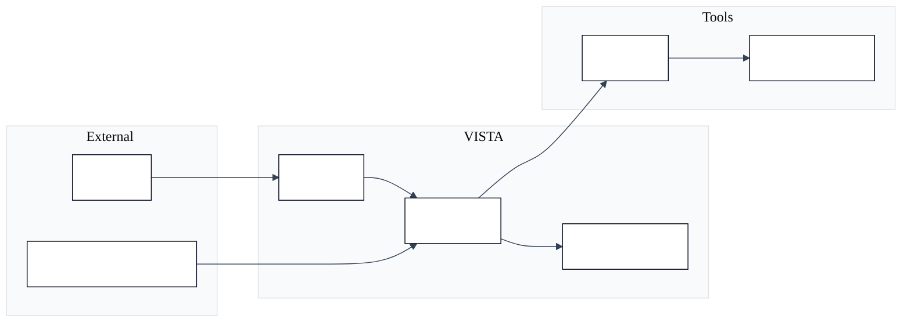

**Fig. 3.2 — Traceability from objectives to requirements.**

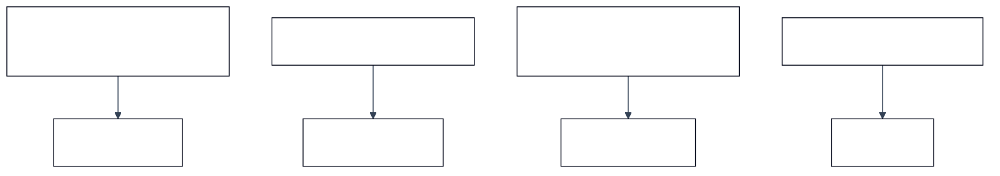

**Fig. 3.3 — Non-functional categories.**

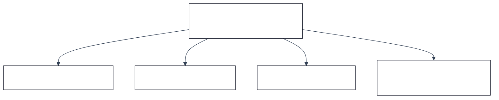

# CHAPTER IV

## Chapter 4: Proposed solution (methodology, implementation)

### 4.1 Scientific method and reproducibility

Experiments are defined by a frozen run identifier, a pinned adapter checkpoint path, and logged flags in the machine-readable evaluation manifest. This chapter explains, at engineering level, how training data becomes a deployed pipeline.

### 4.2 Dataset and training configuration

The repository retains twenty thousand VERT-style pairs. Training uses the project defaults documented in **Table 4.1**.

**Table 4.1 — Training hyperparameters (defaults).**

| Parameter | Value |
|-----------|-------|
| Base model family | LLaMA 3.1 (8B) |
| Adaptation | QLoRA (rank / alpha 256 / 256) |
| Learning rate | 1e-4 |
| Epochs | 3 |
| Micro-batch × accumulation | 2 × 32 (effective 64) |
| Max sequence length | 4096 |

### 4.3 Core methodology narrative

The methodology interleaves **learned** generation with **deterministic** repair. The following figures summarize architecture, training flow, adaptation concept, runtime interactions, post-processing, wrapper construction, evaluation packaging, and deployment.

**Fig. 4.1 — End-to-end methodology overview.**

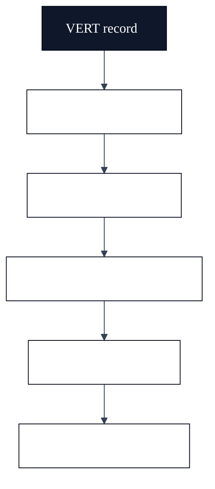

**Fig. 4.2 — Dataset and training flow.**

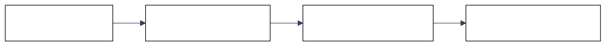

**Fig. 4.3 — QLoRA adaptation (conceptual).**

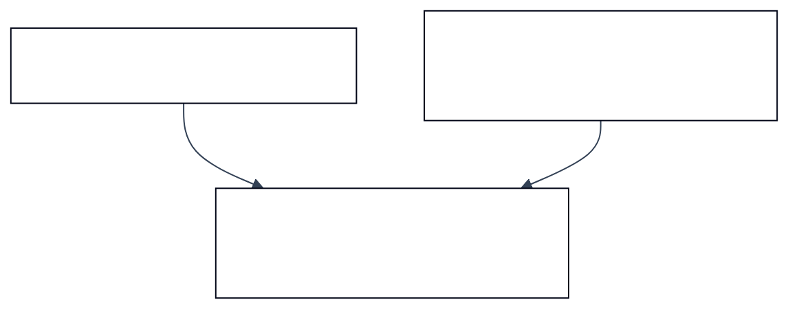

**Fig. 4.4 — Inference sequence (demonstration path).**

```mermaid
%%{init: {'theme':'base','themeVariables': {'fontFamily':'Segoe UI, Arial, sans-serif','fontSize':'17px','primaryColor':'#0f172a','primaryTextColor':'#ffffff','primaryBorderColor':'#020617','secondaryColor':'#cbd5e1','tertiaryColor':'#f8fafc','lineColor':'#334155','mainBkg':'#ffffff','nodeTextColor':'#0f172a'}}}%%
sequenceDiagram
  participant U as User
  participant C as Web client
  participant B as Backend service
  participant M as LLM
  participant T as Formal tools
  U->>C: Provide RTL + metadata
  C->>B: Request generation
  B->>M: Forward prompt
  M-->>B: Proposed assertions
  B->>B: Post-process + wrap
  B->>T: Parse / BMC
  T-->>B: Status + logs
  B-->>C: Display results
```

**Fig. 4.5 — Post-processing stages.**


**Fig. 4.6 — Synchronous wrapper concept.**

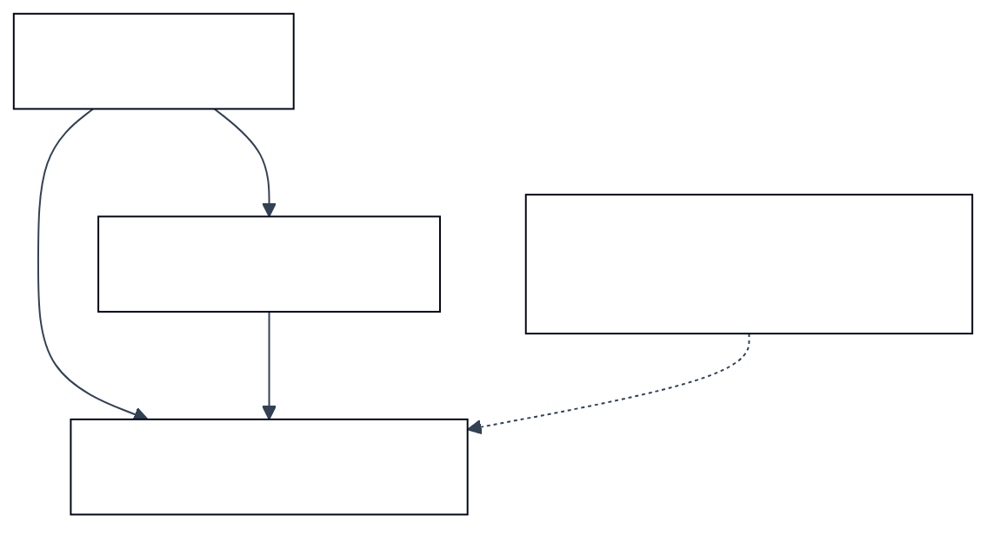

**Fig. 4.7 — Evaluation harness outputs.**

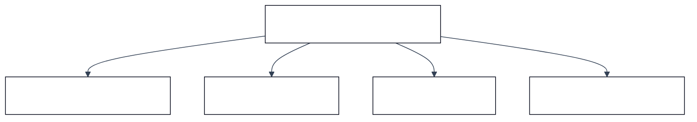

**Fig. 4.8 — Deployment layers.**

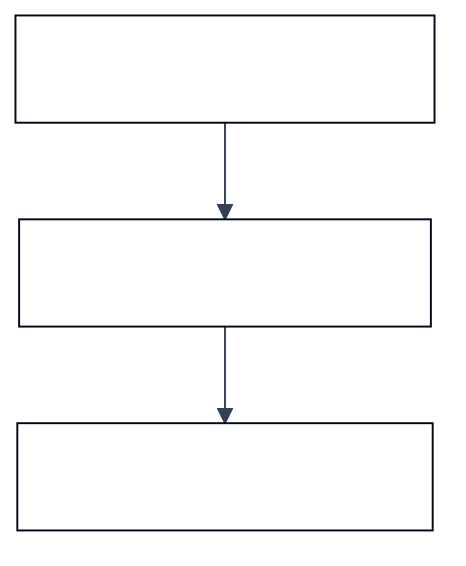

#### 4.4 Dataset curation and VERT record schema

This subsection discusses **Dataset curation and VERT record schema** as it relates to Chapter IV (methodology and implementation). Hardware verification research consistently shows that assertion quality—not raw engine throughput—often limits effective defect discovery. Automated generators must therefore be judged along multiple axes: syntactic acceptability, semantic alignment with designer intent on benchmark corpora, and stability under formal encodings that expose corner cases such as unknown bits and reset interactions. Review committees additionally expect clarity on dataset provenance, train–test overlap risks, and whether metrics are reported on a frozen slice or on a continuously moving checkpoint.

Within **Dataset curation and VERT record schema**, the VISTA project adopts a pragmatic stance aligned with open-source tooling: the VERT distribution supplies paired RTL and reference assertions, while SymbiYosys supplies bounded checks that are easy to reproduce in academic laboratories. This does not replace industrial sign-off flows; it provides a transparent yardstick for iterative model and pipeline improvements. Students extending this report should cite peer-reviewed and standard references in IEEE format, critique assumptions explicitly, and avoid overstating claims beyond the frozen evaluation slice reported in Chapter V.

#### 4.5 Train/validation partitioning and leakage control

This subsection discusses **Train/validation partitioning and leakage control** as it relates to Chapter IV (methodology and implementation). Hardware verification research consistently shows that assertion quality—not raw engine throughput—often limits effective defect discovery. Automated generators must therefore be judged along multiple axes: syntactic acceptability, semantic alignment with designer intent on benchmark corpora, and stability under formal encodings that expose corner cases such as unknown bits and reset interactions. Review committees additionally expect clarity on dataset provenance, train–test overlap risks, and whether metrics are reported on a frozen slice or on a continuously moving checkpoint.

Within **Train/validation partitioning and leakage control**, the VISTA project adopts a pragmatic stance aligned with open-source tooling: the VERT distribution supplies paired RTL and reference assertions, while SymbiYosys supplies bounded checks that are easy to reproduce in academic laboratories. This does not replace industrial sign-off flows; it provides a transparent yardstick for iterative model and pipeline improvements. Students extending this report should cite peer-reviewed and standard references in IEEE format, critique assumptions explicitly, and avoid overstating claims beyond the frozen evaluation slice reported in Chapter V.

#### 4.6 Prompt design and instruction–response alignment

This subsection discusses **Prompt design and instruction–response alignment** as it relates to Chapter IV (methodology and implementation). Hardware verification research consistently shows that assertion quality—not raw engine throughput—often limits effective defect discovery. Automated generators must therefore be judged along multiple axes: syntactic acceptability, semantic alignment with designer intent on benchmark corpora, and stability under formal encodings that expose corner cases such as unknown bits and reset interactions. Review committees additionally expect clarity on dataset provenance, train–test overlap risks, and whether metrics are reported on a frozen slice or on a continuously moving checkpoint.

Within **Prompt design and instruction–response alignment**, the VISTA project adopts a pragmatic stance aligned with open-source tooling: the VERT distribution supplies paired RTL and reference assertions, while SymbiYosys supplies bounded checks that are easy to reproduce in academic laboratories. This does not replace industrial sign-off flows; it provides a transparent yardstick for iterative model and pipeline improvements. Students extending this report should cite peer-reviewed and standard references in IEEE format, critique assumptions explicitly, and avoid overstating claims beyond the frozen evaluation slice reported in Chapter V.

#### 4.7 Tokenization effects on hardware identifiers

This subsection discusses **Tokenization effects on hardware identifiers** as it relates to Chapter IV (methodology and implementation). Hardware verification research consistently shows that assertion quality—not raw engine throughput—often limits effective defect discovery. Automated generators must therefore be judged along multiple axes: syntactic acceptability, semantic alignment with designer intent on benchmark corpora, and stability under formal encodings that expose corner cases such as unknown bits and reset interactions. Review committees additionally expect clarity on dataset provenance, train–test overlap risks, and whether metrics are reported on a frozen slice or on a continuously moving checkpoint.

Within **Tokenization effects on hardware identifiers**, the VISTA project adopts a pragmatic stance aligned with open-source tooling: the VERT distribution supplies paired RTL and reference assertions, while SymbiYosys supplies bounded checks that are easy to reproduce in academic laboratories. This does not replace industrial sign-off flows; it provides a transparent yardstick for iterative model and pipeline improvements. Students extending this report should cite peer-reviewed and standard references in IEEE format, critique assumptions explicitly, and avoid overstating claims beyond the frozen evaluation slice reported in Chapter V.

#### 4.8 LoRA adapter placement and trainable blocks

This subsection discusses **LoRA adapter placement and trainable blocks** as it relates to Chapter IV (methodology and implementation). Hardware verification research consistently shows that assertion quality—not raw engine throughput—often limits effective defect discovery. Automated generators must therefore be judged along multiple axes: syntactic acceptability, semantic alignment with designer intent on benchmark corpora, and stability under formal encodings that expose corner cases such as unknown bits and reset interactions. Review committees additionally expect clarity on dataset provenance, train–test overlap risks, and whether metrics are reported on a frozen slice or on a continuously moving checkpoint.

Within **LoRA adapter placement and trainable blocks**, the VISTA project adopts a pragmatic stance aligned with open-source tooling: the VERT distribution supplies paired RTL and reference assertions, while SymbiYosys supplies bounded checks that are easy to reproduce in academic laboratories. This does not replace industrial sign-off flows; it provides a transparent yardstick for iterative model and pipeline improvements. Students extending this report should cite peer-reviewed and standard references in IEEE format, critique assumptions explicitly, and avoid overstating claims beyond the frozen evaluation slice reported in Chapter V.

#### 4.9 Optimizer choice and learning-rate schedules

This subsection discusses **Optimizer choice and learning-rate schedules** as it relates to Chapter IV (methodology and implementation). Hardware verification research consistently shows that assertion quality—not raw engine throughput—often limits effective defect discovery. Automated generators must therefore be judged along multiple axes: syntactic acceptability, semantic alignment with designer intent on benchmark corpora, and stability under formal encodings that expose corner cases such as unknown bits and reset interactions. Review committees additionally expect clarity on dataset provenance, train–test overlap risks, and whether metrics are reported on a frozen slice or on a continuously moving checkpoint.

Within **Optimizer choice and learning-rate schedules**, the VISTA project adopts a pragmatic stance aligned with open-source tooling: the VERT distribution supplies paired RTL and reference assertions, while SymbiYosys supplies bounded checks that are easy to reproduce in academic laboratories. This does not replace industrial sign-off flows; it provides a transparent yardstick for iterative model and pipeline improvements. Students extending this report should cite peer-reviewed and standard references in IEEE format, critique assumptions explicitly, and avoid overstating claims beyond the frozen evaluation slice reported in Chapter V.

#### 4.10 Gradient accumulation and effective batch size

This subsection discusses **Gradient accumulation and effective batch size** as it relates to Chapter IV (methodology and implementation). Hardware verification research consistently shows that assertion quality—not raw engine throughput—often limits effective defect discovery. Automated generators must therefore be judged along multiple axes: syntactic acceptability, semantic alignment with designer intent on benchmark corpora, and stability under formal encodings that expose corner cases such as unknown bits and reset interactions. Review committees additionally expect clarity on dataset provenance, train–test overlap risks, and whether metrics are reported on a frozen slice or on a continuously moving checkpoint.

Within **Gradient accumulation and effective batch size**, the VISTA project adopts a pragmatic stance aligned with open-source tooling: the VERT distribution supplies paired RTL and reference assertions, while SymbiYosys supplies bounded checks that are easy to reproduce in academic laboratories. This does not replace industrial sign-off flows; it provides a transparent yardstick for iterative model and pipeline improvements. Students extending this report should cite peer-reviewed and standard references in IEEE format, critique assumptions explicitly, and avoid overstating claims beyond the frozen evaluation slice reported in Chapter V.

#### 4.11 Mixed precision and numerical stability

This subsection discusses **Mixed precision and numerical stability** as it relates to Chapter IV (methodology and implementation). Hardware verification research consistently shows that assertion quality—not raw engine throughput—often limits effective defect discovery. Automated generators must therefore be judged along multiple axes: syntactic acceptability, semantic alignment with designer intent on benchmark corpora, and stability under formal encodings that expose corner cases such as unknown bits and reset interactions. Review committees additionally expect clarity on dataset provenance, train–test overlap risks, and whether metrics are reported on a frozen slice or on a continuously moving checkpoint.

Within **Mixed precision and numerical stability**, the VISTA project adopts a pragmatic stance aligned with open-source tooling: the VERT distribution supplies paired RTL and reference assertions, while SymbiYosys supplies bounded checks that are easy to reproduce in academic laboratories. This does not replace industrial sign-off flows; it provides a transparent yardstick for iterative model and pipeline improvements. Students extending this report should cite peer-reviewed and standard references in IEEE format, critique assumptions explicitly, and avoid overstating claims beyond the frozen evaluation slice reported in Chapter V.

#### 4.12 Checkpoint selection and early stopping heuristics

This subsection discusses **Checkpoint selection and early stopping heuristics** as it relates to Chapter IV (methodology and implementation). Hardware verification research consistently shows that assertion quality—not raw engine throughput—often limits effective defect discovery. Automated generators must therefore be judged along multiple axes: syntactic acceptability, semantic alignment with designer intent on benchmark corpora, and stability under formal encodings that expose corner cases such as unknown bits and reset interactions. Review committees additionally expect clarity on dataset provenance, train–test overlap risks, and whether metrics are reported on a frozen slice or on a continuously moving checkpoint.

Within **Checkpoint selection and early stopping heuristics**, the VISTA project adopts a pragmatic stance aligned with open-source tooling: the VERT distribution supplies paired RTL and reference assertions, while SymbiYosys supplies bounded checks that are easy to reproduce in academic laboratories. This does not replace industrial sign-off flows; it provides a transparent yardstick for iterative model and pipeline improvements. Students extending this report should cite peer-reviewed and standard references in IEEE format, critique assumptions explicitly, and avoid overstating claims beyond the frozen evaluation slice reported in Chapter V.

#### 4.13 Greedy decoding versus sampling for verification

This subsection discusses **Greedy decoding versus sampling for verification** as it relates to Chapter IV (methodology and implementation). Hardware verification research consistently shows that assertion quality—not raw engine throughput—often limits effective defect discovery. Automated generators must therefore be judged along multiple axes: syntactic acceptability, semantic alignment with designer intent on benchmark corpora, and stability under formal encodings that expose corner cases such as unknown bits and reset interactions. Review committees additionally expect clarity on dataset provenance, train–test overlap risks, and whether metrics are reported on a frozen slice or on a continuously moving checkpoint.

Within **Greedy decoding versus sampling for verification**, the VISTA project adopts a pragmatic stance aligned with open-source tooling: the VERT distribution supplies paired RTL and reference assertions, while SymbiYosys supplies bounded checks that are easy to reproduce in academic laboratories. This does not replace industrial sign-off flows; it provides a transparent yardstick for iterative model and pipeline improvements. Students extending this report should cite peer-reviewed and standard references in IEEE format, critique assumptions explicitly, and avoid overstating claims beyond the frozen evaluation slice reported in Chapter V.

#### 4.14 Assertion extraction from verbose model outputs

This subsection discusses **Assertion extraction from verbose model outputs** as it relates to Chapter IV (methodology and implementation). Hardware verification research consistently shows that assertion quality—not raw engine throughput—often limits effective defect discovery. Automated generators must therefore be judged along multiple axes: syntactic acceptability, semantic alignment with designer intent on benchmark corpora, and stability under formal encodings that expose corner cases such as unknown bits and reset interactions. Review committees additionally expect clarity on dataset provenance, train–test overlap risks, and whether metrics are reported on a frozen slice or on a continuously moving checkpoint.

Within **Assertion extraction from verbose model outputs**, the VISTA project adopts a pragmatic stance aligned with open-source tooling: the VERT distribution supplies paired RTL and reference assertions, while SymbiYosys supplies bounded checks that are easy to reproduce in academic laboratories. This does not replace industrial sign-off flows; it provides a transparent yardstick for iterative model and pipeline improvements. Students extending this report should cite peer-reviewed and standard references in IEEE format, critique assumptions explicitly, and avoid overstating claims beyond the frozen evaluation slice reported in Chapter V.

#### 4.15 Syntax sanitization for formal front ends

This subsection discusses **Syntax sanitization for formal front ends** as it relates to Chapter IV (methodology and implementation). Hardware verification research consistently shows that assertion quality—not raw engine throughput—often limits effective defect discovery. Automated generators must therefore be judged along multiple axes: syntactic acceptability, semantic alignment with designer intent on benchmark corpora, and stability under formal encodings that expose corner cases such as unknown bits and reset interactions. Review committees additionally expect clarity on dataset provenance, train–test overlap risks, and whether metrics are reported on a frozen slice or on a continuously moving checkpoint.

Within **Syntax sanitization for formal front ends**, the VISTA project adopts a pragmatic stance aligned with open-source tooling: the VERT distribution supplies paired RTL and reference assertions, while SymbiYosys supplies bounded checks that are easy to reproduce in academic laboratories. This does not replace industrial sign-off flows; it provides a transparent yardstick for iterative model and pipeline improvements. Students extending this report should cite peer-reviewed and standard references in IEEE format, critique assumptions explicitly, and avoid overstating claims beyond the frozen evaluation slice reported in Chapter V.

#### 4.16 Temporal lowering and tool dialect mismatches

This subsection discusses **Temporal lowering and tool dialect mismatches** as it relates to Chapter IV (methodology and implementation). Hardware verification research consistently shows that assertion quality—not raw engine throughput—often limits effective defect discovery. Automated generators must therefore be judged along multiple axes: syntactic acceptability, semantic alignment with designer intent on benchmark corpora, and stability under formal encodings that expose corner cases such as unknown bits and reset interactions. Review committees additionally expect clarity on dataset provenance, train–test overlap risks, and whether metrics are reported on a frozen slice or on a continuously moving checkpoint.

Within **Temporal lowering and tool dialect mismatches**, the VISTA project adopts a pragmatic stance aligned with open-source tooling: the VERT distribution supplies paired RTL and reference assertions, while SymbiYosys supplies bounded checks that are easy to reproduce in academic laboratories. This does not replace industrial sign-off flows; it provides a transparent yardstick for iterative model and pipeline improvements. Students extending this report should cite peer-reviewed and standard references in IEEE format, critique assumptions explicitly, and avoid overstating claims beyond the frozen evaluation slice reported in Chapter V.

#### 4.17 Greedy subset selection under parse constraints

This subsection discusses **Greedy subset selection under parse constraints** as it relates to Chapter IV (methodology and implementation). Hardware verification research consistently shows that assertion quality—not raw engine throughput—often limits effective defect discovery. Automated generators must therefore be judged along multiple axes: syntactic acceptability, semantic alignment with designer intent on benchmark corpora, and stability under formal encodings that expose corner cases such as unknown bits and reset interactions. Review committees additionally expect clarity on dataset provenance, train–test overlap risks, and whether metrics are reported on a frozen slice or on a continuously moving checkpoint.

Within **Greedy subset selection under parse constraints**, the VISTA project adopts a pragmatic stance aligned with open-source tooling: the VERT distribution supplies paired RTL and reference assertions, while SymbiYosys supplies bounded checks that are easy to reproduce in academic laboratories. This does not replace industrial sign-off flows; it provides a transparent yardstick for iterative model and pipeline improvements. Students extending this report should cite peer-reviewed and standard references in IEEE format, critique assumptions explicitly, and avoid overstating claims beyond the frozen evaluation slice reported in Chapter V.

#### 4.18 Signal inference from RTL and assertion text

This subsection discusses **Signal inference from RTL and assertion text** as it relates to Chapter IV (methodology and implementation). Hardware verification research consistently shows that assertion quality—not raw engine throughput—often limits effective defect discovery. Automated generators must therefore be judged along multiple axes: syntactic acceptability, semantic alignment with designer intent on benchmark corpora, and stability under formal encodings that expose corner cases such as unknown bits and reset interactions. Review committees additionally expect clarity on dataset provenance, train–test overlap risks, and whether metrics are reported on a frozen slice or on a continuously moving checkpoint.

Within **Signal inference from RTL and assertion text**, the VISTA project adopts a pragmatic stance aligned with open-source tooling: the VERT distribution supplies paired RTL and reference assertions, while SymbiYosys supplies bounded checks that are easy to reproduce in academic laboratories. This does not replace industrial sign-off flows; it provides a transparent yardstick for iterative model and pipeline improvements. Students extending this report should cite peer-reviewed and standard references in IEEE format, critique assumptions explicitly, and avoid overstating claims beyond the frozen evaluation slice reported in Chapter V.

#### 4.19 Keyword filtering and false signal candidates

This subsection discusses **Keyword filtering and false signal candidates** as it relates to Chapter IV (methodology and implementation). Hardware verification research consistently shows that assertion quality—not raw engine throughput—often limits effective defect discovery. Automated generators must therefore be judged along multiple axes: syntactic acceptability, semantic alignment with designer intent on benchmark corpora, and stability under formal encodings that expose corner cases such as unknown bits and reset interactions. Review committees additionally expect clarity on dataset provenance, train–test overlap risks, and whether metrics are reported on a frozen slice or on a continuously moving checkpoint.

Within **Keyword filtering and false signal candidates**, the VISTA project adopts a pragmatic stance aligned with open-source tooling: the VERT distribution supplies paired RTL and reference assertions, while SymbiYosys supplies bounded checks that are easy to reproduce in academic laboratories. This does not replace industrial sign-off flows; it provides a transparent yardstick for iterative model and pipeline improvements. Students extending this report should cite peer-reviewed and standard references in IEEE format, critique assumptions explicitly, and avoid overstating claims beyond the frozen evaluation slice reported in Chapter V.

#### 4.20 Synchronous harness construction and two-phase updates

This subsection discusses **Synchronous harness construction and two-phase updates** as it relates to Chapter IV (methodology and implementation). Hardware verification research consistently shows that assertion quality—not raw engine throughput—often limits effective defect discovery. Automated generators must therefore be judged along multiple axes: syntactic acceptability, semantic alignment with designer intent on benchmark corpora, and stability under formal encodings that expose corner cases such as unknown bits and reset interactions. Review committees additionally expect clarity on dataset provenance, train–test overlap risks, and whether metrics are reported on a frozen slice or on a continuously moving checkpoint.

Within **Synchronous harness construction and two-phase updates**, the VISTA project adopts a pragmatic stance aligned with open-source tooling: the VERT distribution supplies paired RTL and reference assertions, while SymbiYosys supplies bounded checks that are easy to reproduce in academic laboratories. This does not replace industrial sign-off flows; it provides a transparent yardstick for iterative model and pipeline improvements. Students extending this report should cite peer-reviewed and standard references in IEEE format, critique assumptions explicitly, and avoid overstating claims beyond the frozen evaluation slice reported in Chapter V.

#### 4.21 Combinational harness construction with always_comb semantics

This subsection discusses **Combinational harness construction with always_comb semantics** as it relates to Chapter IV (methodology and implementation). Hardware verification research consistently shows that assertion quality—not raw engine throughput—often limits effective defect discovery. Automated generators must therefore be judged along multiple axes: syntactic acceptability, semantic alignment with designer intent on benchmark corpora, and stability under formal encodings that expose corner cases such as unknown bits and reset interactions. Review committees additionally expect clarity on dataset provenance, train–test overlap risks, and whether metrics are reported on a frozen slice or on a continuously moving checkpoint.

Within **Combinational harness construction with always_comb semantics**, the VISTA project adopts a pragmatic stance aligned with open-source tooling: the VERT distribution supplies paired RTL and reference assertions, while SymbiYosys supplies bounded checks that are easy to reproduce in academic laboratories. This does not replace industrial sign-off flows; it provides a transparent yardstick for iterative model and pipeline improvements. Students extending this report should cite peer-reviewed and standard references in IEEE format, critique assumptions explicitly, and avoid overstating claims beyond the frozen evaluation slice reported in Chapter V.

#### 4.22 First-cycle gating and vacuity mitigation

This subsection discusses **First-cycle gating and vacuity mitigation** as it relates to Chapter IV (methodology and implementation). Hardware verification research consistently shows that assertion quality—not raw engine throughput—often limits effective defect discovery. Automated generators must therefore be judged along multiple axes: syntactic acceptability, semantic alignment with designer intent on benchmark corpora, and stability under formal encodings that expose corner cases such as unknown bits and reset interactions. Review committees additionally expect clarity on dataset provenance, train–test overlap risks, and whether metrics are reported on a frozen slice or on a continuously moving checkpoint.

Within **First-cycle gating and vacuity mitigation**, the VISTA project adopts a pragmatic stance aligned with open-source tooling: the VERT distribution supplies paired RTL and reference assertions, while SymbiYosys supplies bounded checks that are easy to reproduce in academic laboratories. This does not replace industrial sign-off flows; it provides a transparent yardstick for iterative model and pipeline improvements. Students extending this report should cite peer-reviewed and standard references in IEEE format, critique assumptions explicitly, and avoid overstating claims beyond the frozen evaluation slice reported in Chapter V.

#### 4.23 SymbiYosys engine configuration and proof depth

This subsection discusses **SymbiYosys engine configuration and proof depth** as it relates to Chapter IV (methodology and implementation). Hardware verification research consistently shows that assertion quality—not raw engine throughput—often limits effective defect discovery. Automated generators must therefore be judged along multiple axes: syntactic acceptability, semantic alignment with designer intent on benchmark corpora, and stability under formal encodings that expose corner cases such as unknown bits and reset interactions. Review committees additionally expect clarity on dataset provenance, train–test overlap risks, and whether metrics are reported on a frozen slice or on a continuously moving checkpoint.

Within **SymbiYosys engine configuration and proof depth**, the VISTA project adopts a pragmatic stance aligned with open-source tooling: the VERT distribution supplies paired RTL and reference assertions, while SymbiYosys supplies bounded checks that are easy to reproduce in academic laboratories. This does not replace industrial sign-off flows; it provides a transparent yardstick for iterative model and pipeline improvements. Students extending this report should cite peer-reviewed and standard references in IEEE format, critique assumptions explicitly, and avoid overstating claims beyond the frozen evaluation slice reported in Chapter V.

#### 4.24 Per-case artifacts and regression packaging

This subsection discusses **Per-case artifacts and regression packaging** as it relates to Chapter IV (methodology and implementation). Hardware verification research consistently shows that assertion quality—not raw engine throughput—often limits effective defect discovery. Automated generators must therefore be judged along multiple axes: syntactic acceptability, semantic alignment with designer intent on benchmark corpora, and stability under formal encodings that expose corner cases such as unknown bits and reset interactions. Review committees additionally expect clarity on dataset provenance, train–test overlap risks, and whether metrics are reported on a frozen slice or on a continuously moving checkpoint.

Within **Per-case artifacts and regression packaging**, the VISTA project adopts a pragmatic stance aligned with open-source tooling: the VERT distribution supplies paired RTL and reference assertions, while SymbiYosys supplies bounded checks that are easy to reproduce in academic laboratories. This does not replace industrial sign-off flows; it provides a transparent yardstick for iterative model and pipeline improvements. Students extending this report should cite peer-reviewed and standard references in IEEE format, critique assumptions explicitly, and avoid overstating claims beyond the frozen evaluation slice reported in Chapter V.

#### 4.25 Web demonstration architecture and separation of concerns

This subsection discusses **Web demonstration architecture and separation of concerns** as it relates to Chapter IV (methodology and implementation). Hardware verification research consistently shows that assertion quality—not raw engine throughput—often limits effective defect discovery. Automated generators must therefore be judged along multiple axes: syntactic acceptability, semantic alignment with designer intent on benchmark corpora, and stability under formal encodings that expose corner cases such as unknown bits and reset interactions. Review committees additionally expect clarity on dataset provenance, train–test overlap risks, and whether metrics are reported on a frozen slice or on a continuously moving checkpoint.

Within **Web demonstration architecture and separation of concerns**, the VISTA project adopts a pragmatic stance aligned with open-source tooling: the VERT distribution supplies paired RTL and reference assertions, while SymbiYosys supplies bounded checks that are easy to reproduce in academic laboratories. This does not replace industrial sign-off flows; it provides a transparent yardstick for iterative model and pipeline improvements. Students extending this report should cite peer-reviewed and standard references in IEEE format, critique assumptions explicitly, and avoid overstating claims beyond the frozen evaluation slice reported in Chapter V.

#### 4.26 Operational security for proprietary RTL

This subsection discusses **Operational security for proprietary RTL** as it relates to Chapter IV (methodology and implementation). Hardware verification research consistently shows that assertion quality—not raw engine throughput—often limits effective defect discovery. Automated generators must therefore be judged along multiple axes: syntactic acceptability, semantic alignment with designer intent on benchmark corpora, and stability under formal encodings that expose corner cases such as unknown bits and reset interactions. Review committees additionally expect clarity on dataset provenance, train–test overlap risks, and whether metrics are reported on a frozen slice or on a continuously moving checkpoint.

Within **Operational security for proprietary RTL**, the VISTA project adopts a pragmatic stance aligned with open-source tooling: the VERT distribution supplies paired RTL and reference assertions, while SymbiYosys supplies bounded checks that are easy to reproduce in academic laboratories. This does not replace industrial sign-off flows; it provides a transparent yardstick for iterative model and pipeline improvements. Students extending this report should cite peer-reviewed and standard references in IEEE format, critique assumptions explicitly, and avoid overstating claims beyond the frozen evaluation slice reported in Chapter V.

#### Chapter IV supplement — M1: Logging and experiment tracking practices

This subsection discusses **Logging and experiment tracking practices** as it relates to Chapter IV engineering practice. Hardware verification research consistently shows that assertion quality—not raw engine throughput—often limits effective defect discovery. Automated generators must therefore be judged along multiple axes: syntactic acceptability, semantic alignment with designer intent on benchmark corpora, and stability under formal encodings that expose corner cases such as unknown bits and reset interactions. Review committees additionally expect clarity on dataset provenance, train–test overlap risks, and whether metrics are reported on a frozen slice or on a continuously moving checkpoint.

Within **Logging and experiment tracking practices**, the VISTA project adopts a pragmatic stance aligned with open-source tooling: the VERT distribution supplies paired RTL and reference assertions, while SymbiYosys supplies bounded checks that are easy to reproduce in academic laboratories. This does not replace industrial sign-off flows; it provides a transparent yardstick for iterative model and pipeline improvements. Students extending this report should cite peer-reviewed and standard references in IEEE format, critique assumptions explicitly, and avoid overstating claims beyond the frozen evaluation slice reported in Chapter V.

#### Chapter IV supplement — M2: Version pinning for PyTorch and CUDA drivers

This subsection discusses **Version pinning for PyTorch and CUDA drivers** as it relates to Chapter IV engineering practice. Hardware verification research consistently shows that assertion quality—not raw engine throughput—often limits effective defect discovery. Automated generators must therefore be judged along multiple axes: syntactic acceptability, semantic alignment with designer intent on benchmark corpora, and stability under formal encodings that expose corner cases such as unknown bits and reset interactions. Review committees additionally expect clarity on dataset provenance, train–test overlap risks, and whether metrics are reported on a frozen slice or on a continuously moving checkpoint.

Within **Version pinning for PyTorch and CUDA drivers**, the VISTA project adopts a pragmatic stance aligned with open-source tooling: the VERT distribution supplies paired RTL and reference assertions, while SymbiYosys supplies bounded checks that are easy to reproduce in academic laboratories. This does not replace industrial sign-off flows; it provides a transparent yardstick for iterative model and pipeline improvements. Students extending this report should cite peer-reviewed and standard references in IEEE format, critique assumptions explicitly, and avoid overstating claims beyond the frozen evaluation slice reported in Chapter V.

#### Chapter IV supplement — M3: Timeout policies for long-running formal jobs

This subsection discusses **Timeout policies for long-running formal jobs** as it relates to Chapter IV engineering practice. Hardware verification research consistently shows that assertion quality—not raw engine throughput—often limits effective defect discovery. Automated generators must therefore be judged along multiple axes: syntactic acceptability, semantic alignment with designer intent on benchmark corpora, and stability under formal encodings that expose corner cases such as unknown bits and reset interactions. Review committees additionally expect clarity on dataset provenance, train–test overlap risks, and whether metrics are reported on a frozen slice or on a continuously moving checkpoint.

Within **Timeout policies for long-running formal jobs**, the VISTA project adopts a pragmatic stance aligned with open-source tooling: the VERT distribution supplies paired RTL and reference assertions, while SymbiYosys supplies bounded checks that are easy to reproduce in academic laboratories. This does not replace industrial sign-off flows; it provides a transparent yardstick for iterative model and pipeline improvements. Students extending this report should cite peer-reviewed and standard references in IEEE format, critique assumptions explicitly, and avoid overstating claims beyond the frozen evaluation slice reported in Chapter V.

#### Chapter IV supplement — M4: Unit tests for parsing and extraction

This subsection discusses **Unit tests for parsing and extraction** as it relates to Chapter IV engineering practice. Hardware verification research consistently shows that assertion quality—not raw engine throughput—often limits effective defect discovery. Automated generators must therefore be judged along multiple axes: syntactic acceptability, semantic alignment with designer intent on benchmark corpora, and stability under formal encodings that expose corner cases such as unknown bits and reset interactions. Review committees additionally expect clarity on dataset provenance, train–test overlap risks, and whether metrics are reported on a frozen slice or on a continuously moving checkpoint.

Within **Unit tests for parsing and extraction**, the VISTA project adopts a pragmatic stance aligned with open-source tooling: the VERT distribution supplies paired RTL and reference assertions, while SymbiYosys supplies bounded checks that are easy to reproduce in academic laboratories. This does not replace industrial sign-off flows; it provides a transparent yardstick for iterative model and pipeline improvements. Students extending this report should cite peer-reviewed and standard references in IEEE format, critique assumptions explicitly, and avoid overstating claims beyond the frozen evaluation slice reported in Chapter V.

#### Chapter IV supplement — M5: Continuous integration for evaluation scripts

This subsection discusses **Continuous integration for evaluation scripts** as it relates to Chapter IV engineering practice. Hardware verification research consistently shows that assertion quality—not raw engine throughput—often limits effective defect discovery. Automated generators must therefore be judged along multiple axes: syntactic acceptability, semantic alignment with designer intent on benchmark corpora, and stability under formal encodings that expose corner cases such as unknown bits and reset interactions. Review committees additionally expect clarity on dataset provenance, train–test overlap risks, and whether metrics are reported on a frozen slice or on a continuously moving checkpoint.

Within **Continuous integration for evaluation scripts**, the VISTA project adopts a pragmatic stance aligned with open-source tooling: the VERT distribution supplies paired RTL and reference assertions, while SymbiYosys supplies bounded checks that are easy to reproduce in academic laboratories. This does not replace industrial sign-off flows; it provides a transparent yardstick for iterative model and pipeline improvements. Students extending this report should cite peer-reviewed and standard references in IEEE format, critique assumptions explicitly, and avoid overstating claims beyond the frozen evaluation slice reported in Chapter V.

#### Chapter IV supplement — M6: Checksum verification for datasets

This subsection discusses **Checksum verification for datasets** as it relates to Chapter IV engineering practice. Hardware verification research consistently shows that assertion quality—not raw engine throughput—often limits effective defect discovery. Automated generators must therefore be judged along multiple axes: syntactic acceptability, semantic alignment with designer intent on benchmark corpora, and stability under formal encodings that expose corner cases such as unknown bits and reset interactions. Review committees additionally expect clarity on dataset provenance, train–test overlap risks, and whether metrics are reported on a frozen slice or on a continuously moving checkpoint.

Within **Checksum verification for datasets**, the VISTA project adopts a pragmatic stance aligned with open-source tooling: the VERT distribution supplies paired RTL and reference assertions, while SymbiYosys supplies bounded checks that are easy to reproduce in academic laboratories. This does not replace industrial sign-off flows; it provides a transparent yardstick for iterative model and pipeline improvements. Students extending this report should cite peer-reviewed and standard references in IEEE format, critique assumptions explicitly, and avoid overstating claims beyond the frozen evaluation slice reported in Chapter V.

# CHAPTER V

## Chapter 5: Results and discussion

### 5.1 Metrics and equation for gold Jaccard

Let token sets for generated assertion text **A** and reference **B** be **T(A)** and **T(B)**. The **gold Jaccard** similarity used in the evaluation manifest is

$$J_{\mathrm{gold}}(A,B) = \frac{|T(A) \cap T(B)|}{|T(A) \cup T(B)|}.$$

*In the final Word document, number this display as (1.1) per institute format and define all symbols immediately above or below.*

### 5.2 Aggregate results

**Table 5.1 — Aggregate metrics (frozen run).**

| Metric | Value |
|--------|-------|
| Samples | 100 |
| Yosys syntax success | 100 / 100 |
| SymbiYosys pass | 99 / 100 |
| SymbiYosys fail | 1 |
| Mean gold Jaccard | 0.991364 |
| Greedy dropped clauses (sum) | 14 |
| Attempted / converted clauses | 472 / 472 |

**Table 5.2 — Gold Jaccard buckets.**

| Bucket | Count |
|--------|-------|
| 0.900 – 0.949 | 9 |
| 0.950 – 0.998 | 1 |
| ≥ 0.999 | 89 |
| < 0.900 | 1 |

### 5.3 Discussion of formal failure (sample 82)

Index **82** fails SymbiYosys while maintaining **gold Jaccard 1.0**. The RTL includes a **case** selector with **X** bits. Formal outcomes therefore depend on encoding and assumptions, not only string equality to the VERT reference.

**Fig. 5.1 — Evaluation workflow.**


**Fig. 5.2 — Aggregate outcomes (n = 100).**

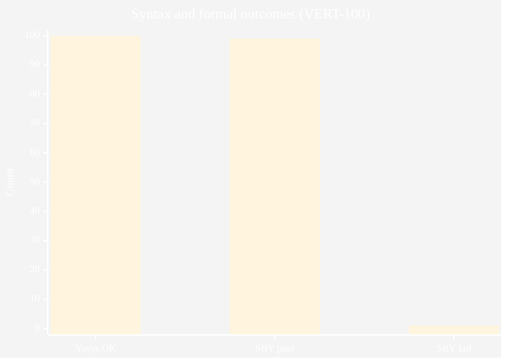

**Fig. 5.3 — Gold Jaccard distribution.**

```mermaid
%%{init: {'theme':'base','themeVariables': {'fontFamily':'Segoe UI, Arial, sans-serif','fontSize':'17px','primaryColor':'#0f172a','primaryTextColor':'#ffffff','primaryBorderColor':'#020617','secondaryColor':'#cbd5e1','tertiaryColor':'#f8fafc','lineColor':'#334155','mainBkg':'#ffffff','nodeTextColor':'#0f172a'}}}%%
pie title Gold Jaccard buckets
  "≥ 0.999" : 89
  "0.900 – 0.949" : 9
  "< 0.900" : 1
  "0.950 – 0.998" : 1
```

**Fig. 5.4 — Interpreting outcomes (conceptual).**

```mermaid
%%{init: {'theme':'base','themeVariables': {'fontFamily':'Segoe UI, Arial, sans-serif','fontSize':'17px','primaryColor':'#0f172a','primaryTextColor':'#ffffff','primaryBorderColor':'#020617','secondaryColor':'#cbd5e1','tertiaryColor':'#f8fafc','lineColor':'#334155','mainBkg':'#ffffff','nodeTextColor':'#0f172a'}}}%%
flowchart TB
  Q{{Syntax OK?}}
  Q -->|No| E1[Investigate parse / wrapper]
  Q -->|Yes| Q2{{SBY pass?}}
  Q2 -->|Yes| OK[Report pass + Jaccard]
  Q2 -->|No| Q3{{High Jaccard?}}
  Q3 -->|Yes| SEM[Review semantics X/assumptions]
  Q3 -->|No| GEN[Review generation quality]
```

#### 5.6 Reporting syntax success versus semantic proof

This subsection discusses **Reporting syntax success versus semantic proof** as it relates to Chapter V (results and discussion). Hardware verification research consistently shows that assertion quality—not raw engine throughput—often limits effective defect discovery. Automated generators must therefore be judged along multiple axes: syntactic acceptability, semantic alignment with designer intent on benchmark corpora, and stability under formal encodings that expose corner cases such as unknown bits and reset interactions. Review committees additionally expect clarity on dataset provenance, train–test overlap risks, and whether metrics are reported on a frozen slice or on a continuously moving checkpoint.

Within **Reporting syntax success versus semantic proof**, the VISTA project adopts a pragmatic stance aligned with open-source tooling: the VERT distribution supplies paired RTL and reference assertions, while SymbiYosys supplies bounded checks that are easy to reproduce in academic laboratories. This does not replace industrial sign-off flows; it provides a transparent yardstick for iterative model and pipeline improvements. Students extending this report should cite peer-reviewed and standard references in IEEE format, critique assumptions explicitly, and avoid overstating claims beyond the frozen evaluation slice reported in Chapter V.

#### 5.7 Interpreting SymbiYosys pass and fail verdicts

This subsection discusses **Interpreting SymbiYosys pass and fail verdicts** as it relates to Chapter V (results and discussion). Hardware verification research consistently shows that assertion quality—not raw engine throughput—often limits effective defect discovery. Automated generators must therefore be judged along multiple axes: syntactic acceptability, semantic alignment with designer intent on benchmark corpora, and stability under formal encodings that expose corner cases such as unknown bits and reset interactions. Review committees additionally expect clarity on dataset provenance, train–test overlap risks, and whether metrics are reported on a frozen slice or on a continuously moving checkpoint.

Within **Interpreting SymbiYosys pass and fail verdicts**, the VISTA project adopts a pragmatic stance aligned with open-source tooling: the VERT distribution supplies paired RTL and reference assertions, while SymbiYosys supplies bounded checks that are easy to reproduce in academic laboratories. This does not replace industrial sign-off flows; it provides a transparent yardstick for iterative model and pipeline improvements. Students extending this report should cite peer-reviewed and standard references in IEEE format, critique assumptions explicitly, and avoid overstating claims beyond the frozen evaluation slice reported in Chapter V.

#### 5.8 Gold Jaccard as a lexical alignment metric

This subsection discusses **Gold Jaccard as a lexical alignment metric** as it relates to Chapter V (results and discussion). Hardware verification research consistently shows that assertion quality—not raw engine throughput—often limits effective defect discovery. Automated generators must therefore be judged along multiple axes: syntactic acceptability, semantic alignment with designer intent on benchmark corpora, and stability under formal encodings that expose corner cases such as unknown bits and reset interactions. Review committees additionally expect clarity on dataset provenance, train–test overlap risks, and whether metrics are reported on a frozen slice or on a continuously moving checkpoint.

Within **Gold Jaccard as a lexical alignment metric**, the VISTA project adopts a pragmatic stance aligned with open-source tooling: the VERT distribution supplies paired RTL and reference assertions, while SymbiYosys supplies bounded checks that are easy to reproduce in academic laboratories. This does not replace industrial sign-off flows; it provides a transparent yardstick for iterative model and pipeline improvements. Students extending this report should cite peer-reviewed and standard references in IEEE format, critique assumptions explicitly, and avoid overstating claims beyond the frozen evaluation slice reported in Chapter V.

#### 5.9 Correlation between Jaccard and formal pass rate

This subsection discusses **Correlation between Jaccard and formal pass rate** as it relates to Chapter V (results and discussion). Hardware verification research consistently shows that assertion quality—not raw engine throughput—often limits effective defect discovery. Automated generators must therefore be judged along multiple axes: syntactic acceptability, semantic alignment with designer intent on benchmark corpora, and stability under formal encodings that expose corner cases such as unknown bits and reset interactions. Review committees additionally expect clarity on dataset provenance, train–test overlap risks, and whether metrics are reported on a frozen slice or on a continuously moving checkpoint.

Within **Correlation between Jaccard and formal pass rate**, the VISTA project adopts a pragmatic stance aligned with open-source tooling: the VERT distribution supplies paired RTL and reference assertions, while SymbiYosys supplies bounded checks that are easy to reproduce in academic laboratories. This does not replace industrial sign-off flows; it provides a transparent yardstick for iterative model and pipeline improvements. Students extending this report should cite peer-reviewed and standard references in IEEE format, critique assumptions explicitly, and avoid overstating claims beyond the frozen evaluation slice reported in Chapter V.

#### 5.10 Outlier analysis for low-Jaccard samples

This subsection discusses **Outlier analysis for low-Jaccard samples** as it relates to Chapter V (results and discussion). Hardware verification research consistently shows that assertion quality—not raw engine throughput—often limits effective defect discovery. Automated generators must therefore be judged along multiple axes: syntactic acceptability, semantic alignment with designer intent on benchmark corpora, and stability under formal encodings that expose corner cases such as unknown bits and reset interactions. Review committees additionally expect clarity on dataset provenance, train–test overlap risks, and whether metrics are reported on a frozen slice or on a continuously moving checkpoint.

Within **Outlier analysis for low-Jaccard samples**, the VISTA project adopts a pragmatic stance aligned with open-source tooling: the VERT distribution supplies paired RTL and reference assertions, while SymbiYosys supplies bounded checks that are easy to reproduce in academic laboratories. This does not replace industrial sign-off flows; it provides a transparent yardstick for iterative model and pipeline improvements. Students extending this report should cite peer-reviewed and standard references in IEEE format, critique assumptions explicitly, and avoid overstating claims beyond the frozen evaluation slice reported in Chapter V.

#### 5.11 Formal failure with high Jaccard: case semantics

This subsection discusses **Formal failure with high Jaccard: case semantics** as it relates to Chapter V (results and discussion). Hardware verification research consistently shows that assertion quality—not raw engine throughput—often limits effective defect discovery. Automated generators must therefore be judged along multiple axes: syntactic acceptability, semantic alignment with designer intent on benchmark corpora, and stability under formal encodings that expose corner cases such as unknown bits and reset interactions. Review committees additionally expect clarity on dataset provenance, train–test overlap risks, and whether metrics are reported on a frozen slice or on a continuously moving checkpoint.

Within **Formal failure with high Jaccard: case semantics**, the VISTA project adopts a pragmatic stance aligned with open-source tooling: the VERT distribution supplies paired RTL and reference assertions, while SymbiYosys supplies bounded checks that are easy to reproduce in academic laboratories. This does not replace industrial sign-off flows; it provides a transparent yardstick for iterative model and pipeline improvements. Students extending this report should cite peer-reviewed and standard references in IEEE format, critique assumptions explicitly, and avoid overstating claims beyond the frozen evaluation slice reported in Chapter V.

#### 5.12 Effect of greedy assertion filtering on yield

This subsection discusses **Effect of greedy assertion filtering on yield** as it relates to Chapter V (results and discussion). Hardware verification research consistently shows that assertion quality—not raw engine throughput—often limits effective defect discovery. Automated generators must therefore be judged along multiple axes: syntactic acceptability, semantic alignment with designer intent on benchmark corpora, and stability under formal encodings that expose corner cases such as unknown bits and reset interactions. Review committees additionally expect clarity on dataset provenance, train–test overlap risks, and whether metrics are reported on a frozen slice or on a continuously moving checkpoint.

Within **Effect of greedy assertion filtering on yield**, the VISTA project adopts a pragmatic stance aligned with open-source tooling: the VERT distribution supplies paired RTL and reference assertions, while SymbiYosys supplies bounded checks that are easy to reproduce in academic laboratories. This does not replace industrial sign-off flows; it provides a transparent yardstick for iterative model and pipeline improvements. Students extending this report should cite peer-reviewed and standard references in IEEE format, critique assumptions explicitly, and avoid overstating claims beyond the frozen evaluation slice reported in Chapter V.

#### 5.13 Clause-level counts and aggregation in the manifest

This subsection discusses **Clause-level counts and aggregation in the manifest** as it relates to Chapter V (results and discussion). Hardware verification research consistently shows that assertion quality—not raw engine throughput—often limits effective defect discovery. Automated generators must therefore be judged along multiple axes: syntactic acceptability, semantic alignment with designer intent on benchmark corpora, and stability under formal encodings that expose corner cases such as unknown bits and reset interactions. Review committees additionally expect clarity on dataset provenance, train–test overlap risks, and whether metrics are reported on a frozen slice or on a continuously moving checkpoint.

Within **Clause-level counts and aggregation in the manifest**, the VISTA project adopts a pragmatic stance aligned with open-source tooling: the VERT distribution supplies paired RTL and reference assertions, while SymbiYosys supplies bounded checks that are easy to reproduce in academic laboratories. This does not replace industrial sign-off flows; it provides a transparent yardstick for iterative model and pipeline improvements. Students extending this report should cite peer-reviewed and standard references in IEEE format, critique assumptions explicitly, and avoid overstating claims beyond the frozen evaluation slice reported in Chapter V.

#### 5.14 Bounded depth and completeness caveats

This subsection discusses **Bounded depth and completeness caveats** as it relates to Chapter V (results and discussion). Hardware verification research consistently shows that assertion quality—not raw engine throughput—often limits effective defect discovery. Automated generators must therefore be judged along multiple axes: syntactic acceptability, semantic alignment with designer intent on benchmark corpora, and stability under formal encodings that expose corner cases such as unknown bits and reset interactions. Review committees additionally expect clarity on dataset provenance, train–test overlap risks, and whether metrics are reported on a frozen slice or on a continuously moving checkpoint.

Within **Bounded depth and completeness caveats**, the VISTA project adopts a pragmatic stance aligned with open-source tooling: the VERT distribution supplies paired RTL and reference assertions, while SymbiYosys supplies bounded checks that are easy to reproduce in academic laboratories. This does not replace industrial sign-off flows; it provides a transparent yardstick for iterative model and pipeline improvements. Students extending this report should cite peer-reviewed and standard references in IEEE format, critique assumptions explicitly, and avoid overstating claims beyond the frozen evaluation slice reported in Chapter V.

#### 5.15 Threats to internal validity of the evaluation slice

This subsection discusses **Threats to internal validity of the evaluation slice** as it relates to Chapter V (results and discussion). Hardware verification research consistently shows that assertion quality—not raw engine throughput—often limits effective defect discovery. Automated generators must therefore be judged along multiple axes: syntactic acceptability, semantic alignment with designer intent on benchmark corpora, and stability under formal encodings that expose corner cases such as unknown bits and reset interactions. Review committees additionally expect clarity on dataset provenance, train–test overlap risks, and whether metrics are reported on a frozen slice or on a continuously moving checkpoint.

Within **Threats to internal validity of the evaluation slice**, the VISTA project adopts a pragmatic stance aligned with open-source tooling: the VERT distribution supplies paired RTL and reference assertions, while SymbiYosys supplies bounded checks that are easy to reproduce in academic laboratories. This does not replace industrial sign-off flows; it provides a transparent yardstick for iterative model and pipeline improvements. Students extending this report should cite peer-reviewed and standard references in IEEE format, critique assumptions explicitly, and avoid overstating claims beyond the frozen evaluation slice reported in Chapter V.

#### 5.16 Threats to external validity beyond VERT

This subsection discusses **Threats to external validity beyond VERT** as it relates to Chapter V (results and discussion). Hardware verification research consistently shows that assertion quality—not raw engine throughput—often limits effective defect discovery. Automated generators must therefore be judged along multiple axes: syntactic acceptability, semantic alignment with designer intent on benchmark corpora, and stability under formal encodings that expose corner cases such as unknown bits and reset interactions. Review committees additionally expect clarity on dataset provenance, train–test overlap risks, and whether metrics are reported on a frozen slice or on a continuously moving checkpoint.

Within **Threats to external validity beyond VERT**, the VISTA project adopts a pragmatic stance aligned with open-source tooling: the VERT distribution supplies paired RTL and reference assertions, while SymbiYosys supplies bounded checks that are easy to reproduce in academic laboratories. This does not replace industrial sign-off flows; it provides a transparent yardstick for iterative model and pipeline improvements. Students extending this report should cite peer-reviewed and standard references in IEEE format, critique assumptions explicitly, and avoid overstating claims beyond the frozen evaluation slice reported in Chapter V.

#### 5.17 Comparison to AssertionBench-style claims

This subsection discusses **Comparison to AssertionBench-style claims** as it relates to Chapter V (results and discussion). Hardware verification research consistently shows that assertion quality—not raw engine throughput—often limits effective defect discovery. Automated generators must therefore be judged along multiple axes: syntactic acceptability, semantic alignment with designer intent on benchmark corpora, and stability under formal encodings that expose corner cases such as unknown bits and reset interactions. Review committees additionally expect clarity on dataset provenance, train–test overlap risks, and whether metrics are reported on a frozen slice or on a continuously moving checkpoint.

Within **Comparison to AssertionBench-style claims**, the VISTA project adopts a pragmatic stance aligned with open-source tooling: the VERT distribution supplies paired RTL and reference assertions, while SymbiYosys supplies bounded checks that are easy to reproduce in academic laboratories. This does not replace industrial sign-off flows; it provides a transparent yardstick for iterative model and pipeline improvements. Students extending this report should cite peer-reviewed and standard references in IEEE format, critique assumptions explicitly, and avoid overstating claims beyond the frozen evaluation slice reported in Chapter V.

#### 5.18 Industrial metrics: review effort and time saved

This subsection discusses **Industrial metrics: review effort and time saved** as it relates to Chapter V (results and discussion). Hardware verification research consistently shows that assertion quality—not raw engine throughput—often limits effective defect discovery. Automated generators must therefore be judged along multiple axes: syntactic acceptability, semantic alignment with designer intent on benchmark corpora, and stability under formal encodings that expose corner cases such as unknown bits and reset interactions. Review committees additionally expect clarity on dataset provenance, train–test overlap risks, and whether metrics are reported on a frozen slice or on a continuously moving checkpoint.

Within **Industrial metrics: review effort and time saved**, the VISTA project adopts a pragmatic stance aligned with open-source tooling: the VERT distribution supplies paired RTL and reference assertions, while SymbiYosys supplies bounded checks that are easy to reproduce in academic laboratories. This does not replace industrial sign-off flows; it provides a transparent yardstick for iterative model and pipeline improvements. Students extending this report should cite peer-reviewed and standard references in IEEE format, critique assumptions explicitly, and avoid overstating claims beyond the frozen evaluation slice reported in Chapter V.

#### 5.19 Reproducibility checklist for independent auditors

This subsection discusses **Reproducibility checklist for independent auditors** as it relates to Chapter V (results and discussion). Hardware verification research consistently shows that assertion quality—not raw engine throughput—often limits effective defect discovery. Automated generators must therefore be judged along multiple axes: syntactic acceptability, semantic alignment with designer intent on benchmark corpora, and stability under formal encodings that expose corner cases such as unknown bits and reset interactions. Review committees additionally expect clarity on dataset provenance, train–test overlap risks, and whether metrics are reported on a frozen slice or on a continuously moving checkpoint.

Within **Reproducibility checklist for independent auditors**, the VISTA project adopts a pragmatic stance aligned with open-source tooling: the VERT distribution supplies paired RTL and reference assertions, while SymbiYosys supplies bounded checks that are easy to reproduce in academic laboratories. This does not replace industrial sign-off flows; it provides a transparent yardstick for iterative model and pipeline improvements. Students extending this report should cite peer-reviewed and standard references in IEEE format, critique assumptions explicitly, and avoid overstating claims beyond the frozen evaluation slice reported in Chapter V.

#### 5.20 Future statistical tests and confidence intervals

This subsection discusses **Future statistical tests and confidence intervals** as it relates to Chapter V (results and discussion). Hardware verification research consistently shows that assertion quality—not raw engine throughput—often limits effective defect discovery. Automated generators must therefore be judged along multiple axes: syntactic acceptability, semantic alignment with designer intent on benchmark corpora, and stability under formal encodings that expose corner cases such as unknown bits and reset interactions. Review committees additionally expect clarity on dataset provenance, train–test overlap risks, and whether metrics are reported on a frozen slice or on a continuously moving checkpoint.

Within **Future statistical tests and confidence intervals**, the VISTA project adopts a pragmatic stance aligned with open-source tooling: the VERT distribution supplies paired RTL and reference assertions, while SymbiYosys supplies bounded checks that are easy to reproduce in academic laboratories. This does not replace industrial sign-off flows; it provides a transparent yardstick for iterative model and pipeline improvements. Students extending this report should cite peer-reviewed and standard references in IEEE format, critique assumptions explicitly, and avoid overstating claims beyond the frozen evaluation slice reported in Chapter V.

#### Chapter V supplement — R1: Replication package structure for conferences

This subsection discusses **Replication package structure for conferences** as it relates to Chapter V measurement and reporting. Hardware verification research consistently shows that assertion quality—not raw engine throughput—often limits effective defect discovery. Automated generators must therefore be judged along multiple axes: syntactic acceptability, semantic alignment with designer intent on benchmark corpora, and stability under formal encodings that expose corner cases such as unknown bits and reset interactions. Review committees additionally expect clarity on dataset provenance, train–test overlap risks, and whether metrics are reported on a frozen slice or on a continuously moving checkpoint.

Within **Replication package structure for conferences**, the VISTA project adopts a pragmatic stance aligned with open-source tooling: the VERT distribution supplies paired RTL and reference assertions, while SymbiYosys supplies bounded checks that are easy to reproduce in academic laboratories. This does not replace industrial sign-off flows; it provides a transparent yardstick for iterative model and pipeline improvements. Students extending this report should cite peer-reviewed and standard references in IEEE format, critique assumptions explicitly, and avoid overstating claims beyond the frozen evaluation slice reported in Chapter V.

#### Chapter V supplement — R2: Archiving SymbiYosys logs for long-term audit

This subsection discusses **Archiving SymbiYosys logs for long-term audit** as it relates to Chapter V measurement and reporting. Hardware verification research consistently shows that assertion quality—not raw engine throughput—often limits effective defect discovery. Automated generators must therefore be judged along multiple axes: syntactic acceptability, semantic alignment with designer intent on benchmark corpora, and stability under formal encodings that expose corner cases such as unknown bits and reset interactions. Review committees additionally expect clarity on dataset provenance, train–test overlap risks, and whether metrics are reported on a frozen slice or on a continuously moving checkpoint.

Within **Archiving SymbiYosys logs for long-term audit**, the VISTA project adopts a pragmatic stance aligned with open-source tooling: the VERT distribution supplies paired RTL and reference assertions, while SymbiYosys supplies bounded checks that are easy to reproduce in academic laboratories. This does not replace industrial sign-off flows; it provides a transparent yardstick for iterative model and pipeline improvements. Students extending this report should cite peer-reviewed and standard references in IEEE format, critique assumptions explicitly, and avoid overstating claims beyond the frozen evaluation slice reported in Chapter V.

#### Chapter V supplement — R3: Redaction of proprietary RTL in appendices

This subsection discusses **Redaction of proprietary RTL in appendices** as it relates to Chapter V measurement and reporting. Hardware verification research consistently shows that assertion quality—not raw engine throughput—often limits effective defect discovery. Automated generators must therefore be judged along multiple axes: syntactic acceptability, semantic alignment with designer intent on benchmark corpora, and stability under formal encodings that expose corner cases such as unknown bits and reset interactions. Review committees additionally expect clarity on dataset provenance, train–test overlap risks, and whether metrics are reported on a frozen slice or on a continuously moving checkpoint.

Within **Redaction of proprietary RTL in appendices**, the VISTA project adopts a pragmatic stance aligned with open-source tooling: the VERT distribution supplies paired RTL and reference assertions, while SymbiYosys supplies bounded checks that are easy to reproduce in academic laboratories. This does not replace industrial sign-off flows; it provides a transparent yardstick for iterative model and pipeline improvements. Students extending this report should cite peer-reviewed and standard references in IEEE format, critique assumptions explicitly, and avoid overstating claims beyond the frozen evaluation slice reported in Chapter V.

# CHAPTER VI

## Chapter 6: Conclusion and future work

### 6.1 Conclusion

VISTA demonstrates strong **syntax** and **formal pass** rates on a deterministic VERT-100 evaluation, with high mean **gold Jaccard**. The work underscores that **professional reporting** must separate **lexical** agreement from **proof** guarantees.

### 6.2 Future work

Counterexample-guided refinement, X-aware preprocessing, vendor-tool export, and hierarchical designs are the principal research extensions.

**Fig. 6.1 — Roadmap.**

```mermaid
%%{init: {'theme':'base','themeVariables': {'fontFamily':'Segoe UI, Arial, sans-serif','fontSize':'17px','primaryColor':'#0f172a','primaryTextColor':'#ffffff','primaryBorderColor':'#020617','secondaryColor':'#cbd5e1','tertiaryColor':'#f8fafc','lineColor':'#334155','mainBkg':'#ffffff','nodeTextColor':'#0f172a'}}}%%
timeline
    title Roadmap
    section Near term
        Regression : Broaden evaluation slices
        Documentation : Defense-ready figures
    section Medium term
        CEGAR : Close loop on failures
        Semantics : Strengthen X handling
    section Long term
        Industrial pilots : NECOP case studies
```

# GLOSSARY

*Alphabetical technical terms (Heading 1 in Word). Expand or prune per faculty guidance.*

### Assertion

A Boolean or temporal expression checked during simulation or formal analysis.

In the VISTA context, **Assertion** appears when discussing toolchains, metrics, or deployment; cross-reference Chapter IV for operational meaning and Chapter V for empirical usage.

### BMC

Bounded model checking: search for property violations up to a fixed temporal depth.

In the VISTA context, **BMC** appears when discussing toolchains, metrics, or deployment; cross-reference Chapter IV for operational meaning and Chapter V for empirical usage.

### CEX

Counterexample: a witness trace showing how a property can fail.

In the VISTA context, **CEX** appears when discussing toolchains, metrics, or deployment; cross-reference Chapter IV for operational meaning and Chapter V for empirical usage.

### Clocking

Rules that specify when signals and assertions are sampled.

In the VISTA context, **Clocking** appears when discussing toolchains, metrics, or deployment; cross-reference Chapter IV for operational meaning and Chapter V for empirical usage.

### Coverage

Metrics indicating which design behaviors were exercised.

In the VISTA context, **Coverage** appears when discussing toolchains, metrics, or deployment; cross-reference Chapter IV for operational meaning and Chapter V for empirical usage.

### Disable iff

SVA construct that suspends property evaluation under a condition.

In the VISTA context, **Disable iff** appears when discussing toolchains, metrics, or deployment; cross-reference Chapter IV for operational meaning and Chapter V for empirical usage.

### Elaboration

Compilation phase that builds a netlist-like model from RTL.

In the VISTA context, **Elaboration** appears when discussing toolchains, metrics, or deployment; cross-reference Chapter IV for operational meaning and Chapter V for empirical usage.

### FSM

Finite-state machine, often a target for temporal properties.

In the VISTA context, **FSM** appears when discussing toolchains, metrics, or deployment; cross-reference Chapter IV for operational meaning and Chapter V for empirical usage.

### Formal

Mathematical analysis of a model against properties.

In the VISTA context, **Formal** appears when discussing toolchains, metrics, or deployment; cross-reference Chapter IV for operational meaning and Chapter V for empirical usage.

### Gold reference

Expert or dataset-provided target output for comparison.

In the VISTA context, **Gold reference** appears when discussing toolchains, metrics, or deployment; cross-reference Chapter IV for operational meaning and Chapter V for empirical usage.

### Harness

Wrapper module that supplies context for fragment-level RTL.

In the VISTA context, **Harness** appears when discussing toolchains, metrics, or deployment; cross-reference Chapter IV for operational meaning and Chapter V for empirical usage.

### Induction

Proof technique generalizing from bounded unrolling.

In the VISTA context, **Induction** appears when discussing toolchains, metrics, or deployment; cross-reference Chapter IV for operational meaning and Chapter V for empirical usage.

### Jaccard

Set overlap measure; here applied to token sets of assertions.

In the VISTA context, **Jaccard** appears when discussing toolchains, metrics, or deployment; cross-reference Chapter IV for operational meaning and Chapter V for empirical usage.

### LoRA

Low-rank adaptation of weight updates in a subset of layers.

In the VISTA context, **LoRA** appears when discussing toolchains, metrics, or deployment; cross-reference Chapter IV for operational meaning and Chapter V for empirical usage.

### PEFT

Parameter-efficient fine-tuning family including LoRA and QLoRA.

In the VISTA context, **PEFT** appears when discussing toolchains, metrics, or deployment; cross-reference Chapter IV for operational meaning and Chapter V for empirical usage.

### Property

Named SVA construct grouping temporal behavior.

In the VISTA context, **Property** appears when discussing toolchains, metrics, or deployment; cross-reference Chapter IV for operational meaning and Chapter V for empirical usage.

### QLoRA

Quantized LoRA training on a low-bit base model representation.

In the VISTA context, **QLoRA** appears when discussing toolchains, metrics, or deployment; cross-reference Chapter IV for operational meaning and Chapter V for empirical usage.

### RTL

Register-transfer level hardware description.

In the VISTA context, **RTL** appears when discussing toolchains, metrics, or deployment; cross-reference Chapter IV for operational meaning and Chapter V for empirical usage.

### Reset

Signal or protocol returning the design to a known state.

In the VISTA context, **Reset** appears when discussing toolchains, metrics, or deployment; cross-reference Chapter IV for operational meaning and Chapter V for empirical usage.

### SMT

Satisfiability modulo theories used by many model checkers.

In the VISTA context, **SMT** appears when discussing toolchains, metrics, or deployment; cross-reference Chapter IV for operational meaning and Chapter V for empirical usage.

### SVA

IEEE 1800 SystemVerilog Assertions language features.

In the VISTA context, **SVA** appears when discussing toolchains, metrics, or deployment; cross-reference Chapter IV for operational meaning and Chapter V for empirical usage.

### SymbiYosys

Front-end driver for Yosys-based formal proof flows.

In the VISTA context, **SymbiYosys** appears when discussing toolchains, metrics, or deployment; cross-reference Chapter IV for operational meaning and Chapter V for empirical usage.

### Temporal operator

Construct relating behavior across clock cycles.

In the VISTA context, **Temporal operator** appears when discussing toolchains, metrics, or deployment; cross-reference Chapter IV for operational meaning and Chapter V for empirical usage.

### Token

Minimal text unit used in lexical similarity computation.

In the VISTA context, **Token** appears when discussing toolchains, metrics, or deployment; cross-reference Chapter IV for operational meaning and Chapter V for empirical usage.

### VERT

Dataset pairing RTL fragments with reference assertions.

In the VISTA context, **VERT** appears when discussing toolchains, metrics, or deployment; cross-reference Chapter IV for operational meaning and Chapter V for empirical usage.

### Vacuity

Situation where a property holds trivially and hides bugs.

In the VISTA context, **Vacuity** appears when discussing toolchains, metrics, or deployment; cross-reference Chapter IV for operational meaning and Chapter V for empirical usage.

### Wrapper

Generated module enclosing dataset RTL for tools.

In the VISTA context, **Wrapper** appears when discussing toolchains, metrics, or deployment; cross-reference Chapter IV for operational meaning and Chapter V for empirical usage.

### X-propagation

Behavior of unknown logic values through expressions.

In the VISTA context, **X-propagation** appears when discussing toolchains, metrics, or deployment; cross-reference Chapter IV for operational meaning and Chapter V for empirical usage.

### Yosys

Open-source RTL synthesis and formal elaboration tool.

In the VISTA context, **Yosys** appears when discussing toolchains, metrics, or deployment; cross-reference Chapter IV for operational meaning and Chapter V for empirical usage.

### Adapter weights

Trainable tensors added by LoRA/QLoRA to a frozen base.

In the VISTA context, **Adapter weights** appears when discussing toolchains, metrics, or deployment; cross-reference Chapter IV for operational meaning and Chapter V for empirical usage.

### Batch size

Number of sequences processed per optimization step.

In the VISTA context, **Batch size** appears when discussing toolchains, metrics, or deployment; cross-reference Chapter IV for operational meaning and Chapter V for empirical usage.

### Epoch

One full pass over the training split.

In the VISTA context, **Epoch** appears when discussing toolchains, metrics, or deployment; cross-reference Chapter IV for operational meaning and Chapter V for empirical usage.

### Greedy filter

Iterative assertion retention subject to parse success.

In the VISTA context, **Greedy filter** appears when discussing toolchains, metrics, or deployment; cross-reference Chapter IV for operational meaning and Chapter V for empirical usage.

### Inference

Forward pass of the model to generate new text.

In the VISTA context, **Inference** appears when discussing toolchains, metrics, or deployment; cross-reference Chapter IV for operational meaning and Chapter V for empirical usage.

### Learning rate

Step size multiplier for gradient updates.

In the VISTA context, **Learning rate** appears when discussing toolchains, metrics, or deployment; cross-reference Chapter IV for operational meaning and Chapter V for empirical usage.

### Perplexity

Exponentiated average negative log-likelihood on held-out text.

In the VISTA context, **Perplexity** appears when discussing toolchains, metrics, or deployment; cross-reference Chapter IV for operational meaning and Chapter V for empirical usage.

### Quantization

Reduced numeric precision for weights or activations.

In the VISTA context, **Quantization** appears when discussing toolchains, metrics, or deployment; cross-reference Chapter IV for operational meaning and Chapter V for empirical usage.

### Sequence length

Maximum tokens per training or inference example.

In the VISTA context, **Sequence length** appears when discussing toolchains, metrics, or deployment; cross-reference Chapter IV for operational meaning and Chapter V for empirical usage.

### Supervised fine-tuning

Training on input–output pairs to imitate a task.

In the VISTA context, **Supervised fine-tuning** appears when discussing toolchains, metrics, or deployment; cross-reference Chapter IV for operational meaning and Chapter V for empirical usage.

### Tokenizer

Component mapping text to model vocabulary indices.

In the VISTA context, **Tokenizer** appears when discussing toolchains, metrics, or deployment; cross-reference Chapter IV for operational meaning and Chapter V for empirical usage.

### Unsloth

Training acceleration library used for LLaMA-family tuning.

In the VISTA context, **Unsloth** appears when discussing toolchains, metrics, or deployment; cross-reference Chapter IV for operational meaning and Chapter V for empirical usage.

### Web client

Browser UI used in the VISTA demonstration.

In the VISTA context, **Web client** appears when discussing toolchains, metrics, or deployment; cross-reference Chapter IV for operational meaning and Chapter V for empirical usage.

### FastAPI

Python web framework hosting inference in the demo stack.

In the VISTA context, **FastAPI** appears when discussing toolchains, metrics, or deployment; cross-reference Chapter IV for operational meaning and Chapter V for empirical usage.

### Next.js

React framework used for the demonstration front end.

In the VISTA context, **Next.js** appears when discussing toolchains, metrics, or deployment; cross-reference Chapter IV for operational meaning and Chapter V for empirical usage.

### OSS CAD Suite

Packaged open-source digital design tools including Yosys.

In the VISTA context, **OSS CAD Suite** appears when discussing toolchains, metrics, or deployment; cross-reference Chapter IV for operational meaning and Chapter V for empirical usage.

### SDG

United Nations Sustainable Development Goal.

In the VISTA context, **SDG** appears when discussing toolchains, metrics, or deployment; cross-reference Chapter IV for operational meaning and Chapter V for empirical usage.

### IEEE 1800

SystemVerilog language standard.

In the VISTA context, **IEEE 1800** appears when discussing toolchains, metrics, or deployment; cross-reference Chapter IV for operational meaning and Chapter V for empirical usage.

### NECOP

Industrial collaboration program supporting this project.

In the VISTA context, **NECOP** appears when discussing toolchains, metrics, or deployment; cross-reference Chapter IV for operational meaning and Chapter V for empirical usage.

### GIKI

Ghulam Ishaq Khan Institute of Engineering Sciences and Technology.

In the VISTA context, **GIKI** appears when discussing toolchains, metrics, or deployment; cross-reference Chapter IV for operational meaning and Chapter V for empirical usage.

# REFERENCES

Follow **IEEE** or **Harvard** style as required by the faculty (Harvard preferred where stated). Official citation guidance:

- IEEE Citation Reference: https://www.ieee.org/documents/ieeecitationref.pdf  
- Harvard overview (external helpdesk link from institute template): http://www.noodletools.com/helpdesk/kb/index.php?action=article&id=53  

**Starter entries (complete and normalize in Zotero / Mendeley):**

[1] IEEE Std 1800-2023, *IEEE Standard for SystemVerilog*.

[2] SymbiYosys documentation, https://symbiyosys.readthedocs.io/

[3] YosysHQ, *Yosys*, https://yosyshq.net/yosys/

[4] T. Dettmers et al., “QLoRA: Efficient Finetuning of Quantized LLMs,” arXiv:2305.14314, 2023.

[5] E. Halpern et al., “AssertionBench…,” arXiv:2406.18627, 2024.

[6] Unsloth, https://github.com/unslothai/unsloth

[7] VERT dataset — cite upstream source and license you relied upon.

# APPENDIX A — Institute formatting checklist

Reproduce title page margins, subsequent-page margins, heading styles (CHAPTER I as Heading 1; chapter title as Heading 3; section headings per template), figure/table placement rules, equation numbering, and Turnitin submission per `Vista_Report_format.txt`.

# APPENDIX B — Reproducibility statement

Quantitative claims refer to run **model_eval_v7_100** in the project formal verification runs directory. The manifest records adapter path, decoding options, and per-index outcomes. Independent auditors should verify checksums and tool versions recorded at experiment time.

# APPENDIX C — Ethics, risk, and limitations

Assertions may be **incorrect** or **misleading** despite passing bounded checks. Assumptions must be disclosed. RTL sent to third-party cloud APIs raises confidentiality risk; local execution mitigates this for the demonstration configuration described in Chapter IV.

---

**Table A.1 — Outlier cases.**

| Index | SymbiYosys | Gold Jaccard | Notes |
|-------|------------|--------------|-------|
| 82 | fail | 1.0000 | Formal fail; don’t-care case item (Ch. V) |
| 52 | pass | 0.9487 | Jaccard < 0.95; review overlap |
| 9 | pass | 0.9375 | Jaccard < 0.95; review overlap |
| 41 | pass | 0.9355 | Jaccard < 0.95; review overlap |
| 46 | pass | 0.9355 | Jaccard < 0.95; review overlap |
| 86 | pass | 0.9333 | Jaccard < 0.95; review overlap |
| 24 | pass | 0.9310 | Jaccard < 0.95; review overlap |
| 67 | pass | 0.9310 | Jaccard < 0.95; review overlap |
| 96 | pass | 0.9310 | Jaccard < 0.95; review overlap |
| 23 | pass | 0.9286 | Jaccard < 0.95; review overlap |
| 40 | pass | 0.7576 | Jaccard < 0.95; review overlap |

# APPENDIX D — Extended threats to validity

**Internal validity:** the hundred-sample slice is not a random draw from all VERT; it is an early contiguous block chosen for reproducibility.

**External validity:** results may not transfer to full modules, different clocks, or commercial SVA subsets.

**Construct validity:** gold Jaccard measures lexical overlap, not full semantic entailment.

**Conclusion validity:** a single formal failure should be interpreted with the case study in Chapter V, not suppressed.

# APPENDIX E — Table B.1 — Per-sample log (n = 100)

| Index | Syntax OK | SymbiYosys | Gold Jaccard | Attempted clauses | Greedy dropped | Converted |
|-------|-----------|------------|--------------|--------------------|----------------|------------|
| 1 | True | pass | 1.0000 | 3 | 0 | 3 |
| 2 | True | pass | 1.0000 | 8 | 0 | 8 |
| 3 | True | pass | 1.0000 | 3 | 0 | 3 |
| 4 | True | pass | 1.0000 | 3 | 0 | 3 |
| 5 | True | pass | 1.0000 | 3 | 0 | 3 |
| 6 | True | pass | 1.0000 | 4 | 0 | 4 |
| 7 | True | pass | 1.0000 | 8 | 0 | 8 |
| 8 | True | pass | 1.0000 | 4 | 0 | 4 |
| 9 | True | pass | 0.9375 | 7 | 0 | 7 |
| 10 | True | pass | 1.0000 | 8 | 0 | 8 |
| 11 | True | pass | 1.0000 | 3 | 0 | 3 |
| 12 | True | pass | 1.0000 | 3 | 0 | 3 |
| 13 | True | pass | 1.0000 | 4 | 0 | 4 |
| 14 | True | pass | 1.0000 | 3 | 0 | 3 |
| 15 | True | pass | 1.0000 | 3 | 0 | 3 |
| 16 | True | pass | 1.0000 | 5 | 1 | 4 |
| 17 | True | pass | 1.0000 | 4 | 0 | 4 |
| 18 | True | pass | 1.0000 | 5 | 1 | 4 |
| 19 | True | pass | 1.0000 | 5 | 1 | 4 |
| 20 | True | pass | 1.0000 | 8 | 0 | 8 |
| 21 | True | pass | 1.0000 | 4 | 0 | 4 |
| 22 | True | pass | 1.0000 | 3 | 0 | 3 |
| 23 | True | pass | 0.9286 | 7 | 0 | 7 |
| 24 | True | pass | 0.9310 | 7 | 0 | 7 |
| 25 | True | pass | 1.0000 | 4 | 0 | 4 |
| 26 | True | pass | 1.0000 | 4 | 0 | 4 |
| 27 | True | pass | 1.0000 | 3 | 0 | 3 |
| 28 | True | pass | 1.0000 | 8 | 0 | 8 |
| 29 | True | pass | 1.0000 | 4 | 1 | 3 |
| 30 | True | pass | 1.0000 | 5 | 1 | 4 |
| 31 | True | pass | 1.0000 | 3 | 0 | 3 |
| 32 | True | pass | 1.0000 | 8 | 0 | 8 |
| 33 | True | pass | 1.0000 | 2 | 0 | 2 |
| 34 | True | pass | 1.0000 | 3 | 0 | 3 |
| 35 | True | pass | 1.0000 | 4 | 0 | 4 |
| 36 | True | pass | 1.0000 | 8 | 0 | 8 |
| 37 | True | pass | 1.0000 | 5 | 1 | 4 |
| 38 | True | pass | 1.0000 | 3 | 0 | 3 |
| 39 | True | pass | 1.0000 | 2 | 1 | 1 |
| 40 | True | pass | 0.7576 | 6 | 0 | 6 |
| 41 | True | pass | 0.9355 | 8 | 0 | 8 |
| 42 | True | pass | 1.0000 | 3 | 1 | 2 |
| 43 | True | pass | 1.0000 | 8 | 0 | 8 |
| 44 | True | pass | 1.0000 | 3 | 0 | 3 |
| 45 | True | pass | 1.0000 | 6 | 1 | 5 |
| 46 | True | pass | 0.9355 | 7 | 0 | 7 |
| 47 | True | pass | 1.0000 | 3 | 0 | 3 |
| 48 | True | pass | 1.0000 | 8 | 0 | 8 |
| 49 | True | pass | 1.0000 | 3 | 0 | 3 |
| 50 | True | pass | 1.0000 | 2 | 0 | 2 |
| 51 | True | pass | 1.0000 | 3 | 0 | 3 |
| 52 | True | pass | 0.9487 | 4 | 0 | 4 |
| 53 | True | pass | 1.0000 | 3 | 0 | 3 |
| 54 | True | pass | 1.0000 | 3 | 0 | 3 |
| 55 | True | pass | 1.0000 | 3 | 0 | 3 |
| 56 | True | pass | 1.0000 | 6 | 1 | 5 |
| 57 | True | pass | 1.0000 | 3 | 0 | 3 |
| 58 | True | pass | 1.0000 | 6 | 1 | 5 |
| 59 | True | pass | 1.0000 | 3 | 0 | 3 |
| 60 | True | pass | 1.0000 | 2 | 0 | 2 |
| 61 | True | pass | 1.0000 | 8 | 0 | 8 |
| 62 | True | pass | 1.0000 | 4 | 0 | 4 |
| 63 | True | pass | 1.0000 | 3 | 0 | 3 |
| 64 | True | pass | 1.0000 | 4 | 0 | 4 |
| 65 | True | pass | 1.0000 | 3 | 0 | 3 |
| 66 | True | pass | 1.0000 | 3 | 0 | 3 |
| 67 | True | pass | 0.9310 | 7 | 0 | 7 |
| 68 | True | pass | 1.0000 | 3 | 0 | 3 |
| 69 | True | pass | 1.0000 | 4 | 0 | 4 |
| 70 | True | pass | 1.0000 | 8 | 0 | 8 |
| 71 | True | pass | 1.0000 | 3 | 0 | 3 |
| 72 | True | pass | 1.0000 | 4 | 0 | 4 |
| 73 | True | pass | 1.0000 | 4 | 0 | 4 |
| 74 | True | pass | 1.0000 | 4 | 0 | 4 |
| 75 | True | pass | 1.0000 | 3 | 0 | 3 |
| 76 | True | pass | 1.0000 | 4 | 0 | 4 |
| 77 | True | pass | 1.0000 | 3 | 0 | 3 |
| 78 | True | pass | 1.0000 | 8 | 0 | 8 |
| 79 | True | pass | 1.0000 | 4 | 1 | 3 |
| 80 | True | pass | 1.0000 | 4 | 0 | 4 |
| 81 | True | pass | 1.0000 | 8 | 0 | 8 |
| 82 | True | fail | 1.0000 | 4 | 0 | 4 |
| 83 | True | pass | 1.0000 | 4 | 0 | 4 |
| 84 | True | pass | 1.0000 | 4 | 0 | 4 |
| 85 | True | pass | 1.0000 | 3 | 0 | 3 |
| 86 | True | pass | 0.9333 | 7 | 0 | 7 |
| 87 | True | pass | 1.0000 | 8 | 0 | 8 |
| 88 | True | pass | 1.0000 | 2 | 1 | 1 |
| 89 | True | pass | 1.0000 | 3 | 0 | 3 |
| 90 | True | pass | 1.0000 | 4 | 0 | 4 |
| 91 | True | pass | 1.0000 | 5 | 1 | 4 |
| 92 | True | pass | 1.0000 | 8 | 0 | 8 |
| 93 | True | pass | 1.0000 | 8 | 0 | 8 |
| 94 | True | pass | 1.0000 | 8 | 0 | 8 |
| 95 | True | pass | 1.0000 | 8 | 0 | 8 |
| 96 | True | pass | 0.9310 | 7 | 0 | 7 |
| 97 | True | pass | 1.0000 | 4 | 0 | 4 |
| 98 | True | pass | 1.0000 | 4 | 0 | 4 |
| 99 | True | pass | 0.9667 | 7 | 0 | 7 |
| 100 | True | pass | 1.0000 | 4 | 0 | 4 |

*Table footnotes (8 pt in Word): Greedy dropped counts assertions removed by the compatibility filter for that sample.*

*End of Draft 3 Markdown — regenerate with `python scripts/build_vista_report_md.py` and export with `python scripts/export_report_to_docx.py` (default output: `exports/Draft 3.docx`).*
